# Deploying BIG-IP in AWS

Understanding Onboarding and Operational Traffic Flows

## Overview

This document explains onboarding and operational traffic flows when deploying F5 BIG-IP systems in AWS. The AWS Cloud Formation Template examples here have default settings that assume Internet access for traffic management ***and*** management interfaces. Some customers directly connect BIG-IP to the Internet, while others restrict outbound Internet access, requiring additional planning. This document aims to clarify traffic flows and endpoints for deploying BIG-IP in an Internet-isolated AWS VPC using F5's CloudFormation templates, Runtime Init, Declarative Onboarding (DO), Application Services (AS3), Telemetry Streaming (TS) and Cloud Failover Extension (CFE).

## BIG-IP Routing

BIG-IP systems use multiple routing tables for management and data plane processing. By default, they also employ [auto last hop](https://my.f5.com/manage/s/article/K13876) on data plane interfaces, allowing them to seemingly function without explicit routes. However, they often need routes to handle traffic intiated by the BIG-IP themselves (ex. outbound and/or operational traffic). By default in AWS, a default management route is configured via DHCP but once data plane routes are configured, data plane routes take precedence over management routes.  This document assumes default routes for both management ***and*** data plane (TMM) are configured and explains traffic flow at different stages.  Familiarity with BIG-IP routing is presumed but not detailed here.


For more information, see:  
 * [K13284: Overview of management interface routing (11.x - 17.x)](https://my.f5.com/manage/s/article/K13284)
 * [K15040: Configuring and displaying the management IP address for the BIG-IP system](https://my.f5.com/manage/s/article/K15040)
    

## Manual Deployments

For manual deployments, you might install F5 extensions like BIG-IP AS3, BIG-IP Cloud Failover Extension, and BIG-IP Telemetry Streaming manually. Unlike automated CFT-based deployments, which leverage startup scripts w/ Cloud-Init and Runtime Init, manual deployments have different traffic flow requirements since users handle software packages and address license workflows. Even after the system is onboarded and these extensions have been installed, some of these integrations still need to send traffic to AWS service API endpoints, like EC2, S3, and CloudWatch (logs), to function correctly. This document explains these requirements and is relevant for isolated systems.


## Licensing and Network Topology Requirements

For AWS marketplace-based PAY-AS-YOU-GO licenses, they are preactivated and don't need a specific network topology for licensing. However, Bring Your Own License (BYOL) instances with license registration keys require outbound access to activate.f5.com. If licensing through a BIG-IQ License Server, the network topology must allow the management interface to connect to BIG-IQ. In the diagrams below, BIG-IQ and activate.f5.com are referred to as ***licensing***.

## Isolated vs Internet Enabled Networks

Your network architecture may dictate that the BIG-IP system does not have direct access to the Internet, or may not have any access to the Internet. Outside of license activation via activate.f5.com, AWS's VPC endpoints can be leveraged to route/handle traffic to AWS specific services.

F5 deployments that do require Internet access, such as [activate.f5.com](https://activate.f5.com/), can use any path that is functional. Examples include Elastic IPs with Internet gateways in a route table that is mapped to the management interface, NAT gateways, or any other system that can proxy the traffic to the Internet. A key point to remember is that the BIG-IP configuration (default routes) **and** the AWS route tables must both be configured to create the required routing to reach any network endpoint.


## Changing Network Requirements During Deployment Phase

When we deploy BIG-IPs via CFTs in AWS, we have two phases that impact how BIG-IP's outbound traffic flow behaves. During the initialization / startup phase, the system picks up a default management route via DHCP. At this phase, all traffic to any destination will use the management interface. After BIG-IP Declarative Onboarding (DO) runs and configures a default data plane (TMM) route, this changes the network flows mid deployment.

### Deployment and Onboarding Process Flow

Deployments involve several steps, including system bootstrapping, file downloads, and system configuration. During this process, the preferred outbound network changes. The diagram below provides a high-level overview of the system state and how the network is used throughout deployment and onboarding.

* Black lines represent traffic initiated from the management interface.
* Red lines represent traffic initiated from the data plane interfaces.
* The top row of boxes represents the deployment phase, and the bottom row represents the communication peer. As the system phase progresses from left to right, network changes are applied, and traffic flows change. Note that the license server is involved in the first phase, assuming you're not using marketplace PAY-AS-YOU-GO instances.


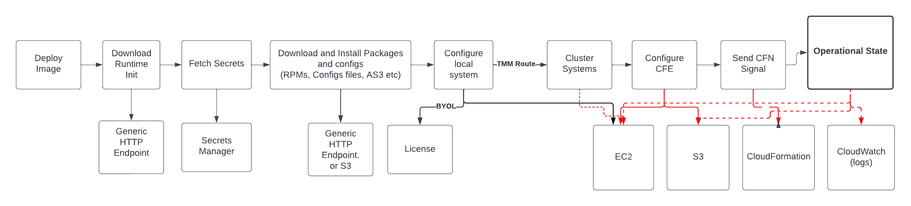

NOTE: If customers customize/modify the BIG-IP DO declaration, and do not configure a default data plane (TMM) route, traffic will continue to egress the management interface.


### Initialization Phase - Network Flows

In the phase prior to BIG-IP DO configuring BIG-IP, all calls to APIs, or for files, will egress the management interface and follow the default management route.  After BIG-IP DO configuration has been applied and creates a data plane (TMM) default route, the system will start using TMM interfaces to talk to API endpoints.  A conceptual view of the routing looks like the diagram below.

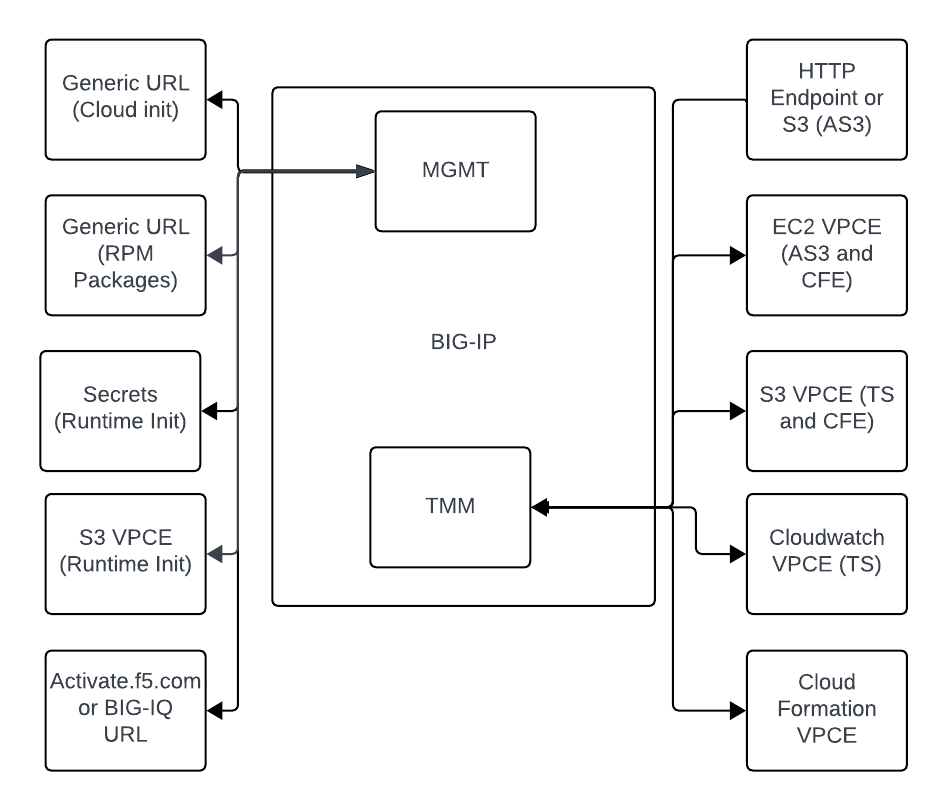


*Note: Not all API resources below are strictly required and may vary depending on the type of deployment.*


##

### Operational Flows (Post Onboard)

At this point in the installation, the config files and RPM source files have already been downloaded, installed and applied. If the system is leveraging a cloud integration with Application Services (AS3), Cloud Failover Extension (CFE) or Telemetry Streaming (TS), it will need to communicate with AWS services. A conceptual view of the routing with a default data plane (TMM) route is below.

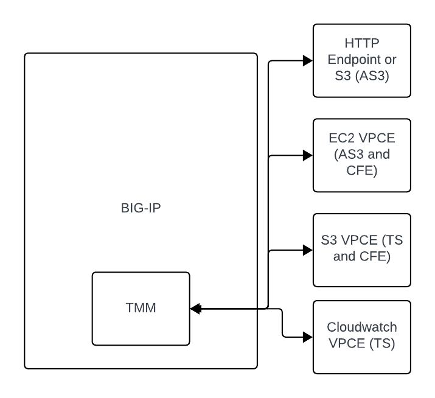

## Deploying via CFT

F5 CFTs have multiple embedded URLs which are used by different systems in the deployment process. In this section we will cover the URLs as they are listed and comment about which systems are using them, and if they need to be changed to run in an isolated environment.

### S3 Bucket Name and Artifact Location

Listed in the [parent template](https://github.com/F5Networks/f5-aws-cloudformation-v2/tree/main/examples/failover). 

 This is the location where the nested child AWS Cloudformation templates are hosted. The Cloudformation service requires these referenced templates to be hosted on S3.  If customizing, the customized templates need to be uploaded to your own S3 bucket and folder location. 

  * s3BucketName
  * s3BucketRegion
  * artifactLocation


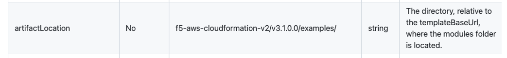

When a user deploys a CFT, they can do so from the AWS web console or from the CLI. In both patterns, the parameters needing to be changed are the same. However, our example will look at the changes in the parent template (as exposed when using the the web console) that need to be changed, and the parameters needing to be updated in each of the BIG-IP templates.

### [F5 Parent Template](https://github.com/F5Networks/f5-aws-cloudformation-v2/tree/main/examples/failover)

If you are deploying the CFT via the AWS CLI and passing a paremeters file, the parameters file needs to be accessible from your workstation.

You will see links to other files such as the BIG-IP Runtime Init packages and Runtime Init configuration files. These endpoints can be any HTTP endpoint that is reachable from the BIG-IP's **management interface** and are unauthenticated.

### F5 BIG-IP Runtime Init Package

This file must be reachable from the management interface and unauthenticated.

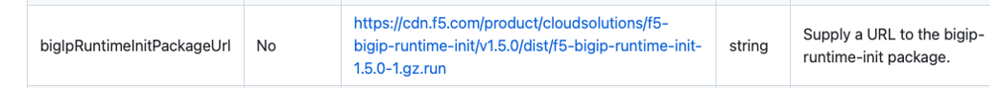

### F5 BIG-IP Runtime Init Configuration Files

These files must be reachable from the management interface and unauthenticated.

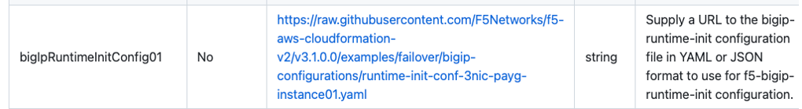

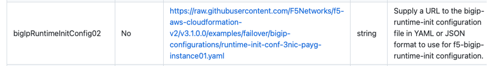

The parent template uses parameters to locate the BIG-IP configurations and Runtime Init.

Examples in bold are what you would need to edit to a reachable endpoint if you are passing the parameters file via the CLI.

```json
{
    "ParameterKey": "bigIpRuntimeInitConfig01",
    "ParameterValue": "https://f5-cft-v2.s3.amazonaws.com/f5-aws-cloudformation-v2/v3.3.0.0/examples/failover/bigip-configurations/runtime-init-conf-3nic-payg-instance01-with-app.yaml"
},
{
    "ParameterKey": "bigIpRuntimeInitConfig02",
    "ParameterValue": "https://f5-cft-v2.s3.amazonaws.com/f5-aws-cloudformation-v2/v3.3.0.0/examples/failover/bigip-configurations/runtime-init-conf-3nic-payg-instance02-with-app.yaml"
},
{
    "ParameterKey": "bigIpRuntimeInitPackageUrl",
    "ParameterValue": "https://cdn.f5.com/product/cloudsolutions/f5-bigip-runtime-init/v1.6.2/dist/f5-bigip-runtime-init-1.6.2-1.gz.run"
}
```


***IMPORTANT:*** The Runtime Init files need to be edited and hosted remotely BEFORE the cloudformation deployment, no matter if you use the web console or CLI installation method. See [customizing and hosting](./README.md#big-ip-configuration) the BIG-IP runtime-init file for more information.  


### F5 BIG-IP Automation Toolchain Files – RPMs to extend BIG-IP actions to AWS

Each BIG-IP will leverage the Runtime Init files above to continue with the bulk of the onboarding, downloadoing additional packages and configuring the system. You can customize the locations Runtime Init uses to download as well. By default, Runtime Init will download the RPMs for BIG-IP DO, BIG-IP AS3, and BIG-IP CFE from public repos. If you want to change these locations (such as a private HTTP endpoints or authenticated S3) you will need to update each of these BIG-IP Runtime Init config files. 


Examples snippet below contains what you would need to customize. 

```yaml
extension_packages: 
  install_operations: 
    - extensionType: do 
      extensionVersion: 1.40.0 
      extensionUrl: https://x-f5-laxs.s3.amazonaws.com/install/f5-declarative-onboarding-1.40.0-8.noarch.rpm 
    - extensionType: as3 
      extensionVersion: 3.47.0 
      extensionUrl: https://x-f5-laxs.s3.amazonaws.com/install/f5-appsvcs-3.47.0-8.noarch.rpm 
    - extensionType: cf 
      extensionVersion: 1.15.0 
      extensionUrl: https://x-f5-laxs.s3.amazonaws.com/install/f5-cloud-failover-1.15.0-0.noarch.rpm
```

Please note that the URL in extensionUrl parameter above cannot be an authenticated url. If you need to pull from an authenticated S3 bucket, you can leverage the **storage** parameter to first download the file to BIG-IP locally:

  ```yaml
  runtime_parameters:
    - name: AWS_TO_FILE
      type: storage
      storageProvider:
        environment: aws
        source: https://mybucket.s3.amazonaws.com/mykey/f5-appsvcs-3.42.0-5.noarch.rpm
        destination: "/var/config/rest/downloads/f5-appsvcs-3.42.0-5.noarch.rpm"
    - name: AWS_TO_FILE_2
      type: storage
      storageProvider:
        environment: aws
        source: s3://mybucket/mykey/asm-policy-v0.0.1.xml
        destination: /var/config/rest/downloads/asm-policy-v0.0.1.xml

  ```

 and then reference the the local file local to the BIG-IP with [file://](../NULL) URL. In this example, the AWS_TO_FILE parameter is renderered as "/var/config/rest/downloads/f5-appsvcs-3.42.0-5.noarch.rpm"; to reference this as a local file URL you must prepend "file://" to the parameter name:

  ```yaml
  extension_packages:
    install_operations:
      - extensionType: as3
        extensionVersion: 3.42.0
        extensionUrl: 'file://{{{AWS_TO_FILE}}}'
  ```

You will also need to update BIG-IP's IAM role in order for BIG-IP to access those S3 Buckets. For more information or examples, etc. please see the Runtime Init [documentation](https://github.com/F5Networks/f5-bigip-runtime-init/blob/main/README.md#runtime_parameters).


## Creating AWS VPC Endpoints for Isolated Environments

So how do we architect for customers that do not want BIG-IP accessing the Internet in any manner? We need deploy [AWS VPC endpoints into the AWS environment](https://docs.aws.amazon.com/whitepapers/latest/aws-privatelink/what-are-vpc-endpoints.html) prior to deploying BIG-IP. In AWS, a VPC endpoint allows access to a service from inside the VPC. This service may be via a gateway endpoint or via a network interface. There are differences in how these operate, and those differences are material to how the system will work.

| Endpoint Type | Method | Notes |
| --- | --- | --- |
| Gateway | Routed to public IP range via internal route table (NO IGW needed). | Must be in the route table that matches the BIG-IP interface TMM default route. Security group rules do not apply. |
| Interface | Network interface from VPC CIDR range | BIG-IP must have a mgmt or TMM route if the network interface is not in shared subnet space; does not require a specific route in the VPC route tables covered by local. Security Group rules apply. Requires the use of the VPC DNS resolver (default for BIG-IP configurations in AWS) |

### Required Endpoints

The following endpoints are required to be deployed into AWS if you are to deploy and operate F5 BIG-IP in an isolated environment.

| Endpoint | Type | Notes |
| --- | --- | --- |
| S3 | Gateway | Route must be in the TMM route table, and in the MGMT route table if hosting deployment files. Required for BIG-IP CFE, and for some BIG-IP TS configs. |
| EC2 | Network Interface | We query this for onboarding and for operation of BIG-IP CFE. |
| Secrets Manager | Network Interface | Retrieve the dynamically generated passwords. |
| CloudFormation | Network Interface | Endpoint to send the CFN complete signal to the template. Can complete running and not timeout. |
| CloudWatch (logs) | Network Interface | Required for Telemetry Streaming. |
| activate.f5.com or *biqiq.customer.com* | Internet | Management route table to deploy BYOL with CFT. Not an AWS endpoint and CANNOT be internal. |

### Example Set of Required Endpoints

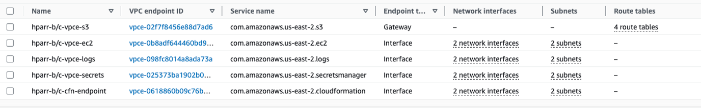

### Placing Network Interface Endpoints

In AWS, the availability zone (AZ) is the fault boundary.  When we place network interface endpoints, there should be one per AZ that our VPC uses. While you can place endpoints in the same subnets as BIG-IP interfaces, users are encouraged to have a services subnet to place items such as endpoints, transit gateway attachments, and other items. While VPC routing is local to the source hypervisor, by moving the endpoint to a dedicated network and creating a logically identical network path from a BIG-IP to any endpoint in any AZ (interface, gateway, destination subnet) and consistent look at both L2 and L3. Additionally, it provides an option to isolate endpoints via network topology. When you deploy these endpoints, the default is to enable DNS resolution for them. Do not change it and ensure that your BIG-IP systems are using the VPC DNS resolver.

### Placing Gateway (Routed Prefix List) Endpoints

This configuration does not consume network interfaces, and the only consideration is how your systems would talk to a public IP address via the TMM routing table and placing the endpoint in the respective VPC routing table. If the default route is on the external VLAN, place the prefix list in the same route table that the ENI matching the external VLAN is in.

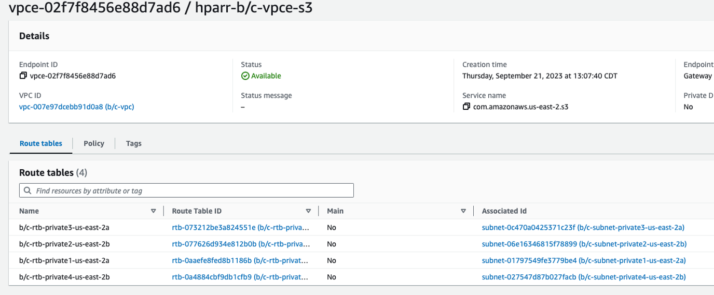

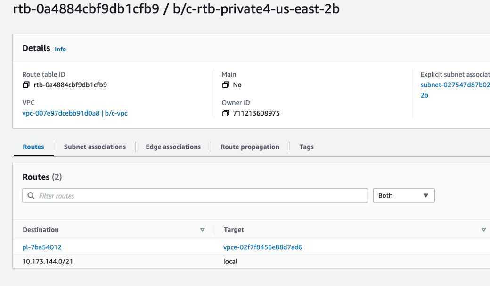

## Example VPC Topology

In the example VPC, all endpoints are deployed in the service network(s). The management subnets have routes to the NAT gateway to activate the license if they are BYOL. Additionally, the management route table has a path to the HTTP endpoint hosting the files. The BIG-IP systems are configured with a default route on the external VLAN which has routes to the S3 gateway endpoints and the services VPC endpoints are leveraged via the local route.

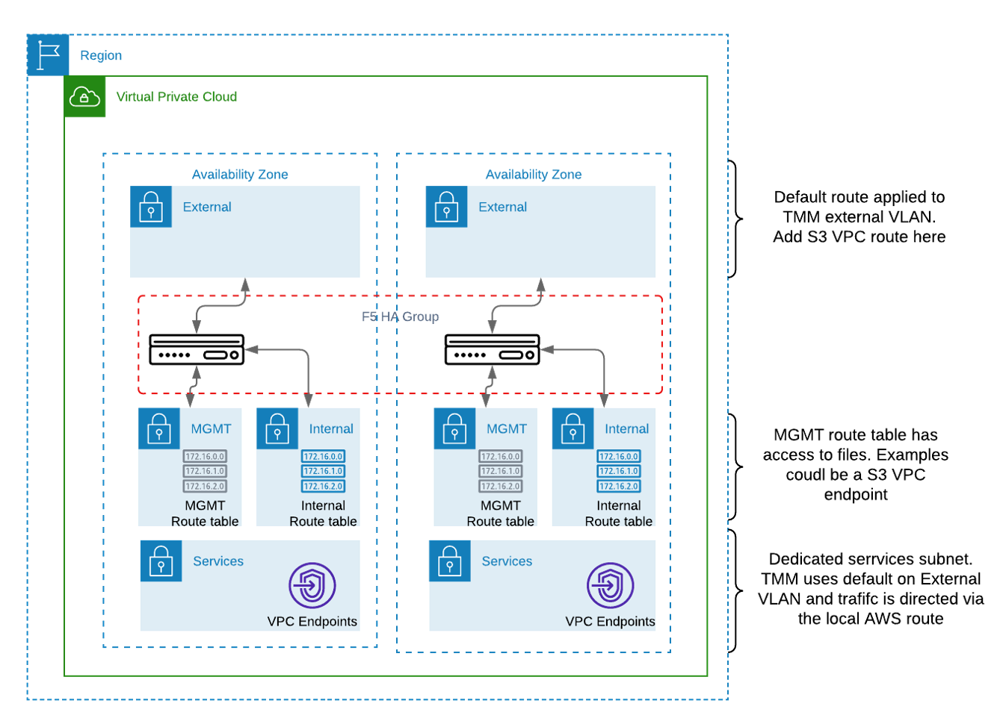

## IAM Role Edits

**Currently under investigation with AWS:** We found our IAM role created in the deployment needs to be updated to work with S3 and BIG-IP CFE. Below we will compare a default template and one that has been edited by **removing the statement containing the aws:PrincipalAccount condition**:

### Default (abbreviated, S3 access issues, non-functional)

```json
{
  "BigIpHighAvailabilityAccessRole": {
      "Condition": "failover",
      "Type": "AWS::IAM::Role",
      "Properties": {
          "Path": "/",
          // The following policy has been abbreviated to show only the affected statements
          "Policies": [
              {
                  "PolicyDocument": {
                      "Statement": [
                          {
                              "Effect": "Allow",
                              "Action": [
                                  "s3:ListAllMyBuckets"
                              ],
                              "Resource": [
                                  "*"
                              ],
                              "Condition": {
                                  "StringEquals": {
                                      "aws:PrincipalAccount": "<my_account_id>"
                                  }
                              }
                          },
                          {
                              "Effect": "Allow",
                              "Action": [
                                  "s3:ListBucket",
                                  "s3:GetBucketLocation",
                                  "s3:GetBucketTagging"
                              ],
                              "Resource": "arn:*:s3:::<my_bucket_id>"
                          }
                      ]
                  }
              }
          ]
      }
  }
}
```

### The abbreviated example below shows the removal of the condition.

```json
{
  "BigIpHighAvailabilityAccessRole": {
      "Condition": "failover",
      "Type": "AWS::IAM::Role",
      "Properties": {
          "Path": "/",
          // The following policy has been abbreviated to show only the affected statements
          "Policies": [
              {
                  "PolicyDocument": {
                      "Statement": [
                          {
                              "Effect": "Allow",
                              "Action": [
                                  "s3:ListAllMyBuckets",
                                  "s3:GetBucketLocation",
                                  "s3:GetBucketTagging"
                              ],
                              "Resource": "*"
                          },
                          {
                              "Effect": "Allow",
                              "Action": [
                                  "s3:ListBucket"
                              ],
                              "Resource": "arn:*:s3:::<my_bucket_id>"
                          }
                      ]
                  }
              }
          ]
      }
  }
}
```