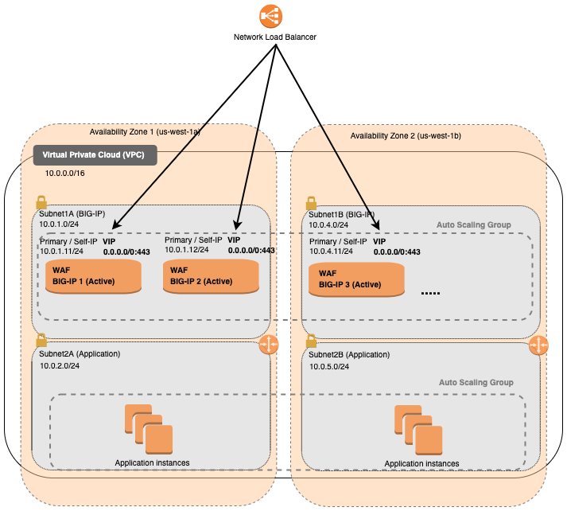

# Deploying the BIG-IP VE in AWS - Example Autoscale BIG-IP WAF (LTM + ASM) - Autoscale Group (Frontend via NLB) - PAYG Licensing

[](https://github.com/f5networks/f5-aws-cloudformation-v2/releases)
[](https://github.com/f5networks/f5-aws-cloudformation-v2/issues)

## Contents

- [Deploying the BIG-IP VE in AWS - Example Autoscale BIG-IP WAF (LTM + ASM) - Autoscale Group (Frontend via NLB) - PAYG Licensing](#deploying-the-big-ip-ve-in-aws---example-auto-scale-big-ip-waf-ltm--asm---autoscale-group-frontend-via-nlb---payg-licensing)
  - [Contents](#contents)
  - [Introduction](#introduction)
  - [Diagram](#diagram)
  - [Prerequisites](#prerequisites)
  - [Important Configuration Notes](#important-configuration-notes)
    - [Template Input Parameters](#template-input-parameters)
    - [Template Outputs](#template-outputs)
    - [Existing Network Template Input Parameters](#existing-network-template-input-parameters)
    - [Existing Network Template Outputs](#existing-network-template-outputs)
  - [Deploying this Solution](#deploying-this-solution)
    - [Deploying via the AWS Launch Stack Button](#deploying-via-the-aws-launch-stack-button)
    - [Deploying via the AWS CLI](#deploying-via-the-aws-cli)
    - [Changing the BIG-IP Deployment](#changing-the-big-ip-deployment)
  - [Validation](#validation)
    - [Validating the Deployment](#validating-the-deployment)
    - [Testing the WAF Service](#testing-the-waf-service)
    - [Viewing the CloudWatch Dashboard](#viewing-the-cloudwatch-dashboard)
    - [Accessing the BIG-IP](#accessing-the-big-ip)
      - [SSH](#ssh)
      - [WebUI](#webui)
    - [Further Exploring](#further-exploring)
      - [WebUI](#webui-1)
      - [SSH](#ssh-1)
  - [Updating this Solution](#updating-this-solution)
  - [Deleting this Solution](#deleting-this-solution)
      - [Deleting this Solution using the AWS Console](#deleting-this-solution-using-the-aws-console)
      - [Deleting this Solution using the AWS CLI](#deleting-this-solution-using-the-aws-cli)
    - [Delete CloudWatch Log groups created by Lambda functions](#delete-cloudwatch-log-groups-created-by-lambda-functions)
      - [Deleting Log Groups using the AWS Console](#deleting-log-groups-using-the-aws-console)
      - [Deleting Log groups using the AWS CLI](#deleting-log-groups-using-the-aws-cli)
  - [Troubleshooting Steps](#troubleshooting-steps)
  - [Security](#security)
  - [BIG-IP Versions](#big-ip-versions)
  - [Documentation](#documentation)
  - [Getting Help](#getting-help)
    - [Filing Issues](#filing-issues)

## Introduction

This solution uses a parent template to launch several linked child templates (modules) to create an example BIG-IP autoscale solution. The linked templates are located in the [examples/modules](https://github.com/F5Networks/f5-aws-cloudformation-v2/tree/main/examples/modules) directory in this repository. **F5 recommends cloning this repository and modifying these templates to fit your use case.** 

***Full Stack (autoscale.yaml)***<br>
Use the *autoscale.yaml* parent template to deploy an example full stack autoscale solution, complete with network, bastion *(optional)*, dag/ingress, access, bigip(s), supporting functions, telemetry destination and application.  

***Existing Network Stack (autoscale-existing-network.yaml)***<br>
Use *autoscale-existing-network.yaml* parent template to deploy the autoscale solution into an existing infrastructure. This template expects VPC, subnets, and bastion host(s) have already been deployed. A demo application is also **NOT** part of this parent template as it intended use is for an existing environment.

The modules below create the following cloud resources:

- **Network**: This template creates AWS VPC and subnets. *(Full stack only)*
- **Bastion**: This template creates a generic example bastion for use when connecting to the management interfaces of BIG-IPs. *(Full stack only)*
- **Application**: This template creates a generic application for use when demonstrating live traffic through the BIG-IP. *(Full stack only)*
- **Disaggregation** *(DAG)*: This template creates resources required to get traffic to the BIG-IP, including AWS Security Groups, Public IP Addresses, internal/external Load Balancers, and accompanying resources such as load balancing rules, NAT rules, and probes.
- **Access**: This template creates IAM Roles, AWS InstanceProfiles and ssh keys.
- **BIG-IP**: This template creates the AWS Autoscale Group with F5 BIG-IP Virtual Editions provisioned with Local Traffic Manager (LTM) and Application Security Manager (ASM). Traffic flows from the AWS load balancer to the BIG-IP VE instances and then to the application servers. The BIG-IP VE(s) are configured in single-NIC mode. Auto scaling means that as certain thresholds are reached, the number of BIG-IP VE instances automatically increases or decreases accordingly. The BIG-IP module template can be deployed separately from the example template provided here into an "existing" stack.
- **Function**: This template creates AWS Lambda functions for revoking licenses from BIG-IP instances that were licensed using a BIG-IQ license pool or utility offer *(BIG-IQ only)*, looking up AMI by name, file cleanup, etc.
- **Telemetry**: This template creates resources to support sending metrics and remote logging (for example, an S3 Bucket or AWS CloudWatch Log Group, Log Stream and Dashboard). 

This solution leverages more traditional Autoscale configuration management practices where each instance is created with an identical configuration as defined in the Autoscale Group's "model" (in other words, "launch config"). Scale Max sizes are no longer restricted to the small limitations of the cluster. The BIG-IP's configuration, now defined in a single convenient YAML or JSON [F5 BIG-IP Runtime Init](https://github.com/F5Networks/f5-bigip-runtime-init) configuration file, leverages [F5 Automation Tool Chain](https://www.f5.com/pdf/products/automation-toolchain-overview.pdf) declarations which are easier to author, validate, and maintain as code. For instance, if you need to change the configuration on the BIG-IPs in the deployment, you update the instance model by passing a new config file (which references the updated Automation Toolchain declarations) via template's bigIpRuntimeInitConfig input parameter. New instances will be deployed with the updated configurations.


## Diagram



## Prerequisites

- Accepted the EULA for the F5 image in the AWS marketplace. If you have not deployed BIG-IP VE in your environment before, search for F5 in the Marketplace and then click **Accept Software Terms**. This only appears the first time you attempt to launch an F5 image. By default, this solution deploys the [F5 BIG-IP BEST with IPI and Threat Campaigns (PAYG, 25Mbps)](https://aws.amazon.com/marketplace/pp/prodview-nlakutvltzij4) images. For more information, see [K14810: Overview of BIG-IP VE license and throughput limits](https://support.f5.com/csp/article/K14810).
- The appropriate permission in AWS to launch CloudFormation (CFT) templates. You must be using an IAM user with the AdministratorAccess policy attached and have permission to create the objects contained in this solution. VPCs, Routes, EIPs, EC2 Instances. For details on permissions and all AWS configuration, see AWS [documentation](https://aws.amazon.com/documentation/). 

- Sufficient **EC2 Resources** to deploy this solution. For more information, see [AWS resource limit documentation](https://docs.aws.amazon.com/AWSEC2/latest/UserGuide/ec2-resource-limits.html).


## Important Configuration Notes

- If you have customized the Runtime Configurations, use the **bigIpRuntimeInitConfig** input parameter to specify the new location of the BIG-IP Runtime-Init config. See [Changing the BIG-IP Deployment](#changing-the-big-ip-deployment) for more BIG-IP customization details.

- To change the BIG-IP image, update the  **bigIpImage** parameter. See [Understanding AMI Lookup Function](../../modules/function/README.md#understanding-ami-lookup-function) for valid string options. For non marketplace custom images (for example, clones or those created by the [F5 BIG-IP Image Generator](https://github.com/f5devcentral/f5-bigip-image-generator/)), update the **bigIpCustomImageId** parameter.

- By default, this solution configures an SSH Key pair in AWS for management access to BIG-IP VE via the **sshKey** parameter. For more information about creating and/or importing the key pair in AWS, see [AWS SSH key documentation](https://docs.aws.amazon.com/AWSEC2/latest/UserGuide/ec2-key-pairs.html). If one is not specified, one will be created for you named `uniqueString-keyPair` *(where uniqueString is the value you provided in the **uniqueString** parameter)*. To obtain the private key, refer to AWS section [To retrieve the private key in plain text](https://docs.aws.amazon.com/AWSCloudFormation/latest/UserGuide/aws-resource-ec2-keypair.html). 
  - For example, you first obtain the key pair ID.
    - If using the AWS Management Console, navigate to *EC2 > Key Pairs > uniqueString-keyPair > ID column*.
    - If using the AWS CLI, you can run the following aws cli [command](https://docs.aws.amazon.com/cli/latest/reference/ec2/describe-key-pairs.html), replacing uniqueString and region with your values:
      ```bash
      aws ec2 describe-key-pairs --key-name ${UNIQUE_STRING}-keyPair --query KeyPairs[*].KeyPairId --output text --region ${REGION}
      ```
  - Then you can use the key pair ID to obtain the private key:
    - If using the AWS Management Console, navigate to *Systems Manager > Parameter Store > click on your /ec2/keypair/${KEY_ID} -> click Show*
    - If using the AWS CLI, you can run the following aws cli [command](https://docs.aws.amazon.com/cli/latest/reference/ssm/get-parameter.html), replacing the key id and region with your values:
      ```bash
      aws ssm get-parameter --name "/ec2/keypair/${KEY_ID}" --with-decryption --query Parameter.Value --output text --region ${REGION}
      ```
  - For more information about accessing the instances with a SSH private key, see Accessing the BIG-IP [below](#ssh). 

- By default, this solution creates required IAM roles, policies, and instance profile. By specifying a value for the **bigIpInstanceProfile** input parameter, you can assign a pre-existing IAM instance profile with applied IAM policy to the BIG-IP instance(s). See AWS IAM [documentation](https://docs.aws.amazon.com/codedeploy/latest/userguide/getting-started-create-iam-instance-profile.html) for more information on creating these resources. See [IAM Permissions by Solution Type](https://github.com/F5Networks/f5-aws-cloudformation-v2/tree/main/examples/modules/access#iam-permissions-by-solution-type) for a detailed list of the permissions required by this solution.

- If you have cloned this repository to modify the templates or BIG-IP config files and published to your own location (NOTE: CloudFormation can only reference S3 bucket locations for templates and not generic URLs like from GitHub), you can use the **s3BucketName**, **s3BucketRegion** and **artifactLocation** input parameters to specify the new location of the customized templates. You may also need to ensure that the user has READ IAM permissions to that bucket. See main [/examples/README.md](../README.md#cloud-configuration) for more template customization details. 

- By default, the example runtime-init configs do not create a password authenticated BIG-IP user as it follows the immutable model (in other words, individual instances are not meant to be actively managed post-deployment, and configuration is instead defined through the model). However, sshKey is required here to provide minimal admin access. 
   -  **Disclaimer:** ***Accessing or logging into the instances themselves is for demonstration and debugging purposes only. All configuration changes should be applied by updating the model via the template instead. See [Changing the BIG-IP Deployment](#changing-the-big-ip-deployment) for more details.***

- In the autoscale model, instances are ephemeral so remote logging is required. By default, this example logs to CloudWatch and creates a Log Group, Log Stream and Dashboard. This solution sends metrics and logs to the following CloudWatch destinations: 
  - metricsNamespace: f5-scaling-metrics 
  - logGroup: f5telemetry
  - logstream: f5-waf-logs

  The default metrics and logging values in this template can only be used once per account as CloudWatch resources must be unique. To deploy more than one of these per account, you must supply unique values for the metricNameSpace, cloudWatchLogGroupName, and cloudWatchLogStreamName input parameters. There also are many possible logging destinations. See AWS [documentation](https://docs.aws.amazon.com/AmazonCloudWatch/latest/logs/Working-with-log-groups-and-streams.html) and [Changing the BIG-IP Deployment](#changing-the-big-ip-deployment) for more details.

- This solution requires Internet Access for: 
    - Downloading additional F5 software components used for onboarding and configuring the BIG-IP (via GitHub.com). By default, this solution provisions Public IPs to enable this but in a production environment, outbound access should be provided by a `routed` SNAT service (for example: NAT Gateway, custom firewall, etc.). *NOTE: access via web proxy is not currently supported. Other options include 1) hosting the file locally and modifying the runtime-init package URL and configuration files to point to local URLs instead or 2) baking them into a custom image, using the [F5 Image Generation Tool](https://clouddocs.f5.com/cloud/public/v1/ve-image-gen_index.html) (BYOL only).*
    - Contacting native cloud services (for example, s3.amazonaws.com, ec2.amazonaws.com, etc.) for various cloud integrations: 
    - *Onboarding*:
        - [F5 BIG-IP Runtime Init](https://github.com/f5networks/f5-bigip-runtime-init) - to fetch secrets from native vault services.
    - *Operation*:
        - [F5 Application Services 3](https://clouddocs.f5.com/products/extensions/f5-appsvcs-extension/latest/) - for features like Service Discovery.
        - [F5 Telemetry Streaming](https://clouddocs.f5.com/products/extensions/f5-telemetry-streaming/latest/) - for logging and reporting.
      - Additional cloud services like [VPC endpoints](https://docs.aws.amazon.com/vpc/latest/privatelink/vpc-endpoints.html) can be used to address calls to native services traversing the Internet.
  - See the [Security](#security) section for more details. 

- In this solution, the BIG-IP VE has the [LTM](https://f5.com/products/big-ip/local-traffic-manager-ltm) and [ASM](https://f5.com/products/big-ip/application-security-manager-asm) modules enabled to provide Advanced Traffic Management and Web Application Security functionality. 

- This solution has specifically been tested in AWS Commercial Cloud. Additional cloud environments such as AWS China cloud have not yet been tested.

- This template can send non-identifiable statistical information to F5 Networks to help us improve our templates. You can disable this functionality for this deployment only by supplying **false** for the value of the **allowUsageAnalytics** input parameter, or you can disable it system-wide by setting the **autoPhonehome** system class property value to false in the F5 Declarative Onboarding declaration. See [Sending statistical information to F5](#sending-statistical-information-to-f5).

- See [Troubleshooting steps](#troubleshooting-steps) for more details.


### Template Input Parameters

**Required** means user input is required because there is no default value or an empty string is not allowed. If no value is provided, the template will fail to launch. In some cases, the default value may only work on the first deployment due to creating a resource in a global namespace and customization is recommended. See the Description for more details. 


| Parameter | Required | Default | Type | Description |
| --- | --- | --- |  --- | --- |
| allowUsageAnalytics | No | true | string | This deployment can send anonymous statistics to F5 to help us determine how to improve our solutions. If you select **false** statistics are not sent. |
| appContainerName | No | f5devcentral/f5-demo-app:latest  | string | The name of the public container used when configuring the application server. If this value is left blank, the application module template is not deployed. |
| application | No | f5app | string | Application Tag. |
| appScalingMaxSize | No | 50 | string | Maximum number of Application instances (2-50) that can be created in the Autoscale Group. |
| appScalingMinSize | No | 1 | string | Minimum number of Application instances (1-49) you want available in the Autoscale Group. |
| artifactLocation | No | f5-aws-cloudformation-v2/v3.1.0.0/examples/  | string | The path in the S3Bucket where the modules folder is located. |
| bastionScalingMaxSize | No | 2 | string | Maximum number of Bastion instances (2-10) that can be created in the Autoscale Group. |
| bastionScalingMinSize | No | 1 | string | Minimum number of Bastion instances (1-9) you want available in the Autoscale Group. |
| bigIpCustomImageId | No |  | string | Provide BIG-IP AMI ID you wish to deploy. bigIpCustomImageId is required when bigIpImage is not specified. Otherwise, can leave empty. |
| bigIpImage | No | \*16.1.3.3-0.0.3 PAYG-Best Plus 25Mbps\*  | string | F5 BIG-IP market place image. See [Understanding AMI Lookup Function](../../modules/function/README.md#understanding-ami-lookup-function) for valid string options. bigIpImage is required when bigIpCustomImageId is not specified. |
| bigIpInstanceProfile | No |  | string | Enter the name of an existing IAM instance profile with applied IAM policy to be associated to the BIG-IP virtual machine(s). Leave default to create a new instance profile. |
| bigIpInstanceType | No | m5.xlarge  | string | Enter valid instance type. |
| bigIpMaxBatchSize | No | 5  | string | Specifies the maximum number of instances that CloudFormation updates. |
| bigIpMinInstancesInService | No | 1 | string | Specifies the minimum number of instances that must be in service within the Auto Scaling group while CloudFormation updates old instances. |
| bigIpPauseTime | No | 480  | string | The amount of time in seconds that CloudFormation pauses after making a change to a batch of instances to give those instances time to start software applications. |
| bigIpRuntimeInitConfig | No | https://f5-cft-v2.s3.amazonaws.com/f5-aws-cloudformation-v2/v3.1.0.0/examples/autoscale/bigip-configurations/runtime-init-conf-payg-with-app.yaml | string | Enter a URL to the bigip-runtime-init configuration file in YAML or JSON format. |
| bigIpRuntimeInitPackageUrl | No | https://cdn.f5.com/product/cloudsolutions/f5-bigip-runtime-init/v1.5.0/dist/f5-bigip-runtime-init-1.5.0-1.gz.run | string | Enter a URL to the bigip-runtime-init package. |
| bigIpScaleInCpuThreshold | No | 20  | string | Low CPU Percentage threshold to begin scaling in BIG-IP VE instances. | 
| bigIpScaleInThroughputThreshold | No | 10000000 | string | Incoming bytes threshold to begin scaling in BIG-IP VE instances. | 
| bigIpScaleOutCpuThreshold | No | 80  | string | High CPU Percentage threshold to begin scaling out BIG-IP VE instances. | 
| bigIpScaleOutThroughputThreshold | No | 20000000 | string | Incoming bytes threshold to begin scaling out BIG-IP VE instances. |
| bigIpScalingMaxSize | No | 50 | string | Maximum number of BIG-IP instances (2-100) that can be created in the Autoscale Group. |
| bigIpScalingMinSize | No | 1 | string | Minimum number of BIG-IP instances (1-99) you want available in the Autoscale Group. |
| bigIpSecretArn | No |  | string | The ARN of a Secrets Manager secret to create READ permissions for. For example, if customizing your runtime-init config with an admin password, logging credential, etc. |
| cloudWatchLogGroupName | No | f5telemetry | string | The name of the CloudWatch Log Group. Note: The name is global for a region. |
| cloudWatchLogStreamName | No | f5-waf-logs  | string | The name of the CloudWatch Log Stream. |
| cloudWatchDashboardName | No | F5-BIGIP-WAF-View  | string | The name of the CloudWatch Log Dashboard. The name is global for a region. |
| cost | No | f5cost  | string | Cost Center Tag. |
| createLogDestination | No | true | string | Select true to create a new CloudWatch logging destination. |
| environment | No | f5env | string | Environment Tag. |
| group | No | f5group  | string | Group Tag. |
| loggingS3BucketName | No |   | string | The name of the S3 bucket where BIG-IP logs will be sent. |
| metricNameSpace | **Yes** |   | string | CloudWatch namespace used for custom metrics. This should match the namespace defined in your Telemetry Streaming declaration within bigipRuntimInitConfig. |
| notificationEmail | **Yes** |   | string | Valid email address to send Autoscaling event notifications. |
| numAzs | No | 2  | string | Number of Availability Zones to use in the VPC. The region must support the number of availability zones entered. The minimum is 1 and the maximum is 4. |
| numSubnets | No | 3  | string | Number of subnets per Availability Zone to create. Subnets are labeled `subnetx` where x is the subnet number. The minimum is 2 and the maximum is 8. In a case when BIG-IP has no public IP, |numSubnets needs to be set to 3 |
| owner | No | f5owner | string | Application Tag. |
| provisionExternalBigipLoadBalancer | No | true | string | Flag to provision external Load Balancer. |
| provisionInternalBigipLoadBalancer | No | false  | string | Flag to provision internal Load Balancer. |
| provisionPublicIp | No | true  | string | Whether or not to provision Public IP Addresses for the BIG-IP Management Network Interface. By default, Public IP addresses are provisioned. See the restrictedSrcAddressMgmt parameter below. If set to false, a bastion host tier will be provisioned instead. See [diagram](diagrams/diagram-w-bastion.png). |
| restrictedSrcAddressMgmt | **Yes** |   | string | An IP address or address range (in CIDR notation) used to restrict SSH and management GUI access to the BIG-IP Management or bastion host instances. **IMPORTANT**: The VPC CIDR is automatically added for internal use (access via bastion host, clustering, etc.). Please do NOT use "0.0.0.0/0". Instead, restrict the IP address range to your client or trusted network, for example "55.55.55.55/32". Production should never expose the BIG-IP Management interface to the Internet. |
| restrictedSrcAddressApp | **Yes** |   | string | An IP address range (CIDR) that can be used to restrict access web traffic (80/443) to the BIG-IP instances, for example 'X.X.X.X/32' for a host, '0.0.0.0/0' for the Internet, etc. **NOTE**: The VPC CIDR is automatically added for internal use. |
| s3BucketRegion | No | us-east-1 | string | The AWS Region for the S3 bucket containing the templates. |
| s3BucketName | No |  f5-cft-v2 | string | The S3 bucket containing the templates. The S3 bucket name can include numbers, lowercase letters, uppercase letters, and hyphens (-). It cannot start or end with a hyphen (-). |
| snsEvents | No | autoscaling:EC2_INSTANCE_LAUNCH,autoscaling:EC2_INSTANCE_LAUNCH_ERROR  | string | Provides list of SNS Topics used on Autoscale Group. | 
| sshKey | No |   | string | Supply the key pair name as listed in AWS that will be used for SSH authentication to the BIG-IP virtual machines. Example: ``myAWSkey``. If a value is not provided, one will will be created using the value of the uniqueString input parameter. Example: ``uniqueString-keyPair``.  |
| subnetMask | No | 24 | string | Mask for subnets. Valid values include 16-28. Note: supernetting of VPC occurs based on the mask provided; therefore, number of networks must be greater than or equal to the number of subnets created. |
| uniqueString | No | myuniqstr  | string | A prefix that will be used to name template resources. Because some resources require globally unique names, we recommend using a unique value. Must contain between 1 and 12 lowercase alphanumeric characters with first character as a letter. |
| vpcCidr | No | 10.0.0.0/16 | string | CIDR block for the VPC. |

### Template Outputs

| Name | Type |  Description |
| --- | --- | --- |
| appAutoScaleGroupName | string | Application Autoscale Group Name |
| bastionAutoscaleGroupName | string | Application Autoscale Group Name |
| bigIpAutoScaleGroupName | string | BIG-IP Autoscale Group Name |
| bigIpKeyPairName | SSH Key Pair | string | SSH key pair name. |
| wafExternalDnsName | string | WAF External DNS Name |
| wafExternalHttpsUrl | string | WAF External HTTPS URL |
| wafInternalDnsName | string | WAF Internal DNS Name | 
| wafInternalHttpsUrl | string | WAF Internal HTTPS URL |
| amiId | string | AMI Id |


### Existing Network Template Input Parameters

| Parameter | Required | Default | Type | Description |
| --- | --- | --- |  --- | --- |
| allowUsageAnalytics | No | true | string | This deployment can send anonymous statistics to F5 to help us determine how to improve our solutions. If you select **false** statistics are not sent. |
| appContainerName | No | f5devcentral/f5-demo-app:latest  | string | The name of the public container used when configuring the application server. If this value is left blank, the application module template is not deployed. |
| application | No | f5app | string | Application Tag. |
| appScalingMaxSize | No | 50 | string | Maximum number of Application instances (2-50) that can be created in the Autoscale Group. |
| appScalingMinSize | No | 1 | string | Minimum number of Application instances (1-49) you want available in the Autoscale Group. |
| artifactLocation | No | f5-aws-cloudformation-v2/v3.1.0.0/examples/  | string | The path in the S3Bucket where the modules folder is located. |
| bastionScalingMaxSize | No | 2 | string | Maximum number of Bastion instances (2-10) that can be created in the Autoscale Group. |
| bastionScalingMinSize | No | 1 | string | Minimum number of Bastion instances (1-9) you want available in the Autoscale Group. |
| bigIpCustomImageId | No |  | string | Provide BIG-IP AMI ID you wish to deploy. bigIpCustomImageId is required when bigIpImage is not specified. Otherwise, can leave empty. |
| bigIpImage | No | \*16.1.3.3-0.0.3 PAYG-Best Plus 25Mbps\*  | string | F5 BIG-IP market place image. See [Understanding AMI Lookup Function](../../modules/function/README.md#understanding-ami-lookup-function) for valid string options. bigIpImage is required when bigIpCustomImageId is not specified. |
| bigIpInstanceProfile | No |  | string | Enter the name of an existing IAM instance profile with applied IAM policy to be associated to the BIG-IP virtual machine(s). Leave default to create a new instance profile. |
| bigIpInstanceType | No | m5.xlarge  | string | Enter valid instance type. |
| bigIpMaxBatchSize | No | 5  | string | Specifies the maximum number of instances that CloudFormation updates. |
| bigIpMinInstancesInService | No | 1 | string | Specifies the minimum number of instances that must be in service within the Auto Scaling group while CloudFormation updates old instances. |
| bigIpPauseTime | No | 480  | string | The amount of time in seconds that CloudFormation pauses after making a change to a batch of instances to give those instances time to start software applications. |
| bigIpRuntimeInitConfig | No | https://f5-cft-v2.s3.amazonaws.com/f5-aws-cloudformation-v2/v3.1.0.0/examples/autoscale/bigip-configurations/runtime-init-conf-payg-with-app.yaml  | string | Enter a URL to the bigip-runtime-init configuration file in YAML or JSON format. |
| bigIpRuntimeInitPackageUrl | No | https://cdn.f5.com/product/cloudsolutions/f5-bigip-runtime-init/v1.5.0/dist/f5-bigip-runtime-init-1.5.0-1.gz.run | string |Enter a URL to the bigip-runtime-init package. |
| bigIpScaleInCpuThreshold | No | 20  | string | Low CPU Percentage threshold to begin scaling in BIG-IP VE instances. | 
| bigIpScaleInThroughputThreshold | No | 10000000 | string | Incoming bytes threshold to begin scaling in BIG-IP VE instances. | 
| bigIpScaleOutCpuThreshold | No | 80  | string | High CPU Percentage threshold to begin scaling out BIG-IP VE instances. | 
| bigIpScaleOutThroughputThreshold | No | 20000000 | string | Incoming bytes threshold to begin scaling out BIG-IP VE instances. |
| bigIpScalingMaxSize | No | 50 | string | Maximum number of BIG-IP instances (2-100) that can be created in the Autoscale Group. |
| bigIpScalingMinSize | No | 1 | string | Minimum number of BIG-IP instances (1-99) you want available in the Autoscale Group. |
| bigIpSecretArn | No |  | string | The ARN of a Secrets Manager secret to create READ permissions for. For example, if customizing your runtime-init config with an admin password, logging credential, etc. |
| bigIpSubnetAz1 | **Yes** |   | string | Availability Zone 1 BIG-IP Subnet ID. |
| bigIpSubnetAz2 | **Yes** |   | string | Availability Zone 2 BIG-IP Subnet ID. |
| cloudWatchLogGroupName | No | f5telemetry | string | The name of the CloudWatch Log Group. Note: The name is global for a region. Will be added to IAM role. |
| cloudWatchLogStreamName | No | f5-waf-logs  | string | The name of the CloudWatch Log Stream. |
| cloudWatchDashboardName | No | F5-BIGIP-WAF-View  | string | The name of the CloudWatch Log Dashboard. The name is global for a region. |
| cost | No | f5cost  | string | Cost Center Tag. |
| createLogDestination | No | true | string | Select true to create a new CloudWatch logging destination. |
| environment | No | f5env | string | Environment Tag. |
| externalSubnetAz1 | No |   | string | Availability Zone 1 External Subnet ID. Required if you are provisioning an external load balancer. |
| externalSubnetAz2 | No |   | string | Availability Zone 2 External Subnet ID. Required if you are provisioning an external load balancer. |
| internalSubnetAz2 | No |   | string | Availability Zone 1 Internal Subnet ID. Required if you are provisioning an internal load balancer. |
| internalSubnetAz2 | No |   | string | Availability Zone 2 Internal Subnet ID. Required if you are provisioning an internal load balancer. |
| group | No | f5group  | string | Group Tag. |
| loggingS3BucketName | No |   | string | The name of the S3 bucket where BIG-IP logs will be sent. |
| metricNameSpace | **Yes** |   | string | CloudWatch namespace used for custom metrics. This should match the namespace defined in your Telemetry Streaming declaration within bigipRuntimInitConfig. |
| notificationEmail | **Yes** |   | string | Valid email address to send Autoscaling event notifications. |
| numAzs | No | 2  | string | Number of Availability Zones to use in the VPC. The region must support the number of availability zones entered. The minimum is 1 and the maximum is 4. |
| numSubnets | No | 3  | string | Number of subnets per Availability Zone to create. Subnets are labeled `subnetx` where x is the subnet number. The minimum is 2 and the maximum is 8. In a case when BIG-IP has no public IP, |numSubnets needs to be set to 3 |
| owner | No | f5owner  | string | Application Tag. |
| provisionExternalBigipLoadBalancer | No | true | string | Flag to provision external Load Balancer. |
| provisionInternalBigipLoadBalancer | No | false  | string | Flag to provision internal Load Balancer. |
| provisionPublicIp | No | true  | string | Whether or not to provision Public IP Addresses for the BIG-IP Management Network Interface. By default, Public IP addresses are provisioned. See the restrictedSrcAddressMgmt parameter below. If set to false, a bastion host tier will be provisioned instead. See [diagram](diagrams/diagram-w-bastion.png). |
| restrictedSrcAddressMgmt | **Yes** |   | string | An IP address or address range (in CIDR notation) used to restrict SSH and management GUI access to the BIG-IP Management or bastion host instances. **IMPORTANT**: The VPC CIDR is automatically added for internal use (access via bastion host, clustering, etc.). Please do NOT use "0.0.0.0/0". Instead, restrict the IP address range to your client or trusted network, for example "55.55.55.55/32". Production should never expose the BIG-IP Management interface to the Internet. |
| restrictedSrcAddressApp | **Yes** |   | string | An IP address range (CIDR) that can be used to restrict access web traffic (80/443) to the BIG-IP instances, for example 'X.X.X.X/32' for a host, '0.0.0.0/0' for the Internet, etc. **NOTE**: The VPC CIDR is automatically added for internal use. |
| s3BucketRegion | No | us-east-1 | string | The AWS Region for the S3 bucket containing the templates. |
| s3BucketName | No |  f5-cft-v2 | string | The S3 bucket containing the templates. The S3 bucket name can include numbers, lowercase letters, uppercase letters, and hyphens (-). It cannot start or end with a hyphen (-). |
| snsEvents | No | autoscaling:EC2_INSTANCE_LAUNCH,autoscaling:EC2_INSTANCE_LAUNCH_ERROR  | string | Provides list of SNS Topics used on Autoscale Group. | 
| sshKey | No |   | string | Supply the key pair name as listed in AWS that will be used for SSH authentication to the BIG-IP virtual machines. Example: ``myAWSkey``. If a value is not provided, one will will be created using the value of the uniqueString input parameter. Example: ``uniqueString-keyPair``.  |
| subnetMask | No | 24 | string | Mask for subnets. Valid values include 16-28. Note: supernetting of VPC occurs based on the mask provided; therefore, number of networks must be greater than or equal to the number of subnets created. |
| uniqueString | No | myuniqstr  | string | A prefix that will be used to name template resources. Because some resources require globally unique names, we recommend using a unique value. Must contain between 1 and 12 lowercase alphanumeric characters with first character as a letter. |
| vpcCidr | No | 10.0.0.0/16 | string | CIDR block for the VPC. |
| vpcId | **Yes** |   | string | ID for the existing VPC. |

### Existing Network Template Outputs

| Name | Type | Description |
| --- | --- | --- |
| bigIpAutoScaleGroupName | string | BIG-IP Autoscale Group Name |
| bigIpKeyPairName | SSH Key Pair | string | SSH key pair name. |
| wafExternalDnsName | string | WAF External DNS Name |
| wafExternalHttpsUrl | string | WAF External HTTPS URL |
| wafInternalDnsName | string | WAF Internal DNS Name |
| wafInternalHttpsUrl | string | WAF Internal HTTPS URL |
| amiId | string | AMI Id |


## Deploying this Solution

See [Prerequisites](#prerequisites) before you begin.
 
Two options for deploying this solution include:
  - Using the [Launch Stack button](#deploying-via-the-aws-launch-stack-button)
  - Using the [AWS CLI](#deploying-via-the-aws-cli)

### Deploying via the AWS Launch Stack Button

The easiest way to deploy this CloudFormation template is to use the Launch button.<br>
**Important**: By default, the link takes you to an AWS console set to the us-east-1 region. Select the AWS region (upper right) in which you want to deploy after clicking the Launch Stack button. 

**Full Stack**
<a href="https://console.aws.amazon.com/cloudformation/home?region=us-east-1#/stacks/new?stackName=BigIp-Autoscale-WAF-Example&templateURL=https://f5-cft-v2.s3.amazonaws.com/f5-aws-cloudformation-v2/v3.1.0.0/examples/autoscale/payg/autoscale.yaml">
    </a>

**Existing Stack**
<a href="https://console.aws.amazon.com/cloudformation/home?region=us-east-1#/stacks/new?stackName=BigIp-Autoscale-WAF-Example&templateURL=https://f5-cft-v2.s3.amazonaws.com/f5-aws-cloudformation-v2/v3.1.0.0/examples/autoscale/payg/autoscale-existing-network.yaml">
    </a>

*Step 1: Specify template* 
  - Click "Next".

*Step 2: Specify stack details* 
  - Fill in the *REQUIRED* parameters. 
    - **sshKey**
    - **restrictedSrcAddressMgmt**
    - **restrictedSrcAddressApp**
    - **uniqueString**
    - **notificationEmail**
  - And any network related parameters if deploying the autoscale-existing-network.yaml template:
    - **bigIpRuntimeInitConfig** (Customization always required. See [Changing the BIG-IP Deployment](#changing-the-big-ip-deployment) below)
    - **bigIpSubnetAz1**
    - **bigIpSubnetAz2**
    - **vpcId**
  - Click "Next".

*Step 3: Configure Stack Options*
  - Click "Next".

*Step 4: Review*
  - **Capabilities** > Check "Acknowledgement" Boxes
  - Click "Create Stack".

For next steps, see [Validating the Deployment](#validating-the-deployment).


### Deploying via the AWS CLI]

By default, the templates in this repository are also publicly hosted on S3 at [https://f5-cft-v2.s3.amazonaws.com/f5-aws-cloudformation-v2/[VERSION]/](https://f5-cft-v2.s3.amazonaws.com/f5-aws-cloudformation-v2/). If you want deploy the template using the [AWS CLI](https://docs.aws.amazon.com/cli/latest/userguide/cli-chap-welcome.html), provide url of the parent template and REQUIRED parameters:

```bash
 aws cloudformation create-stack --region ${REGION} --stack-name ${STACK_NAME} \
  --template-url https://f5-cft-v2.s3.amazonaws.com/f5-aws-cloudformation-v2/v3.1.0.0/examples/autoscale/payg/autoscale.yaml \
  --parameters "ParameterKey=<KEY>,ParameterValue=<VALUE> ParameterKey=<KEY>,ParameterValue=<VALUE>" \
  --capabilities CAPABILITY_NAMED_IAM
```

or with a local parameters file (see `autoscale-parameters.json` example in this directory):
```bash
 aws cloudformation create-stack --region ${REGION} --stack-name ${STACK_NAME} \
  --template-url https://f5-cft-v2.s3.amazonaws.com/f5-aws-cloudformation-v2/v3.1.0.0/examples/autoscale/payg/autoscale.yaml \
  --parameters file://autoscale-parameters.json \
  --capabilities CAPABILITY_NAMED_IAM
```

Example:

**Full Stack**
```bash
 aws cloudformation create-stack --region us-east-1 --stack-name mywaf \
  --template-url https://f5-cft-v2.s3.amazonaws.com/f5-aws-cloudformation-v2/v3.1.0.0/examples/autoscale/payg/autoscale.yaml \
  --parameters "ParameterKey=sshKey,ParameterValue=MY_SSH_KEY_NAME ParameterKey=restrictedSrcAddressMgmt,ParameterValue=55.55.55.55/32 ParameterKey=restrictedSrcAddressApp,ParameterValue=0.0.0.0/0 ParameterKey=uniqueString,ParameterValue=mywaf ParameterKey=notificationEmail,ParameterValue=myemail@example.com" \
  --capabilities CAPABILITY_NAMED_IAM
```
**Existing Stack**
```bash
 aws cloudformation create-stack --region us-east-1 --stack-name mywaf \
  --template-url https://f5-cft-v2.s3.amazonaws.com/f5-aws-cloudformation-v2/v3.1.0.0/examples/autoscale/payg/autoscale-existing-network.yaml \
  --parameters "ParameterKey=sshKey,ParameterValue=MY_SSH_KEY_NAME ParameterKey=restrictedSrcAddressMgmt,ParameterValue=55.55.55.55/32 ParameterKey=restrictedSrcAddressApp,ParameterValue=0.0.0.0/0 ParameterKey=uniqueString,ParameterValue=mywaf ParameterKey=notificationEmail,ParameterValue=myemail@example.com ParameterKey=bigIpSubnetAz1,ParameterValue=<SUBNET ID> ParameterKey=bigIpSubnetAz2,ParameterValue=<SUBNET ID> ParameterKey=vpcId,ParameterValue=<VPC ID>" \
  --capabilities CAPABILITY_NAMED_IAM
```

For next steps, see [Validating the Deployment](#validating-the-deployment).


### Changing the BIG-IP Deployment


You will most likely want or need to change the BIG-IP configuration. This generally involves referencing or customizing a [F5 BIG-IP Runtime Init](https://github.com/f5networks/f5-bigip-runtime-init) configuration file and passing a new URL through the **bigIpRuntimeInitConfig** template parameter. 

Example from autoscale-parameters.json
```json
  {
    "ParameterKey": "bigIpRuntimeInitConfig",
    "ParameterValue": "https://f5-cft-v2.s3.amazonaws.com/f5-aws-cloudformation-v2/v3.1.0.0/examples/autoscale/bigip-configurations/runtime-init-conf-payg-with-app.yaml"
  },
```
  - **IMPORTANT**: Any URLs pointing to git **must** use the raw file format (for example, "raw.githubusercontent.com")

F5 has provided the following example configuration files in the `examples/autoscale/bigip-configurations` folder:

- `runtime-init-conf-bigiq-with-app.yaml` - This configuration file installs packages and creates WAF-protected services for a BIG-IQ licensed deployment based on the Automation Toolchain declaration URLs listed above.
- `runtime-init-conf-payg-with-app.yaml` - This inline configuration file installs packages and creates WAF-protected services for a PAYG licensed deployment.
- `Rapid_Deployment_Policy_13_1.xml` - This ASM security policy is supported for BIG-IP 13.1 and later.

See [F5 BIG-IP Runtime Init](https://github.com/f5networks/f5-bigip-runtime-init) for more examples.

**IMPORTANT**: 
By default, this solution references the `runtime-init-conf-payg-with-app.yaml` example BIG-IP config file.
  - The **Full Stack** (autoscale.yaml) can use this file as is. This example configuration does not require any modifications to deploy successfully *(Disclaimer: "Successfully" implies the template deploys without errors and deploys BIG-IP WAFs capable of passing traffic. To be fully functional as designed, you would need to have satisfied the [Prerequisites](#prerequisites))*. However, in production, these files would commonly be customized. Some examples of small customizations or modifications are provided below. 
  - The **Existing Network Stack** (autoscale-existing-network.yaml) always **requires** customizing this file (with a Virtual Service configuration pointing at your own application) and republished before deploying.


**Example Customization 1:**

To change the Virtual Service configuration:
  1. Edit/modify the Application Services 3 (AS3) declaration in the example runtime-init config file ` [runtime-init-conf-payg-with-app.yaml](../bigip-configurations/runtime-init-conf-payg-with-app.yaml) to point at your own application. 

      Example: At a minimum, update the Pool class:
      ```yaml
                  shared_pool:
                    class: Pool
                    remark: Service 1 shared pool
                    members:
                      - servicePort: 80
                        addressDiscovery: aws
                        region: '{{{REGION}}}'
                        updateInterval: 60
                        tagKey: 'aws:cloudformation:logical-id'
                        tagValue: appAutoscaleGroup
                        addressRealm: private
                    monitors:
                      - http
      ```
      with: 
      ```yaml
                  shared_pool:
                    class: Pool
                    remark: Service 1 shared pool
                    members:
                      - servicePort: 80
                        addressDiscovery: aws
                        region: '{{{REGION}}}'
                        updateInterval: 60
                        tagKey: <TAG KEY ON YOUR APPLICATION>
                        tagValue: <TAG VALUE ON YOUR APPLICATION>
                        addressRealm: private
                    monitors:
                      - http
      ```

      Or even with another pool configuration entirely. For example, using the [FQDN](https://clouddocs.f5.com/products/extensions/f5-appsvcs-extension/latest/declarations/discovery.html#using-an-fqdn-pool-to-identify-pool-members) Service Discovery instead to point to a DNS name.

      Example:
      ```yaml
                      class: Pool
                      remark: Service 1 shared pool
                      members:
                      - addressDiscovery: fqdn
                        autoPopulate: true
                        hostname: <WWW.YOURSITE.COM>
                        servicePort: 80
      ```

      See AS3 [documentation](https://clouddocs.f5.com/products/extensions/f5-appsvcs-extension/latest/userguide/composing-a-declaration.html) for more details and examples.

  3. Publish/host the customized runtime-init config file at a location reachable by the BIG-IP at deploy time (for example, S3, git, etc.).
  4. Update the **bigIpRuntimeInitConfig** input parameter to reference the URL of the customized configuration file.


**Example Customization 2:**

By default, this solution sends metrics and logs to the following CloudWatch destinations: 

  - metricsNamespace: f5-scaling-metrics 
  - logGroup: f5telemetry
  - logstream: f5-waf-logs

To log to an S3 Bucket instead:
  1. Ensure the target S3 Logging destination exists in the same region. See AWS [documentation](https://docs.aws.amazon.com/AmazonS3/latest/userguide/creating-buckets-s3.html) for more information.
  2. Edit/modify the Telemetry Streaming (TS) declaration in the example runtime-init config file in the corresponding `payg` [runtime-init-conf-payg-with-app.yaml](../bigip-configurations/runtime-init-conf-payg-with-app.yaml) with the new `Telemetry_Consumer` configuration.

      Example: Replace 
      ```yaml
              My_Cloudwatch_Logs:
                class: Telemetry_Consumer
                type: AWS_CloudWatch
                region: '{{{ REGION }}}'
                logGroup: f5telemetry
                logStream: f5-waf-logs
      ```
      with: 
      ```yaml
              My_S3_Logs:
                class: Telemetry_Consumer
                type: AWS_S3
                region: '{{{ REGION }}}'
                bucket: <YOUR_BUCKET_NAME>
      ```
  3. Publish/host the customized runtime-init config file at a location reachable by the BIG-IP at deploy time (for example, S3, git, etc.).
  4. Update the **bigIpRuntimeInitConfig** input parameter to reference the URL of the customized configuration file.
  5. Update the **loggingS3BucketName** input parameter with name of your logging destination. 
      - An IAM role will be created with permissions to log to that bucket.

To log to another remote destination that may require authentication:
  1. Edit/modify the `runtime_parameters:` in the runtime-init config file to ADD a secret. If a secret is provided via the **bigIpSecretArn** parameter, it will made available on the BIG-IP via a file called `/config/cloud/secret_id`. For example: Add the section below. 

      ```yaml
        - name: SECRET_ID
          type: url
          value: file:///config/cloud/secret_id
        - name: LOGGING_API_KEY
          type: secret
          secretProvider:
            type: SecretsManager
            environment: aws
            version: AWSCURRENT
            secretId: '{{{SECRET_ID}}}'
      ```
  2. Edit/modify the Telemetry Streaming (TS) declaration in the example runtime-init config with the new `Telemetry_Consumer` configuration, replacing `<YOUR_HOST>` with value for your host.

      ```yaml
              My_Consumer:
                class: Telemetry_Consumer
                type: Splunk
                host: <YOUR_HOST>
                protocol: https
                port: 8088
                passphrase:
                  cipherText: '{{{LOGGING_API_KEY}}}'
                compressionType: gzip
      ```
  3. Publish/host the customized runtime-init config file at a location reachable by the BIG-IP at deploy time (for example, S3, git, etc.).
  4. Update the **bigIpRuntimeInitConfig** input parameter to reference the URL of the customized configuration file.
  5. Update the **bigIpSecretArn** input parameter with the ARN of your logging secret.
     - An IAM role will be created with permissions to fetch that secret.

Also see the [BIG-IQ autoscale example](../bigiq/README.md) for how to pass a secret from secret manager and [F5 BIG-IP Runtime Init](https://github.com/f5networks/f5-bigip-runtime-init) for more examples.


## Validation

This section describes how to validate the template deployment, test the WAF service, and troubleshoot common problems.

### Validating the Deployment

To view the status of the example and module stack deployments in the AWS Console, navigate to **CloudFormation > Stacks > *Your stack name***. You should see a series of stacks, including one for the Parent Quickstart template as well as the Network, Application, DAG, BIG-IP nested templates. The creation status for each stack deployment should be "CREATE_COMPLETE".

Expected Deploy time for entire stack =~ 15 minutes.

If any of the stacks are in a failed state, proceed to the [Troubleshooting Steps](#troubleshooting-steps) section below.


### Testing the WAF Service

To test the WAF service, perform the following steps:

1. Obtain the address of the WAF service:

  - **Console**: Navigate to **CloudFormation > *STACK_NAME* > Outputs > *wafExternalHttpsUrl***. 
  - **AWS CLI**: 
      ```bash
      aws cloudformation describe-stacks --region ${REGION} --stack-name ${STACK_NAME}  --query  "Stacks[0].Outputs[?OutputKey=='wafExternalHttpsUrl'].OutputValue" --output text
      ```

2. Verify the application is responding:

  - Paste the IP address in a browser: ```https://${IP_ADDRESS_FROM_OUTPUT}```
      - *NOTE: By default the Virtual Service starts with a self-signed cert. Follow your browser's instructions for accepting self-signed certs (for example, if using Chrome, click inside the page and type this "thisisunsafe". If using Firefox, click "Advanced" button, click "Accept Risk and Continue", etc.).*
  - Use curl: 
      ```shell
       curl -sko /dev/null -w '%{response_code}\n' https://${IP_ADDRESS_FROM_OUTPUT}
       ```

3. Verify the WAF is configured to block illegal requests:
    ```shell
    curl -sk -X DELETE https://${IP_ADDRESS_FROM_OUTPUT}
    ```
   The response should include a message that the request was blocked, and a reference support ID. 

    Example:
    ```shell
    $ curl -sko /dev/null -w '%{response_code}\n' https://55.55.55.55
    200
    $ curl -sk -X DELETE https://55.55.55.55
    <html><head><title>Request Rejected</title></head><body>The requested URL was rejected. Please consult with your administrator.<br><br>Your support ID is: 2394594827598561347<br><br><a href='javascript:history.back();'>[Go Back]</a></body></html>
    ```

### Viewing the CloudWatch Dashboard

 - If left at the defaults, a CloudWatch Dashboard named "F5-BIGIP-WAF-View" is created. 
    - **Console**: Navigate to **CloudWatch > *DASHBOARD_NAME***.
      - Review any violations.


### Accessing the BIG-IP

As mentioned in [Configuration notes](#important-configuration-notes), by default, this solution does not create a password authenticated user and accessing or logging into the instances themselves is for demonstration or debugging purposes only.

From Template Outputs:
  - **Console**: Navigate to **CloudFormation > *STACK_NAME* > Outputs**.
  - **AWS CLI**: 
      ```bash
      aws cloudformation describe-stacks --region ${REGION} --stack-name ${STACK_NAME}  --query  "Stacks[0].Outputs"
      ```

  - Obtain an Instance ID of one of the instances from the BIG-IP Autoscale Group:
    - **Console**:
      - Navigate to **CloudFormation > *STACK_NAME* > Outputs > *bigIpAutoscaleGroupName***. 
      - Navigate to **EC2 > Autos Scaling Groups > *bigIpAutoscaleGroupName* > Instance Management**
    - **AWS CLI**: 
        ```bash
        aws cloudformation describe-stacks --region ${REGION} --stack-name ${STACK_NAME} --query  "Stacks[0].Outputs[?OutputKey=='bigIpAutoscaleGroupName'].OutputValue" --output text
        ```
        ```bash
        aws autoscaling describe-auto-scaling-groups --region ${REGION} --auto-scaling-group-name ${bigIpAutoscaleGroup} --query 'AutoScalingGroups[*].Instances[*]'
        ```

  - Obtain the Public IP address of the BIG-IP Management Port:
      - **Console**: Navigate to **EC2 > Instances > *INSTANCE_ID* > Instance Summary > Public IPv4 address**.
      - **AWS CLI**: 
        - Public IPs: 
            ```bash
            aws ec2 describe-instances --region ${REGION} --filters "Name=instance-state-name,Values=running" "Name=instance-id,Values=${INSTANCE_ID}" --query 'Reservations[*].Instances[*].[PublicIpAddress]' --output text
            ```

  - Or if you are going through a bastion host (when **provisionPublicIP** = **false**):
      - Follow steps above for the BIG-IP but substitute **bigIpAutoscaleGroup** with **bastionAutoscaleGroupName** 
         - Obtain an Instance ID of one of the Bastion Host instances
         - Obtain the Public IP of the Bastion Host instance

       - Obtain the Private IP address of the BIG-IP host instead: 
         -  **Console**: Navigate to **EC2 > Instances > *INSTANCE_ID* > Instance Summary > Public IPv4 address**.
         -  **AWS CLI**: 
         - Private IPs: 
              ```bash
              aws ec2 describe-instances --region ${REGION} --filters "Name=instance-state-name,Values=running" "Name=instance-id,Values=${INSTANCE_ID}" --query 'Reservations[*].Instances[*].[PrivateIpAddress]' --output text
              ```
#### SSH

  - **SSH key authentication**: 
      ```bash
      # (Optional) If you did not provide the name of an existing SSH key pair, you must retrieve the private key before connecting
      REGION=us-east-1
      UNIQUE_STRING=myuniqstr
      YOUR_PRIVATE_SSH_KEY=${UNIQUE_STRING}-private-key.pem

      # Retrieve the key pair ID
      KEY_ID=$(aws ec2 describe-key-pairs --key-name ${UNIQUE_STRING}-keyPair --query KeyPairs[*].KeyPairId --output text --region ${REGION})
      # Uses key Pair ID to retrieve the private key and save to a file for SSH client
      aws ssm get-parameter --name "/ec2/keypair/${KEY_ID}" --with-decryption --query Parameter.Value --output text --region ${REGION} > ${YOUR_PRIVATE_SSH_KEY}
      # Set the permissions on the private key file for SSH client
      chmod 400 ${YOUR_PRIVATE_SSH_KEY}
      
      # Key is now ready to use for SSH client
      ssh admin@${IP_ADDRESS_FROM_OUTPUT} -i ${YOUR_PRIVATE_SSH_KEY}
      ```

    - OR if you are going through a bastion host (when **provisionPublicIP** = **false**):

        From your desktop client/shell, create an SSH tunnel:
        ```bash
        ssh -i ${YOUR_PRIVATE_SSH_KEY} -o ProxyCommand="ssh -i ${YOUR_PRIVATE_SSH_KEY} -W %h:%p ubuntu@[BASTION-HOST-PUBLIC-IP]" admin@[BIG-IP-MGMT-PRIVATE-IP]
        ```

        Replace the variables in brackets before submitting the command.

        For example:
        ```bash
        ssh -i ~/.ssh/mykey.pem -o ProxyCommand="ssh -i ~/.ssh/mykey.pem -W %h:%p ubuntu@34.82.102.190" admin@10.0.1.11

#### WebUI 

- Login in via WebUI:
  - As mentioned above, no password is configured by default. If you would like or need to login to the GUI for debugging or inspection, you can create a custom username/password by logging in to admin account via SSH (per above) and use TMSH to create one:
    At the TMSH prompt ```admin@(bigip1)(cfg-sync Standalone)(Active)(/Common)(tmos)#```:
      ```shell
      create auth user <YOUR_WEBUI_USERNAME> password <YOUR_STRONG_PASSWORD> partition-access add { all-partitions { role admin } }

      save sys config
      ```

  - Open a browser to the Management IP
    - ```https://${IP_ADDRESS_FROM_OUTPUT}:8443```

        

    - OR when you are going through a bastion host (when **provisionPublicIP** = **false**):

        From your desktop client/shell, create an SSH tunnel:
        ```bash
        ssh -i [keyname-passed-to-template.pem] ubuntu@[BASTION-HOST-PUBLIC-IP] -L 8443:[BIG-IP-MGMT-PRIVATE-IP]:[BIGIP-GUI-PORT]
        ```
        For example:
        ```bash
        ssh -i ~/.ssh/mykey.pem ubuntu@34.82.102.190 -L 8443:10.0.1.11:8443
        ```

        You should now be able to open a browser to the BIG-IP UI from your desktop:

        https://localhost:8443


  - NOTE: 
    - By default, for Single NIC deployments, the management port is 8443.
    - By default, the BIG-IP's WebUI starts with a self-signed cert. Follow your browsers instructions for accepting self-signed certs (for example, if using Chrome, click inside the page and type this "thisisunsafe". If using Firefox, click "Advanced" button, Click "Accept Risk and Continue" ).

  - To Login: 
    - username: `<YOUR_WEBUI_USERNAME>`
    - password: `<YOUR_STRONG_PASSWORD>`

### Further Exploring

#### WebUI
 - Navigate to **Virtual Services**.
    - From the drop-down menu **Partition** (upper right), select Partition = `Tenant_1`.
    - Navigate to **Local Traffic > Virtual Servers**. You should see two Virtual Services (one for HTTP and one for HTTPS). The should show up as Green. Click on them to look at the configuration *(declared in the AS3 declaration)*

#### SSH

  - From the TMSH shell, type 'bash' to enter the bash shell.
    - Examine the BIG-IP configuration via [F5 Automation Toolchain](https://www.f5.com/pdf/products/automation-toolchain-overview.pdf) declarations:
    ```bash
    curl -u admin: http://localhost:8100/mgmt/shared/declarative-onboarding | jq .
    curl -u admin: http://localhost:8100/mgmt/shared/appsvcs/declare | jq .
    curl -u admin: http://localhost:8100/mgmt/shared/telemetry/declare | jq . 
    ```
  - Examine the Runtime-Init Config downloaded: 
    ```bash 
    cat /config/cloud/runtime-init.conf
    ```


## Updating this Solution

As mentioned in [Introduction](#introduction), this solution leverages more traditional Autoscale configuration management practices where the entire configuration and lifecycle of each instance is exclusively managed via the Autoscale Group's "model" (in other words, "launch config"). If you need to change the configuration on the BIG-IPs in the deployment, you update the instance model by passing a new config file via template's **bigIpRuntimeInitConfig** input parameter. New instances will be deployed with the updated configurations according the Rolling Update Policy.

To update the BIG-IP configuration:

  1. Edit/modify the runtime-init config file. 
  2. Publish/host the customized runtime-init config file at a location reachable by the BIG-IP at deploy time (for example, S3, git, etc.).
  3. Update the **bigIpRuntimeInitConfig** input parameter to reference the new URL of the updated configuration file.
      Example: if versioning with git tag, change
      - ```https://raw.githubusercontent.com/myAccount/myRepo/0.0.1/runtime-init.conf```
      
      to
      - ```https://raw.githubusercontent.com/myAccount/myRepo/0.0.2/runtime-init.conf```
  4. Update the CloudFormation Stack with new **bigIpRuntimeInitConfig** parameter:
      ```bash
      aws cloudformation update-stack --region ${REGION} --stack-name ${STACK_NAME} \
        --template-url https://f5-cft-v2.s3.amazonaws.com/f5-aws-cloudformation-v2/v3.1.0.0/examples/autoscale/payg/autoscale.yaml \
        --parameters "ParameterKey=bigIpRuntimeInitConfig,ParameterValue=https://<YOUR_NEW_LOCATION> ParameterKey=<KEY>,ParameterValue=<VALUE>"
      ```

All lifecycle elements are now managed by the model as well. For example:

To update the BIG-IP OS version:
  1. Update the CloudFormation Stack with new **bigIpImage** parameter:
      ```bash
      aws cloudformation update-stack --region ${REGION} --stack-name ${STACK_NAME} \
        --template-url https://f5-cft-v2.s3.amazonaws.com/f5-aws-cloudformation-v2/v3.1.0.0/examples/autoscale/payg/autoscale.yaml \
        --parameters "ParameterKey=bigIpImage,ParameterValue=${bigIpImage} ParameterKey=<KEY>,ParameterValue=<VALUE>"
      ```

To update the BIG-IP instance size:
  1. Update the CloudFormation Stack with new **instanceType** parameter:
      ```bash
      aws cloudformation update-stack --region ${REGION} --stack-name ${STACK_NAME} \
        --template-url https://f5-cft-v2.s3.amazonaws.com/f5-aws-cloudformation-v2/v3.1.0.0/examples/autoscale/payg/autoscale.yaml \
        --parameters "ParameterKey=instanceSize,ParameterValue=${instanceType} ParameterKey=<KEY>,ParameterValue=<VALUE>"
      ```

See [Launch Configuration](https://docs.aws.amazon.com/autoscaling/ec2/userguide/LaunchConfiguration.html) and [Rolling Update](https://docs.aws.amazon.com/AWSCloudFormation/latest/UserGuide/aws-attribute-updatepolicy.html#cfn-attributes-updatepolicy-rollingupdate) documentation for more information.


## Deleting this Solution


#### Deleting this Solution using the AWS Console

1. Go to **CloudFormation > Stacks**.

2. Select the radio button to highlight the Parent Template.

3. Click "Delete" (upper right). 

4. At the confirm pop up "Deleting this stack will delete all stack resources. Resources will be deleted according to their DeletionPolicy. Learn more", click "Delete Stack".

#### Deleting this Solution using the AWS CLI

```bash
 aws cloudformation delete-stack --region ${REGION} --stack-name ${STACK_NAME}
```

### Delete CloudWatch Log groups created by Lambda functions

By default, this solution creates CloudWatch log groups with the following naming convention

    - ```/aws/lambda/<STACK_NAME>-Function-<UNIQUE_STACK_STRING>-AMIInfoFunction-<UNIQUEO_OBJECT_STRING>```     
    - ```/aws/lambda/<STACK_NAME>-Function-<UNIQUE_STACK_STRING>-CopyZipsFunction-<UNIQUE_OBJECT_STRING>``` 
    - ```/aws/lambda/<STACK_NAME>-Function-<UNIQUE_STACK_STRING>-LambdaDeploymentCleanup-<UNIQUE_OBJECT_STRING>``` 

that are not [deleted](https://github.com/aws/serverless-application-model/issues/1216) when the stack is deleted. 

#### Deleting Log Groups using the AWS Console

1. Navigate to **CloudWatch > Log groups**.

2. Use the Filter bar to filter for Log Groups with your stack name:
    ```bash
    /aws/lambda/${STACK_NAME}-Function
    ``` 
    Example:
    ```bash
    /aws/lambda/mywaf-Function
    ```
3. Select the radio button to highlight Log Group(s).
4. Click the **Actions** menu button (upper right).
5. Select **Delete Log Group(s)**.

#### Deleting Log groups using the AWS CLI

```bash
aws logs delete-log-group --region ${REGION} --log-group-name ${LOG_GROUP_NAME}
```

Example: Simple bash loop to first LIST all log groups from a stack named "mywaf":
```bash
LOG_GROUPS_TO_SEARCH='/aws/lambda/mywaf-Function'; for i in $(aws logs describe-log-groups --log-group-name-prefix ${LOG_GROUPS_TO_SEARCH} --query logGroups[].logGroupName --output text); do echo "Log Group: ${i}"; done
```

Example: Simple bash loop to DELETE all log groups from a stack named "mywaf":
```bash
LOG_GROUPS_TO_SEARCH='/aws/lambda/mywaf-Function'; for i in $(aws logs describe-log-groups --log-group-name-prefix ${LOG_GROUPS_TO_SEARCH} --query logGroups[].logGroupName --output text); do echo "Deleting Log Group: ${i}"; aws logs delete-log-group --log-group-name ${i}; done
```

## Troubleshooting Steps

There are generally two classes of issues:

1. Stack creation itself failed
2. Resource(s) within the stack failed to deploy

If a template in the stack failed, click on the name of a failed stack and then click `Events`. Check the `Status Reason` column for the failed event for details about the cause. 

**When creating a GitHub issue for a template, please include as much information as possible from the failed CloudFormation stack events.**

Common deployment failure causes include:
- Required fields were left empty or contained incorrect values (input type mismatch, prohibited characters, etc.) causing template validation failure
- Insufficient permissions to create the deployment or resources created by a deployment (IAM roles, etc.)
- Resource limitations (exceeded limit of IP addresses or compute resources, etc.)
- AWS service issues (service health can be checked from the AWS [Service Health Dashboard](https://status.aws.amazon.com/)

If all stacks were created "successfully" but maybe the BIG-IP or Service is not reachable, then log in to the BIG-IP instance via SSH to confirm BIG-IP deployment was successful (for example, if startup scripts completed as expected on the BIG-IP). To verify BIG-IP deployment, perform the following steps:
- Obtain the IP address of the BIG-IP instance. See instructions [above](#accessing-the-bigip-ip)
- Check startup-script to make sure was installed/interpolated correctly:
  - ```cat /opt/cloud/instance/user-data.txt```
- Check the logs (in order of invocation):
  - cloud-init Logs:
    - */var/log/boot.log*
    - */var/log/cloud-init.log*
    - */var/log/cloud-init-output.log*
  - runtime-init Logs:
    - */var/log/cloud/startup-script.log*: This file contains events that happen prior to execution of f5-bigip-runtime-init. If the files required by the deployment fail to download, for example, you will see those events logged here.
    - */var/log/cloud/bigIpRuntimeInit.log*: This file contains events logged by the f5-bigip-runtime-init onboarding utility. If the configuration is invalid causing onboarding to fail, you will see those events logged here. If deployment is successful, you will see an event with the body "All operations completed successfully".
  - Automation Tool Chain Logs:
    - */var/log/restnoded/restnoded.log*: This file contains events logged by the F5 Automation Toolchain components. If an Automation Toolchain declaration fails to deploy, you will see more details for those events logged here.
- *GENERAL LOG TIP*: Search most critical error level errors first (for example, egrep -i err /var/log/<Logname>).

If you are unable to login to the BIG-IP instance, you can navigate to **EC2 > Instances**, select the check box next to the instance you want to troubleshoot, and then click **Actions > Monitor and Troubleshoot > Get System Log** or **Get Instance Screenshot** for potential logging to serial console.

```bash
aws ec2 get-console-output --region ${REGION}  --instance-id ${INSTANCE_ID}
```


## Security

This CloudFormation template downloads helper code to configure the BIG-IP system:

- f5-bigip-runtime-init.gz.run: The self-extracting installer for the F5 BIG-IP Runtime Init RPM can be verified against a SHA256 checksum provided as a release asset on the F5 BIG-IP Runtime Init public GitHub repository, for example: https://github.com/F5Networks/f5-bigip-runtime-init/releases/download/1.3.2/f5-bigip-runtime-init-1.3.2-1.gz.run.sha256.
- F5 BIG-IP Runtime Init: The self-extracting installer script extracts, verifies, and installs the F5 BIG-IP Runtime Init RPM package. Package files are signed by F5 and automatically verified using GPG.
- F5 Automation Toolchain components: F5 BIG-IP Runtime Init downloads, installs, and configures the F5 Automation Toolchain components. Although it is optional, F5 recommends adding the extensionHash field to each extension install operation in the configuration file. The presence of this field triggers verification of the downloaded component package checksum against the provided value. The checksum values are published as release assets on each extension's public GitHub repository, for example: https://github.com/F5Networks/f5-appsvcs-extension/releases/download/v3.30.0/f5-appsvcs-3.30.0-5.noarch.rpm.sha256

The following configuration file will verify the Declarative Onboarding and Application Services extensions before configuring AS3 from a local file:

```yaml
runtime_parameters: []
extension_packages:
    install_operations:
        - extensionType: do
          extensionVersion: 1.23.0
          extensionHash: bfe88c7cf3fdb24adc4070590c27488e203351fc808d57ae6bbb79b615d66d27
        - extensionType: as3
          extensionVersion: 3.30.0
          extensionHash: 47cc7bb6962caf356716e7596448336302d1d977715b6147a74a142dc43b391b
extension_services:
    service_operations:
      - extensionType: as3
        type: url
        value: file:///examples/declarations/as3.json
```

More information about F5 BIG-IP Runtime Init and additional examples can be found in the [GitHub repository](https://github.com/F5Networks/f5-bigip-runtime-init/blob/main/README.md).

List of endpoints BIG-IP may contact during onboarding:
- BIG-IP image default:
    - vector2.brightcloud.com (by BIG-IP image for [IPI subscription validation](https://support.f5.com/csp/article/K03011490) )
- Solution / Onboarding:
    - github.com (for downloading helper packages mentioned above)
    - f5-cft.s3.amazonaws.com (downloading GPG Key and other helper configuration files)
    - license.f5.com (licensing functions)
- Telemetry:
    - www-google-analytics.l.google.com
    - product-s.apis.f5.com
    - f5-prod-webdev-prod.apigee.net
    - global.azure-devices-provisioning.net
    - id-prod-global-endpoint.trafficmanager.net


## BIG-IP Versions

| BIG-IP Version | Build Number |
| --- | --- |
| 16.1.3.3 | 0.0.3 |
| 14.1.5.3 | 0.0.5 |

## Documentation

For more information on F5 solutions for AWS, including manual configuration procedures for some deployment scenarios, see the AWS section of [Public Cloud Docs](http://clouddocs.f5.com/cloud/public/v1/).

For information on getting started using F5's CloudFormation templates on GitHub, see [Amazon Web Services: Solutions 101](https://clouddocs.f5.com/cloud/public/v1/aws/AWS_solutions101.html). 


## Getting Help

Due to the heavy customization requirements of external cloud resources and BIG-IP configurations in these solutions, F5 does not provide technical support for deploying, customizing, or troubleshooting the templates themselves. However, the various underlying products and components used (for example: [F5 BIG-IP Virtual Edition](https://clouddocs.f5.com/cloud/public/v1/), [F5 BIG-IP Runtime Init](https://github.com/F5Networks/f5-bigip-runtime-init), [F5 Automation Toolchain](https://www.f5.com/pdf/products/automation-toolchain-overview.pdf) extensions, and [Cloud Failover Extension (CFE)](https://clouddocs.f5.com/products/extensions/f5-cloud-failover/latest/)) in the solutions located here are F5-supported and capable of being deployed with other orchestration tools. Read more about [Support Policies](https://www.f5.com/company/policies/support-policies). Problems found with the templates deployed as-is should be reported via a GitHub issue.

For help with authoring and support for custom CST2 templates, we recommend engaging F5 Professional Services (PS).


### Filing Issues

Use the **Issues** link on the GitHub menu bar in this repository for items such as enhancement or feature requests and bugs found when deploying the example templates as-is. Tell us as much as you can about what you found and how you found it.
