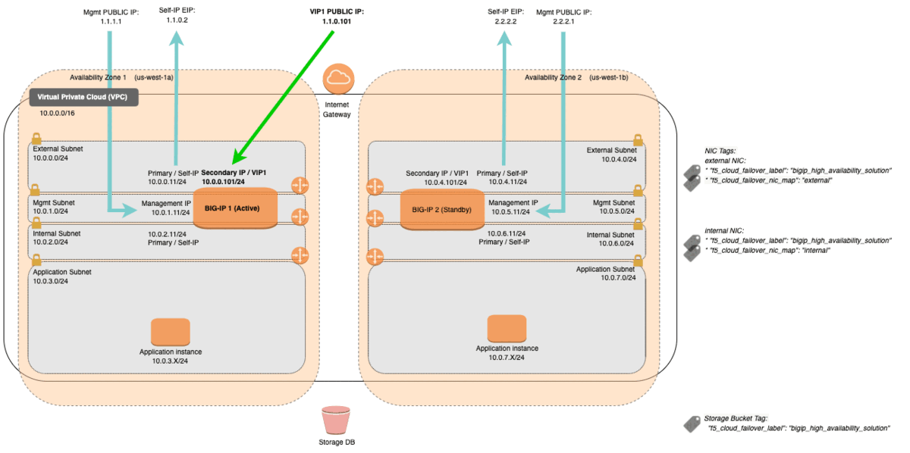

# Deploying the BIG-IP VE in AWS - Example Failover BIG-IP HA Cluster - Virtual Machines

[](https://github.com/f5networks/f5-aws-cloudformation-v2/releases)
[](https://github.com/f5networks/f5-aws-cloudformation-v2/issues)

## Contents

- [Deploying the BIG-IP VE in AWS - Example Failover BIG-IP HA Cluster - Virtual Machines](#deploying-the-big-ip-ve-in-aws---example-failover-big-ip-ha-cluster---virtual-machines)
  - [Contents](#contents)
  - [Introduction](#introduction)
  - [Diagram](#diagram)
  - [Prerequisites](#prerequisites)
  - [Important Configuration Notes](#important-configuration-notes)
    - [Template Input Parameters](#template-input-parameters)
    - [Template Outputs](#template-outputs)
    - [Existing Network Template Input Parameters](#existing-network-template-input-parameters)
    - [Existing Network Template Outputs](#existing-network-template-outputs)
  - [Deploying this Solution](#deploying-this-solution)
    - [Deploying via the AWS Deploy button](#deploying-via-the-aws-launch-stack-button)
    - [Deploying via the AWS CLI](#deploying-via-the-aws-cli)
    - [Changing the BIG-IP Deployment](#changing-the-big-ip-deployment)
  - [Validation](#validation)
    - [Validating the Deployment](#validating-the-deployment)
    - [Accessing the BIG-IP](#accessing-the-big-ip)
      - [SSH](#ssh)
      - [WebUI](#webui)
    - [Further Exploring](#further-exploring)
      - [WebUI](#webui-1)
      - [SSH](#ssh-1)
    - [Testing the WAF Service](#testing-the-waf-service)
    - [Testing Failover](#testing-failover)
  - [Deleting this Solution](#deleting-this-solution)
    - [Deleting the S3 bucket via AWS Console](#deleting-the-s3-bucket-using-the-aws-console)
    - [Deleting the S3 bucket using the AWS CLI](#deleting-the-s3-bucket-using-the-aws-cli)
    - [Deleting the deployment via AWS Console](#deleting-this-solution-using-the-aws-console)
    - [Deleting the deployment using the AWS CLI](#deleting-this-solution-using-the-aws-cli)
  - [Troubleshooting Steps](#troubleshooting-steps)
  - [Security](#security)
  - [BIG-IP Versions](#big-ip-versions)
  - [Documentation](#documentation)
  - [Getting Help](#getting-help)
    - [Filing Issues](#filing-issues)


## Introduction

The goal of this solution is to reduce prerequisites and complexity to a minimum so with a few clicks, a user can quickly deploy a BIG-IP, login and begin exploring the BIG-IP platform in a working full-stack deployment capable of passing traffic. 

This solution uses a parent template to launch several linked child templates (modules) to create an example BIG-IP Highly Available (HA) solution using the F5 Cloud Failover Extension (CFE).  For information about this deployment, see the F5 Cloud Failover Extension [documentation](https://clouddocs.f5.com/products/extensions/f5-cloud-failover/latest/userguide/aws.html). The linked templates are located in the [`examples/modules`](https://github.com/F5Networks/f5-aws-cloudformation-v2/tree/main/examples/modules) directory in this repository. *F5 recommends cloning this repository and modifying these templates to fit your use case.*

***Full Stack (failover.yaml)***<br>
Use the *failover.yaml* parent template to deploy an example full stack HA solution, complete with network, bastion *(optional)*, dag/ingress, access, bigip(s) and application.  

***Existing Network Stack (failover-existing-network.yaml)***<br>
Use the *failover-existing-network.yaml* parent template to deploy HA solution into an existing network infrastructure. This template expects VPC, subnets, and bastion host(s) have already been deployed. A demo application is also not part of this parent template as it intended use is for a production deployment.

The modules below create the following cloud resources:

- **Network**: A virtual network (also known as VPC), subnets, internet/NAT gateways, DHCP options, network ACLs, and other network-related resources. *(Full stack only)*
- **Bastion**: This template creates a bastion host for accessing the BIG-IP instances when no public IP address is used for the management interfaces. *(Full stack only)*
- **Application**: This template creates a generic example application for use when demonstrating live traffic through the BIG-IP instance. *(Full stack only)*
- **Disaggregation** *(DAG/Ingress)*: This template creates resources required to get traffic to the BIG-IP, including Network Security Groups, Public IP Addresses, NAT rules and probes.
- **Access**: This template creates AWS InstanceProfiles and IAM Roles.
- **BIG-IP**: This template creates F5 BIG-IP Virtual Edition instances provisioned with Local Traffic Manager (LTM) and (optionally) Application Security Manager (ASM). 

By default, this solution (failover.yaml) creates a VPN with 4 subnets, an example Web Application instance, two PAYG BIG-IP instances with three network interfaces (one for management and two for dataplane/application traffic - called external and internal). Depending on settings, the number of Public IPs provisioned will vary.
* Two EIPs will automatically be provisioned for the external Self IPs (for egress system routing).
* Two EIPs will automatically be provisioned for NAT gateways.
* If **provisionPublicIpMgmt** is set to **true**, two EIPs will be provisioned the Management Interfaces. If set to **false**, one EIP will be created for a bastion host. 
* If **provisionExampleApp** is set to **true**, an additional EIP is provisioned for the virtual service.

Application traffic from the Internet traverses an external network interface configured with both public and private IP addresses. Traffic to the application traverses an internal network interface configured with a private IP address.

***DISCLAIMER/WARNING***: To reduce prerequisites and complexity to a bare minimum for evaluation purposes only, this example template provides immediate access to the management interface via a Public IP. At the very *minimum*, configure the **restrictedSrcAddressMgmt** parameter to limit access to your client IP or trusted network. Note that in production deployments, management access should never be directly exposed to the Internet and instead should be accessed via typical management best practices like jump boxes/bastion hosts, VPNs, etc. See the  **provisionPublicIpMgmt** parameter for more details.

## Diagram



For information about this type of deployment, see the F5 Cloud Failover Extension [documentation](https://clouddocs.f5.com/products/extensions/f5-cloud-failover/latest/userguide/aws.html).

## Prerequisites

  - An **SSH Key pair** in AWS for management access to BIG-IP VE. For more information about creating and/or importing the key pair in AWS, see AWS SSH key [documentation](https://docs.aws.amazon.com/AWSEC2/latest/UserGuide/ec2-key-pairs.html).

  - An **AWS secret** stored in AWS [Secrets Manager](https://aws.amazon.com/secrets-manager/) containing the password used to access and cluster the HA Pair. For example, to create a secret using the AWS CLI:
    ```bash
    aws secretsmanager create-secret --region us-east-1 --name mySecretId --secret-string 'YOUR_BIGIP_PASSWORD'
    ```
    - *NOTE:*
      - By default, the secret name used is `mySecretId` and must be created in the region where deploying the template. Otherwise, see [Changing the BIG-IP Deployment](#changing-the-big-ip-deployment) for more details.
      - Obtain the secret ARN. The ARN format required for the input parameter will look like _arn:aws:secretsmanager:us-east-1:111111111111:secret:mySecretId-xdg0kdf_ You will pass this value to the *secretArn* input parameter.
      - In the example above, the *--secret-string* value is in single quotes to avoid bash special character interpolation. See the AWS CLI secretsmanager [documentation](https://docs.aws.amazon.com/cli/latest/reference/secretsmanager/index.html#cli-aws-secretsmanager) for a more secure example using a file.


  - Accepted the EULA for the F5 image in the AWS marketplace. If you have not deployed BIG-IP VE in your environment before, search for F5 in the Marketplace and then click **Accept Software Terms**. This only appears the first time you attempt to launch an F5 image. By default, this solution deploys the [F5 BIG-IP Advanced WAF PAYG 25Mbps](https://aws.amazon.com/marketplace/pp/B08R5W828T) images. For more information, see [K14810: Overview of BIG-IP VE license and throughput limits](https://support.f5.com/csp/article/K14810).
  - The appropriate permission in AWS to launch CloudFormation (CFT) templates. You must be using an IAM user with the AdministratorAccess policy attached and have permission to create the objects contained in this solution. VPCs, Routes, EIPs, EC2 Instances. For details on permissions and all AWS configuration, see AWS [documentation](https://aws.amazon.com/documentation/). 
  - Sufficient **EC2 Resources** to deploy this solution. For more information, see [AWS resource limit documentation](https://docs.aws.amazon.com/AWSEC2/latest/UserGuide/ec2-resource-limits.html).


## Important Configuration Notes

- By default, this solution modifies the username **admin** with a password set to value of the AWS Secret Manager secret which is provided in the input **secretArn** of the parent template.

- This solution requires Internet access for: 
    - Downloading additional F5 software components used for onboarding and configuring the BIG-IP (via github.com and/or cdn.f5.com). Internet access is required via the management interface and then via a dataplane interface (for example, external Self IP) once a default route is configured. See [Overview of Mgmt Routing](https://support.f5.com/csp/article/K13284) for more details. By default, as a convenience, this solution provisions Public IPs to enable this but in a production environment, outbound access should be provided by a `routed` SNAT service (for example: NAT Gateway, custom firewall, etc.). *NOTE: access via web proxy is not currently supported. Other options include 1) hosting the file locally and modifying the runtime-init package url and configuration files to point to local URLs instead or 2) baking them into a custom image, using the [F5 Image Generation Tool](https://clouddocs.f5.com/cloud/public/v1/ve-image-gen_index.html).*
    - Contacting native cloud services for various cloud integrations: 
    - *Onboarding*:
        - [F5 BIG-IP Runtime Init](https://github.com/f5networks/f5-bigip-runtime-init) - to fetch secrets from native vault services
    - *Operation*:
        - [F5 Application Services 3](https://clouddocs.f5.com/products/extensions/f5-appsvcs-extension/latest/) - for features like Service Discovery
        - [Cloud Failover Extension (CFE)](https://clouddocs.f5.com/products/extensions/f5-cloud-failover/latest/) - for updating IP and routes mappings
    - Additional cloud services like [Private endpoints](https://docs.aws.amazon.com/vpc/latest/privatelink/vpc-endpoints.html) can be used to address calls to native services traversing the Internet.
  - See [Security](#security) section for more details. 

- This solution template provides an **initial** deployment only for an "infrastructure" use case (meaning that it does not support managing the entire deployment exclusively via the template's "Redeploy" function). This solution leverages cloud-init to send the instance **user_data**, which is only used to provide an initial BIG-IP configuration and not as the primary configuration API for a long-running platform. Although "Redeploy" can be used to update some cloud resources, as the BIG-IP configuration needs to align with the cloud resources, like IPs to NICs, updating one without the other can result in inconsistent states, while updating other resources, like the **image** or **instanceType**, can trigger an entire instance redeployment. For instance, to upgrade software versions, traditional in-place upgrades should be leveraged. See [AskF5 Knowledge Base](https://support.f5.com/csp/article/K84554955) and [Changing the BIG-IP Deployment](#changing-the-big-ip-deployment) for more information.

- If you have cloned this repository to modify the templates or BIG-IP config files and published to your own location (NOTE: CloudFormation can only reference S3 bucket locations for templates and not generic URLs like from GitHub), you can use the **s3BucketName**, **s3BucketRegion** and **artifactLocation** input parameters to specify the new location of the customized templates. You may also need to ensure that the user has READ IAM permissions to that bucket. See main [/examples/README.md](../README.md#cloud-configuration) for more template customization details. If you have customized the Runtime Configurations, use the **bigIpRuntimeInitConfig** input parameter to specify the new location of the BIG-IP Runtime-Init config. See [Changing the BIG-IP Deployment](#changing-the-big-ip-deployment) for more BIG-IP customization details. 

- In this solution, the BIG-IP VE has the [LTM](https://f5.com/products/big-ip/local-traffic-manager-ltm) and [ASM](https://f5.com/products/big-ip/application-security-manager-asm) (when **provisionExampleApp** is set to **true**) modules enabled to provide advanced traffic management and web application security functionality. 

- This template can send non-identifiable statistical information to F5 Networks to help us improve our templates. You can disable this functionality by setting the **autoPhonehome** system class property value to false in the F5 Declarative Onboarding declaration. See [Sending statistical information to F5](#sending-statistical-information-to-f5).

- See [trouble shooting steps](#troubleshooting-steps) for more details.

### Template Input Parameters
 
**Required** means user input is required because there is no default value or an empty string is not allowed. If no value is provided, the template will fail to launch. In some cases, the default value may only work on the first deployment due to creating a resource in a global namespace and customization is recommended. See the Description for more details. 


| Parameter | Required* | Default | Type | Description |
| --- | --- | --- | --- | --- |
| appDockerImageName | No | f5devcentral/f5-demo-app:latest  | string | The name of a container to download and install which is used for the example application server(s). If this value is left blank, the application module template is not deployed. |
| application | No | f5app  | string | Application Tag. |
| artifactLocation | No | f5-aws-cloudformation-v2/v2.2.0.0/examples/  | string | The directory, relative to the templateBaseUrl, where the modules folder is located. |
| bigIpInstanceType | No | m5.xlarge | string | Enter a valid instance type. |
| bigIpImage | No | \*16.1.2.2-0.0.28**PAYG-Adv WAF Plus 25Mbps\* | string | F5 BIG-IP Performance Type. |
| bigIpCustomImageId | No |   | string | Provide a custom BIG-IP AMI ID you wish to deploy. Otherwise, can leave empty. |
| bigIpRuntimeInitPackageUrl | No | https://cdn.f5.com/product/cloudsolutions/f5-bigip-runtime-init/v1.4.1/dist/f5-bigip-runtime-init-1.4.1-1.gz.run  | string | Supply a URL to the bigip-runtime-init package. |
| bigIpExternalSelfIp01 | No | 10.0.0.11 | string | External Private IP Address for BIGIP Instance A. IP address parameter must be in the form x.x.x.x. |
| bigIpMgmtAddress01 | No | 10.0.1.11 | string | Management Private IP Address for BIGIP Instance 01. IP address parameter must be in the form x.x.x.x. |
| bigIpInternalSelfIp01 | No | 10.0.2.11  | string | Internal Private IP Address for BIGIP Instance A. IP address parameter must be in the form x.x.x.x. |
| bigIpRuntimeInitConfig01 | No | https://raw.githubusercontent.com/F5Networks/f5-aws-cloudformation-v2/v2.2.0.0/examples/failover/bigip-configurations/runtime-init-conf-3nic-payg-instance01.yaml | string | Supply a URL to the bigip-runtime-init configuration file in YAML or JSON format, or an escaped JSON string to use for f5-bigip-runtime-init configuration. |
| bigIpExternalSelfIp02 | No | 10.0.4.11 | string | External Private IP Address for BIGIP Instance B. IP address parameter must be in the form x.x.x.x. |
| bigIpMgmtAddress02 | No | 10.0.5.11  | string | Management Private IP Address for BIGIP Instance 02. IP address parameter must be in the form x.x.x.x. |
| bigIpInternalSelfIp02 | No | 10.0.6.11  | string | Internal Private IP Address for BIGIP Instance B. IP address parameter must be in the form x.x.x.x. |
| bigIpRuntimeInitConfig02 | No | https://raw.githubusercontent.com/F5Networks/f5-aws-cloudformation-v2/v2.2.0.0/examples/failover/bigip-configurations/runtime-init-conf-3nic-payg-instance01.yaml  | string | Supply a URL to the bigip-runtime-init configuration file in YAML or JSON format, or an escaped JSON string to use for f5-bigip-runtime-init configuration. |
| bigIpPeerAddr | No | 10.0.1.11  | string | Type the static self IP address of the remote host here. Set to empty string if not configuring peering with a remote host on this device. |
| bigIpExternalVip01 | No | 10.0.0.101 | string | External Secondary Private IP Address for BIGIP instance A. |
| bigIpExternalVip02 | No | 10.0.4.101 | string |External Secondary Private IP Address for BIGIP instance B. |
| cfeVipTag | No |  10.0.0.101,10.0.4.101 | string | Cloud Failover VIP tag value; provides private IP addresses to be assigned to VIP public IP. |
| cfeTag | No | bigip_high_availability_solution  | string | Cloud Failover deployment tag value. |
| cfeS3Bucket | No | bigip-high-availability-solution  | string | S3 bucket name used by Cloud Failover Extension. |
| cost | No | f5cost  | string | Cost Center Tag. |
| environment | No | f5env  | string | Environment Tag. |
| group | No | f5group  | string | Group Tag. |
| numAzs | No | 2  | string | Number of Availability Zones. Default = 2 |
| numSubnets | No | 4 | string | Number of Subnets. Default = 3, 4 required when provisionExampleApp = false |
| owner | No | f5own | string | Owner Tag. |
| provisionExampleApp | No | true  | string | Flag to deploy the demo web application.. |
| provisionPublicIpMgmt | No | true  | string | Whether or not to provision Public IP Addresses for the BIG-IP Management Network Interface. By default, Public IP addresses are provisioned. See the restrictedSrcAddressMgmt parameter below. If set to false, a bastion host will be provisioned instead. |
| restrictedSrcAddressApp | Yes |   | string | An IP address range (CIDR) that can be used to access web traffic (80/443) to the AWS instances, for example 'X.X.X.X/32' for a host, '0.0.0.0/0' for the Internet, etc. NOTE: The VPC CIDR is automatically added for internal usage. |
| restrictedSrcAddressMgmt | Yes |   | string | An IP address or address range (in CIDR notation) used to restrict SSH and management GUI access to the BIG-IP Management or bastion host instances. **IMPORTANT**: The VPC CIDR is automatically added for internal use (access via bastion host, clustering, etc.). Please do NOT use "0.0.0.0/0". Instead, restrict the IP address range to your client or trusted network, for example "55.55.55.55/32". Production should never expose the BIG-IP Management interface to the Internet. |
| s3BucketRegion | No | us-east-1 | string | The AWS Region that contains the S3 bucket containing templates. |
| s3BucketName | No | f5-cft-v2 | string | The S3 bucket name for the modules. The S3 bucket name can include numbers, lowercase letters, uppercase letters, and hyphens (-). It cannot start or end with a hyphen (-). |
| secretArn | Yes |   | string | The URL of the AWS secret manager secret, including secret ARN, where the BIG-IP password used for clustering is stored. |
| sshKey | Yes |   | string | Supply the key pair name as listed in AWS that will be used for SSH authentication to the BIG-IP and application virtual machines. Example: ``myAWSkey`` |
| subnetMask | No | 24  | string | Mask for subnets. Valid values include 16-28. Note supernetting of VPC occurs based on mask provided; therefore, number of networks must be >= to the number of subnets created. Mask for subnets. Valid values include 16-28. |
| uniqueString | No | myUniqStr | string | A prefix that will be used to name template resources. Because some resources require globally unique names, we recommend using a unique value. |
| vpcCidr | No | 10.0.0.0/16 | string | CIDR block for the VPC. |

<br>

### Template Outputs


| Name | Required Resource | Type | Description |
| --- | --- | --- | --- |
| amiId | Function Module | string | The ami-id used for deployment. |
| bastionInstanceId | Bastion Module | string | Instance ID of standalone Bastion instance. | 
| bigIpInstance01 | BigipStandalone Module | string | Instance ID of BIG-IP VE instance. |
| bigIpInstanceMgmtPrivateIp01 | BigipStandalone Module | string | Private management address. |
| bigIpInstance02 | BigipStandalone Module | string | Instance ID of BIG-IP VE instance. |
| bigIpInstanceMgmtPrivateIp02 | BigipStandalone Module | string | Private management address. |
| cfeS3Bucket | BigipStandalone Module | string | The s3 bucket used for cloud failover extension. |


### Existing Network Template Input Parameters

| Parameter | Required | Default | Type | Description |
| --- | --- | --- |  --- | --- | 
| appDockerImageName | No | f5devcentral/f5-demo-app:latest  | string | The name of a container to download and install which is used for the example application server(s). If this value is left blank, the application module template is not deployed. |
| application | No | f5app  | string | Application Tag. |
| artifactLocation | No | f5-aws-cloudformation-v2/v2.2.0.0/examples/  | string | The directory, relative to the templateBaseUrl, where the modules folder is located. |
| bigIpInstanceType | No | m5.xlarge | string | Enter a valid instance type. |
| bigIpImage | No | \*16.1.2.2-0.0.28**PAYG-Adv WAF Plus 25Mbps\* | string | F5 BIG-IP Performance Type. |
| bigIpCustomImageId | No |   | string | Provide a custom BIG-IP AMI ID you wish to deploy. Otherwise, can leave empty. |
| bigIpRuntimeInitPackageUrl | No | https://cdn.f5.com/product/cloudsolutions/f5-bigip-runtime-init/v1.4.1/dist/f5-bigip-runtime-init-1.4.1-1.gz.run  | string | Supply a URL to the bigip-runtime-init package. |
| bigIpExternalSubnetId01 | Yes |   | string | Subnet ID used for BIGIP instance A external interface. |
| bigIpExternalSelfIp01 | No | 10.0.0.11 | string | External Private IP Address for BIGIP Instance A. IP address parameter must be in the form x.x.x.x. |
| bigIpMgmtSubnetId01 | Yes |   | string | Subnet ID used for BIGIP instance A management interface. |
| bigIpMgmtAddress01 | No | 10.0.1.11 | string | Management Private IP Address for BIGIP Instance 01. IP address parameter must be in the form x.x.x.x. |
| bigIpInternalSubnetId01 | Yes |   | string | Subnet ID used for BIGIP instance A internal interface. |
| bigIpInternalSelfIp01 | No | 10.0.2.11  | string | Internal Private IP Address for BIGIP Instance A. IP address parameter must be in the form x.x.x.x. |
| bigIpRuntimeInitConfig01 | No | https://raw.githubusercontent.com/F5Networks/f5-aws-cloudformation-v2/v2.2.0.0/examples/failover/bigip-configurations/runtime-init-conf-3nic-payg-instance01.yaml  | string | Supply a URL to the bigip-runtime-init configuration file in YAML or JSON format, or an escaped JSON string to use for f5-bigip-runtime-init configuration. |
| bigIpExternalSubnetId02 | Yes |   | string | Subnet ID used for BIGIP instance B external interface. |
| bigIpExternalSelfIp02 | No | 10.0.4.11 | string | External Private IP Address for BIGIP Instance B. IP address parameter must be in the form x.x.x.x. |
| bigIpMgmtSubnetId02 | Yes |   | string | Subnet ID used for BIGIP instance B management interface. |
| bigIpMgmtAddress02 | No | 10.0.5.11  | string | Management Private IP Address for BIGIP Instance 02. IP address parameter must be in the form x.x.x.x. |
| bigIpInternalSubnetId02 | Yes |   | string | Subnet ID used for BIGIP instance B internal interface. |
| bigIpInternalSelfIp02 | No | 10.0.6.11  | string | Internal Private IP Address for BIGIP Instance B. IP address parameter must be in the form x.x.x.x. |
| bigIpRuntimeInitConfig02 | No | https://raw.githubusercontent.com/F5Networks/f5-aws-cloudformation-v2/v2.2.0.0/examples/failover/bigip-configurations/runtime-init-conf-3nic-payg-instance01.yaml  | string | Supply a URL to the bigip-runtime-init configuration file in YAML or JSON format, or an escaped JSON string to use for f5-bigip-runtime-init configuration. |
| bigIpPeerAddr | No | 10.0.1.11  | string | Type the static self IP address of the remote host here. Set to empty string if not configuring peering with a remote host on this device. |
| bigIpExternalVip01 | No | 10.0.0.101 | string | External Secondary Private IP Address for BIGIP instance A. |
| bigIpExternalVip02 | No | 10.0.4.101 | string | External Secondary Private IP Address for BIGIP instance B. |
| cfeVipTag | No |  10.0.0.101,10.0.4.101 | string | Cloud Failover VIP tag value; provides private IP addresses to be assigned to VIP public IP. |
| cfeTag | No | bigip_high_availability_solution  | string | Cloud Failover deployment tag value. |
| cfeS3Bucket | No | bigip-high-availability-solution  | string | S3 bucket name used by Cloud Failover Extension. |
| cost | No | f5cost  | string | Cost Center Tag. |
| environment | No | f5env  | string | Environment Tag. |
| group | No | f5group  | string | Group Tag. |
| numAzs | No | 2  | string | Number of Availability Zones. Default = 2 |
| numSubnets | No | 4 | string | Number of Subnets. Default = 3, 4 required when provisionExampleApp = false |
| owner | No | f5own | string |Owner Tag. |
| provisionExampleApp | No | true  | string | Flag to deploy the demo web application. |
| provisionPublicIpMgmt | No | true  | string | Whether or not to provision Public IP Addresses for the BIG-IP Management Network Interface. By default, Public IP addresses are provisioned. See the restrictedSrcAddressMgmt parameter below. If set to false, a bastion host will be provisioned instead. |
| restrictedSrcAddressApp | Yes |   | string | An IP address range (CIDR) that can be used to access web traffic (80/443) to the AWS instances, for example 'X.X.X.X/32' for a host, '0.0.0.0/0' for the Internet, etc. NOTE: The VPC CIDR is automatically added for internal usage. |
| restrictedSrcAddressMgmt | Yes |   | string | An IP address or address range (in CIDR notation) used to restrict SSH and management GUI access to the BIG-IP Management or bastion host instances. **IMPORTANT**: The VPC CIDR is automatically added for internal use (access via bastion host, clustering, etc.). Please do NOT use "0.0.0.0/0". Instead, restrict the IP address range to your client or trusted network, for example "55.55.55.55/32". Production should never expose the BIG-IP Management interface to the Internet. |
| s3BucketRegion | No | us-east-1 | string | The AWS Region that contains the S3 bucket containing templates. |
| s3BucketName | No | f5-cft-v2 | string | The S3 bucket name for the modules. The S3 bucket name can include numbers, lowercase letters, uppercase letters, and hyphens (-). It cannot start or end with a hyphen (-). |
| secretArn | Yes |   | string | The URL of the AWS secret manager secret, including secret ARN, where the BIG-IP password used for clustering is stored. |
| sshKey | Yes |   | string | Supply the key pair name as listed in AWS that will be used for SSH authentication to the BIG-IP and application virtual machines. Example: ``myAWSkey`` |
| subnetMask | No | 24  | string | Mask for subnets. Valid values include 16-28. Note supernetting of VPC occurs based on mask provided; therefore, number of networks must be >= to the number of subnets created. Mask for subnets. Valid values include 16-28. |
| uniqueString | No | myUniqStr | string | A prefix that will be used to name template resources. Because some resources require globally unique names, we recommend using a unique value. |
| vpcCidr | No | 10.0.0.0/16 | string | CIDR block for the VPC. |
| vpcId | Yes |   | string | ID for VPC to use with deployment. |

<br>

### Existing Network Template Outputs


| Name | Required Resource | Type | Description |
| --- | --- | --- | --- |
| amiId | Function Module | string | ami-id used for deployment |
| bigIpInstance01 | BigipStandalone Module | string | Instance ID of BIG-IP VE instance |
| bigIpInstanceMgmtPrivateIp01 | BigipStandalone Module | string | Private management address |
| bigIpInstance02 | BigipStandalone Module | string | Instance ID of BIG-IP VE instance | 
| bigIpInstanceMgmtPrivateIp02 | BigipStandalone Module | string | Private management address |
| cfeS3Bucket | BigipStandalone Module | string | s3 bucket used for cloud failover extension |

## Deploying this Solution

Two options for deploying this solution:
  - Using the [Launch Stack button](#deploying-via-the-aws-launch-stack-button)
  - Using the [AWS CLI](#deploying-via-the-aws-cli)

### Deploying via the AWS Launch Stack button
The easiest way to deploy this CloudFormation template is to use the Launch button.<br>
**Important**: By default, the link takes you to an AWS console set to the us-east-1 region. Select the AWS region (upper right) in which you want to deploy after clicking the Launch Stack button.

**Failover**<br>
<a href="https://console.aws.amazon.com/cloudformation/home?region=us-east-1#/stacks/new?stackName=BigIp-Failover-Example&templateURL=https://f5-cft-v2.s3.amazonaws.com/f5-aws-cloudformation-v2/v2.2.0.0/examples/failover/failover.yaml">
    </a>

**Failover Existing Network**<br>
<a href="https://console.aws.amazon.com/cloudformation/home?region=us-east-1#/stacks/new?stackName=BigIp-Failover-Existing-Network-Example&templateURL=https://f5-cft-v2.s3.amazonaws.com/f5-aws-cloudformation-v2/v2.2.0.0/examples/failover/failover-existing-network.yaml">
    </a>


*Step 1: Specify template* 
  - Click "Next".

*Step 2: Specify stack details* 
  - Fill in the *REQUIRED* parameters. For example:
    - **sshKey**
    - **restrictedSrcAddressMgmt**
    - **restrictedSrcAddressApp**
    - **secretArn** (Note: f5-bigip-runtime-init configurations need to use secrets name for the arn identified here)
  - Click "Next"

*Step 3: Configure Stack Options*
  - Click "Next".

*Step 4: Review*
  - Navigate to **Capabilities** > Check "Acknowledgment" Boxes.
  - Click **Create Stack**.

For next steps, see [Validating the Deployment](#validating-the-deployment).

### Deploying via the AWS CLI

As an alternative to deploying through the AWS Console (GUI), each solution provides an example AWS CLI 2.0 command to deploy the CloudFormation template. The following example deploys a HA pair of 3-NIC BIG-IP VE instances.

### Deploying via the AWS CLI

By default, the templates in this repository are also publicly hosted on S3 at [https://f5-cft-v2.s3.amazonaws.com/f5-aws-cloudformation-v2/[VERSION]/](https://f5-cft-v2.s3.amazonaws.com/f5-aws-cloudformation-v2/). If you want deploy the template using the [AWS CLI](https://docs.aws.amazon.com/cli/latest/userguide/cli-chap-welcome.html), provide url of the parent template and REQUIRED parameters:

```bash
 aws cloudformation create-stack --region ${REGION} --stack-name ${STACK_NAME} \
  --template-url https://f5-cft-v2.s3.amazonaws.com/f5-aws-cloudformation-v2/v1.2.0.0/examples/failover/failover.yaml \
  --parameters "ParameterKey=<KEY>,ParameterValue=<VALUE> ParameterKey=<KEY>,ParameterValue=<VALUE>"
```

or with a local parameters file (see `failover-parameters.json` example in this directory):
```bash
 aws cloudformation create-stack --region ${REGION} --stack-name ${STACK_NAME} \
  --template-url https://f5-cft-v2.s3.amazonaws.com/f5-aws-cloudformation-v2/v1.2.0.0/examples/failover/failover.yaml \
  --parameters file://failover-parameters.json
```

Example:

```bash
 aws cloudformation create-stack --region us-east-1 --stack-name myFailover \
  --template-url https://f5-cft-v2.s3.amazonaws.com/f5-aws-cloudformation-v2/v1.2.0.0/examples/failover/failover.yaml \
  --parameters "ParameterKey=sshKey,ParameterValue=MY_SSH_KEY_NAME ParameterKey=restrictedSrcAddressMgmt,ParameterValue=55.55.55.55/32 ParameterKey=restrictedSrcAddressApp,ParameterValue=0.0.0.0/0,ParameterKey=secretArn,ParameterValue=arn:aws:secretsmanager:us-west-1:012345678901:secret:myBigipSecret-Qnju"
```

For next steps, see [Validating the Deployment](#validating-the-deployment).


### Changing the BIG-IP Deployment

You will most likely want or need to change the BIG-IP configuration. This generally involves referencing or customizing a [F5 BIG-IP Runtime Init](https://github.com/f5networks/f5-bigip-runtime-init) configuration file and passing it through the **bigIpRuntimeInitConfig01** and **bigIpRuntimeInitConfig02** template parameters as a URL or inline json. 

Example from failover-parameters.json
```json
  {
    "ParameterKey": "bigIpRuntimeInitConfig01",
    "ParameterValue": "https://raw.githubusercontent.com/F5Networks/f5-aws-cloudformation-v2/main/examples/failover/bigip-configurations/runtime-init-conf-3nic-payg-instance01.yaml"
  },
  {
    "ParameterKey": "bigIpRuntimeInitConfig02",
    "ParameterValue": "https://raw.githubusercontent.com/F5Networks/f5-aws-cloudformation-v2/main/examples/failover/bigip-configurations/runtime-init-conf-payg-02.yaml"
  },
```

**IMPORTANT**: Note the "raw.githubusercontent.com". Any URLs pointing to github **must** use the raw file format. 

*TIP: If you haven't forked/published your own repository or don't have an easy way to host your own config files, passing the config as inline json via the template input parameter might be the quickest / most accessible option to test out different BIG-IP configs using this repository.*

F5 has provided the following example configuration files in the `examples/failover/bigip-configurations` folder:

- These examples install Automation Tool Chain packages for a PAYG licensed deployment.
  - `runtime-init-conf-3nic-payg-instance01.yaml`
  - `runtime-init-conf-3nic-payg-instance02.yaml`
- These examples install Automation Tool Chain packages and create WAF-protected services for a PAYG licensed deployment.
  - `runtime-init-conf-3nic-payg-instance01-with-app.yaml`
  - `runtime-init-conf-3nic-payg-instance02-with-app.yaml`
- These examples install Automation Tool Chain packages for a BYOL licensed deployment.
  - `runtime-init-conf-3nic-byol-instance01.yaml`
  - `runtime-init-conf-3nic-byol-instance02.yaml`
- These examples install Automation Tool Chain packages and create WAF-protected services for a BYOL licensed deployment.
  - `runtime-init-conf-3nic-byol-instance01-with-app.yaml`
  - `runtime-init-conf-3nic-byol-instance02-with-app.yaml`
- `Rapid_Deployment_Policy_13_1.xml` - This ASM security policy is supported for BIG-IP 13.1 and later.

See [F5 BIG-IP Runtime Init](https://github.com/f5networks/f5-bigip-runtime-init) for more examples.

- When specifying values for the bigIpInstanceType parameter, ensure that the instance type you select is appropriate for the deployment scenario. See [AWS Virtual Machine Instance Types](https://aws.amazon.com/ec2/instance-types/) for more information.

However, most changes require modifying the configurations themselves. For example:

To deploy **BYOL** instances:

  1. Edit/modify the Declarative Onboarding (DO) declarations in a corresponding `byol` runtime-init config file with the new `regKey` value. 

Example:
```yaml
          My_License:
            class: License
            licenseType: regKey
            regKey: AAAAA-BBBBB-CCCCC-DDDDD-EEEEEEE
```
  2. Publish/host the customized runtime-init config files at a location reachable by the BIG-IP at deploy time (for example: github, AWS Storage, etc.)
  3. Update the **bigIpRuntimeInitConfig01** and **bigIpRuntimeInitConfig02** input parameters to reference the new URL of the updated configuration.
  4. Update the **bigIpImage** input parameter to use `byol` image.
        Example:
        ```json
          {
            "ParameterKey": "bigIpImage",
            "ParameterValue": "*16.1.2.2-0.0.28**BYOL-All Modules 2Boot*"
          },
        ```

In order deploy additional **virtual services**:

For illustration purposes, this solution pre-provisions IP addresses needed for an example virtual service and the runtime-init configurations contain an AS3 declaration with a virtual service. However, in practice, cloud-init runs once and is typically used for initial provisioning, not as the primary configuration API for a long-running platform. More typically in an infrastructure use case, virtual services are added post initial deployment and involves:
  1. *Cloud* - Provisioning additional IPs on the desired Network Interfaces.
      - [Assigning a Private IP](https://docs.aws.amazon.com/AWSEC2/latest/UserGuide/MultipleIP.html#ManageMultipleIP)
      - [Allocating a Public IP](https://docs.aws.amazon.com/AWSEC2/latest/UserGuide/elastic-ip-addresses-eip.html#using-instance-addressing-eips-allocating)
      - [Associating a Public IP](https://docs.aws.amazon.com/AWSEC2/latest/UserGuide/elastic-ip-addresses-eip.html#using-instance-addressing-eips-associating)
  2. *BIG-IP* - Creating Virtual Services that match those additional Secondary IPs.
      - Updating the [AS3](https://clouddocs.f5.com/products/extensions/f5-appsvcs-extension/latest/userguide/composing-a-declaration.html) declaration with additional Virtual Services (see **virtualAddresses:**).

*NOTE: For cloud resources, templates can be customized to pre-provision and update additional resources (for example, various combinations of NICs, IPs, Public IPs, etc). Please see [Getting Help](#getting-help) for more information. For BIG-IP configurations, you can leverage any REST or Automation Tool Chain clients like [Ansible](https://ansible.github.io/workshops/exercises/ansible_f5/3.0-as3-intro/),[Terraform](https://registry.terraform.io/providers/F5Networks/bigip/latest/docs/resources/bigip_as3), etc.*


## Validation

This section describes how to validate the template deployment, test the WAF service, and troubleshoot common problems.

### Validating the Deployment

To view the status of the example and module stack deployments in the AWS Console, navigate to **CloudFormation > Stacks > *Your stack name***. You should see a series of stacks, including one for the Parent Failover template as well as the Network, Application, DAG, Bastion, Function, BIG-IP nested templates. The creation status for each stack deployment should be "CREATE_COMPLETE".

Expected Deploy time for entire stack =~ 13-15 minutes.

If any of the stacks are in a failed state, proceed to the [Troubleshooting Steps](#troubleshooting-steps) section below.

### Accessing the BIG-IP

From Parent Template Outputs:
  - **Console**: Navigate to **CloudFormation > *STACK_NAME* > Outputs**.
  - **AWS CLI**: 
      ```bash
      aws --region ${REGION} cloudformation describe-stacks --stack-name ${STACK_NAME}  --query  "Stacks[0].Outputs" 
      ```

  - Obtain the Instance ID:
    - **Console**: Navigate to **CloudFormation > *STACK_NAME* > Outputs > *bigIpInstanceId***.
    - **AWS CLI**: 
        ```bash
        aws --region ${REGION} cloudformation describe-stacks --stack-name ${STACK_NAME} --query  "Stacks[0].Outputs[?OutputKey=='bigIpInstanceId'].OutputValue" --output text
        ```

  - Obtain the IP address of the BIG-IP Management Port:
    - **Console**: Navigate to **CloudFormation > *STACK_NAME* > Outputs > *bigIpManagementPublicIp***.
    - **AWS CLI**: 
      - Public IPs: 
          ```bash
          aws --region ${REGION} cloudformation describe-stacks --stack-name ${STACK_NAME} --query  "Stacks[0].Outputs[?OutputKey=='bigIpInstanceMgmtPublicIp01'].OutputValue" --output text
          aws --region ${REGION} cloudformation describe-stacks --stack-name ${STACK_NAME} --query  "Stacks[0].Outputs[?OutputKey=='bigIpInstanceMgmtPublicIp02'].OutputValue" --output text
          ```
      - Private IPs: 
          ```bash
          aws --region ${REGION} cloudformation describe-stacks --stack-name ${STACK_NAME} --query  "Stacks[0].Outputs[?OutputKey=='bigIpInstanceMgmtPrivateIp01'].OutputValue" --output text
          aws --region ${REGION} cloudformation describe-stacks --stack-name ${STACK_NAME} --query  "Stacks[0].Outputs[?OutputKey=='bigIpInstanceMgmtPrivateIp02'].OutputValue" --output text
          ```
    - Or if you are going through a bastion host (when **provisionPublicIP** = **false**):

        Obtain the Public IP address of the bastion host:
            ```bash 
            aws --region ${REGION} cloudformation describe-stacks --stack-name ${STACK_NAME} --query  "Stacks[0].Outputs[?OutputKey=='bastionPublicIp'].OutputValue" --output text
            ```
#### SSH
  
  - **SSH key authentication**: 
      ```bash
      ssh admin@${IP_ADDRESS_FROM_OUTPUT} -i ${YOUR_PRIVATE_SSH_KEY}
      ```
  - **Password authentication**: 
      ```bash 
      ssh admin@${IP_ADDRESS_FROM_OUTPUT}
      ``` 
      at prompt, enter your **bigIpInstanceId** (see above to obtain from template "Outputs")


- OR if you are going through a bastion host (when **provisionPublicIP** = **false**):

    From your desktop client/shell, create an SSH tunnel:
    ```bash
    ssh -i [keyname-passed-to-template.pem] -o ProxyCommand='ssh -i [keyname-passed-to-template.pem] -W %h:%p ubuntu@[BASTION-HOST-PUBLIC-IP]' admin@[BIG-IP-MGMT-PRIVATE-IP]
    ```

    Replace the variables in brackets before submitting the command.

    For example:
    ```bash
    ssh -i ~/.ssh/mykey.pem -o ProxyCommand='ssh -i ~/.ssh/mykey.pem -W %h:%p ubuntu@34.82.102.190' admin@10.0.1.11

#### WebUI 

1. Obtain the URL address of the BIG-IP Management Port.
    - **Console**: Navigate to **CloudFormation > *STACK_NAME* > Outputs > *bigIpManagement01Url443 or bigIpManagement02Url443***.
    - **AWS CLI**: 
        ```bash
        aws --region ${REGION} cloudformation describe-stacks --stack-name ${STACK_NAME} --query  "Stacks[0].Outputs[?OutputKey=='bigIpManagement01Url443'].OutputValue" --output text

        aws --region ${REGION} cloudformation describe-stacks --stack-name ${STACK_NAME} --query  "Stacks[0].Outputs[?OutputKey=='bigIpManagement02Url443'].OutputValue" --output text
        ```

    - OR when you are going through a bastion host (when **provisionPublicIpMgmt** = **false**):

        From your desktop client/shell, create an SSH tunnel:
        ```bash
        ssh -i [keyname-passed-to-template.pem] ubuntu@[BASTION-HOST-PUBLIC-IP] -L 8443:[BIG-IP-MGMT-PRIVATE-IP]:[BIGIP-GUI-PORT]
        ```
        For example:
        ```bash
        ssh -i ~/.ssh/mykey.pem ubuntu@34.82.102.190 -L 8443:10.0.1.11:443
        ```

        You should now be able to open a browser to the BIG-IP UI from your desktop:

        https://localhost:443


2. Open a browser to the Management URL.
  - *NOTE: By default, the BIG-IP system's WebUI starts with a self-signed cert. Follow your browser's instructions for accepting self-signed certs (for example, if using Chrome, click inside the page and type this "thisisunsafe". If using Firefox, click "Advanced" button, click "Accept Risk and Continue").*
  - To Login: 
    - username: admin
    - password: **password identified in secretArn**


### Further Exploring
#### WebUI

If you deployed the example application (**provisionExampleApp** = **true**)

 - Navigate to **Virtual Services**. 
    - From the drop-down menu **Partition** (upper right), select Partition = `Tenant_1`.
    - Navigate to **Local Traffic > Virtual Servers**. You should see two Virtual Services (one for HTTP and one for HTTPS). This should show up as Green. Click on them to look at the configuration *(declared in the AS3 declaration)*.

#### SSH

  - From TMSH shell, type 'bash' to enter the bash shell:
    - Examine the Runtime-Init Config downloaded: 
    ```bash 
    cat /config/cloud/runtime-init.conf
    ```
    - Examine BIG-IP configuration via [F5 Automation Toolchain](https://www.f5.com/pdf/products/automation-toolchain-overview.pdf) declarations:
    ```bash
    curl -u admin: http://localhost:8100/mgmt/shared/declarative-onboarding | jq .
    ```
    - Examine the BIG-IP [Cloud Failover Extension (CFE)](https://clouddocs.f5.com/products/extensions/f5-cloud-failover/latest/) declaration:
    ```bash
    curl -su admin: http://localhost:8100/mgmt/shared/cloud-failover/declare | jq . 
    ```
    - If you deployed the example application (**provisionExampleApp** = **true**)
    ```bash
    curl -u admin: http://localhost:8100/mgmt/shared/appsvcs/declare | jq .
    ```
### Testing the WAF Service

If you deployed the example application (**provisionExampleApp** = **true**), to test the WAF service, perform the following steps:

1. Obtain the address of the WAF service:
  - **Console**: Navigate to **CloudFormation > *STACK_NAME* > Outputs > *vip1PublicUrl***. 
  - **AWS CLI**: 
      ```bash 
      aws --region ${REGION}  cloudformation describe-stacks --stack-name ${STACK_NAME} --query  "Stacks[0].Outputs[?OutputKey=='vip1PublicUrl'].OutputValue" --output text
      ```

2. Verify the application is responding:
  - Paste the IP address in a browser: ```https://${IP_ADDRESS_FROM_OUTPUT}```
      - *NOTE: By default, the Virtual Service starts with a self-signed cert. Follow your browsers instructions for accepting self-signed certs (for example, if using Chrome, click inside the page and type this "thisisunsafe". If using Firefox, click "Advanced" button, click "Accept Risk and Continue", etc.).*
  - Use curl: 
      ```shell
       curl -sko /dev/null -w '%{response_code}\n' https://${IP_ADDRESS_FROM_OUTPUT}
       ```

3. Verify the WAF is configured to block illegal requests:
    ```shell
    curl -sk -X DELETE https://${IP_ADDRESS_FROM_OUTPUT}
    ```
  - The response should include a message that the request was blocked, and a reference support ID.
    Example:
    ```shell
    $ curl -sko /dev/null -w '%{response_code}\n' https://55.55.55.55
    200
    $ curl -sk -X DELETE https://55.55.55.55
    <html><head><title>Request Rejected</title></head><body>The requested URL was rejected. Please consult with your administrator.<br><br>Your support ID is: 2394594827598561347<br><br><a href='javascript:history.back();'>[Go Back]</a></body></html>
    ```

### Testing Failover

If you have deployed the example application(**provisionExampleApp** = **true**), to test failover, perform the following steps:

1. Log on to the BIG-IPs per instructions above:

  - **WebUI**: Go to Device Management of Active Instance -> Traffic-Groups -> Select box next to *traffic-group-1* -> Click the "Force to Standby" button *.
  - **BIG-IP CLI**: 
      ```bash 
      tmsh run sys failover standby
      ```

Verify the EIP associated w/ the Virtual Service (**vipPublicUrl**) is remapped to the peer BIG-IP (ex. for this deployment, from 10.0.0.101 in AZ1 to 10.0.4.101 in AZ2).

For information on the Cloud Failover solution, see [F5 Cloud Failover Extension](https://clouddocs.f5.com/products/extensions/f5-cloud-failover/latest/userguide/aws.html).


## Deleting this Solution


As CloudFormation does not delete S3 buckets that contain data, in order to delete this deployment, you will first need to empty / delete the S3 bucket created for the Cloud Failover Extension (provided via **cfeS3Bucket** parameter). 

After the S3 Bucket is deleted, you can now delete the solution by deleting the CloudFormation stack.
### Deleting the S3 bucket using the AWS Console

1. Navigate to **S3**.

2. Select the radio button to select the bucket name provided with the **cfeS3Bucket** parameter.

3. Click **Empty**.

4. Reselect the bucket and click **Delete**.

### Deleting the S3 bucket using the AWS CLI

```bash
aws s3 rb s3://${cfeS3Bucket} --force
```

For more information, see AWS's CLI [s3 rm](https://docs.aws.amazon.com/cli/latest/reference/s3/rb.html).

### Deleting this Solution using the AWS Console

1. Navigate to **CloudFormation > Stacks**.

2. Select the radio button to highlight the Parent Template.

3. Click **Delete**.

4. At the confirm pop up "Deleting this stack will delete all stack resources. Resources will be deleted according to their DeletionPolicy. Learn more", click **Delete Stack**.

### Deleting this Solution using the AWS CLI

```bash
 aws cloudformation delete-stack --region ${REGION} --stack-name ${STACK_NAME}
```

For more information, see [Troubleshooting AWS CloudFormation](https://docs.aws.amazon.com/AWSCloudFormation/latest/UserGuide/troubleshooting.html).

## Troubleshooting Steps

There are generally two classes of issues:

1. Stack creation itself failed
2. Resource(s) within the stack failed to deploy

In the even that a template in the stack failed, click on the name of a failed stack and then click `Events`. Check the `Status Reason` column for the failed event for details about the cause. 

**When creating a GitHub issue for a template, please include as much information as possible from the failed CloudFormation stack events.**

Common deployment failure causes include:
- Required fields were left empty or contained incorrect values (input type mismatch, prohibited characters, etc.) causing template validation failure
- Insufficient permissions to create the deployment or resources created by a deployment (IAM roles, etc.)
- Resource limitations (exceeded limit of IP addresses or compute resources, etc.)
- AWS service issues (service health can be checked from the AWS [Service Health Dashboard](https://status.aws.amazon.com/)

If all stacks were created "successfully" but maybe the BIG-IP or Service is not reachable, then log in to the BIG-IP instance via SSH to confirm BIG-IP deployment was successful (for example, if startup scripts completed as expected on the BIG-IP). To verify BIG-IP deployment, perform the following steps:
- Obtain the IP address of the BIG-IP instance. See instructions [above](#accessing-the-bigip-ip)
- Check startup-script to make sure was installed/interpolated correctly:
  - ```cat /opt/cloud/instance/user-data.txt```
- Check the logs (in order of invocation):
  - cloud-init Logs:
    - */var/log/boot.log*
    - */var/log/cloud-init.log*
    - */var/log/cloud-init-output.log*
  - runtime-init Logs:
    - */var/log/cloud/startup-script.log*: This file contains events that happen prior to execution of f5-bigip-runtime-init. If the files required by the deployment fail to download, for example, you will see those events logged here.
    - */var/log/cloud/bigipRuntimeInit.log*: This file contains events logged by the f5-bigip-runtime-init onboarding utility. If the configuration is invalid causing onboarding to fail, you will see those events logged here. If deployment is successful, you will see an event with the body "All operations completed successfully".
  - Automation Tool Chain Logs:
    - */var/log/restnoded/restnoded.log*: This file contains events logged by the F5 Automation Toolchain components. If an Automation Toolchain declaration fails to deploy, you will see more details for those events logged here.
- *GENERAL LOG TIP*: Search most critical error level errors first (for example, egrep -i err /var/log/<Logname>).

If you are unable to login to the BIG-IP instance, you can navigate to **EC2 > Instances**, select the check box next to the instance you want to troubleshoot, and then click **Actions > Monitor and Troubleshoot > Get System Log** or **Get Instance Screenshot** for potential logging to serial console.

```
aws ec2 get-console-output --region ${REGION}  --instance-id <ID>'
```


## Security

This CloudFormation template downloads helper code to configure the BIG-IP system:

- f5-bigip-runtime-init.gz.run: The self-extracting installer for the F5 BIG-IP Runtime Init RPM can be verified against a SHA256 checksum provided as a release asset on the F5 BIG-IP Runtime Init public GitHub repository, for example: https://github.com/F5Networks/f5-bigip-runtime-init/releases/download/1.3.2/f5-bigip-runtime-init-1.3.2-1.gz.run.sha256.
- F5 BIG-IP Runtime Init: The self-extracting installer script extracts, verifies, and installs the F5 BIG-IP Runtime Init RPM package. Package files are signed by F5 and automatically verified using GPG.
- F5 Automation Toolchain components: F5 BIG-IP Runtime Init downloads, installs, and configures the F5 Automation Toolchain components. Although it is optional, F5 recommends adding the extensionHash field to each extension install operation in the configuration file. The presence of this field triggers verification of the downloaded component package checksum against the provided value. The checksum values are published as release assets on each extension's public GitHub repository, for example: https://github.com/F5Networks/f5-appsvcs-extension/releases/download/v3.30.0/f5-appsvcs-3.30.0-5.noarch.rpm.sha256

The following configuration file will verify the Declarative Onboarding and Application Services extensions before configuring AS3 from a local file:

```yaml
runtime_parameters: []
extension_packages:
    install_operations:
        - extensionType: do
          extensionVersion: 1.23.0
          extensionHash: bfe88c7cf3fdb24adc4070590c27488e203351fc808d57ae6bbb79b615d66d27
        - extensionType: as3
          extensionVersion: 3.30.0
          extensionHash: 47cc7bb6962caf356716e7596448336302d1d977715b6147a74a142dc43b391b
extension_services:
    service_operations:
      - extensionType: as3
        type: url
        value: file:///examples/declarations/as3.json
```

More information about F5 BIG-IP Runtime Init and additional examples can be found in the [GitHub repository](https://github.com/F5Networks/f5-bigip-runtime-init/blob/main/README.md).


List of endpoints BIG-IP may contact during onboarding:
- BIG-IP image default:
    - vector2.brightcloud.com (by BIG-IP image for [IPI subscription validation](https://support.f5.com/csp/article/K03011490) )
- Solution / Onboarding:
    - github.com (for downloading helper packages mentioned above)
    - f5-cft.s3.amazonaws.com (downloading GPG Key and other helper configuration files)
    - license.f5.com (licensing functions)
- Telemetry:
    - www-google-analytics.l.google.com
    - product-s.apis.f5.com.
    - f5-prod-webdev-prod.apigee.net.
    - global.azure-devices-provisioning.net.
    - id-prod-global-endpoint.trafficmanager.net.

## BIG-IP Versions

These templates have been tested and validated with the following versions of BIG-IP. 

| AWS BIG-IP Image Version | BIG-IP Version |
| --- | --- |
| 16.1.2.2 | 0.0.28 |
| 14.1.4.6 | 0.0.6 |


## Documentation

For more information on F5 solutions for AWS, including manual configuration procedures for some deployment scenarios, see the AWS section of [Public Cloud Docs](http://clouddocs.f5.com/cloud/public/v1/).

For information on getting started using F5's CloudFormation templates on GitHub, see [Amazon Web Services: Solutions 101](https://clouddocs.f5.com/cloud/public/v1/aws/AWS_solutions101.html). 

For information on the Cloud Failover solution, see [F5 Cloud Failover Extension](https://clouddocs.f5.com/products/extensions/f5-cloud-failover/latest/).

## Getting Help

Due to the heavy customization requirements of external cloud resources and BIG-IP configurations in these solutions, F5 does not provide technical support for deploying, customizing, or troubleshooting the templates themselves. However, the various underlying products and components used (for example: [F5 BIG-IP Virtual Edition](https://clouddocs.f5.com/cloud/public/v1/), [F5 BIG-IP Runtime Init](https://github.com/F5Networks/f5-bigip-runtime-init), [F5 Automation Toolchain](https://www.f5.com/pdf/products/automation-toolchain-overview.pdf) extensions, and [Cloud Failover Extension (CFE)](https://clouddocs.f5.com/products/extensions/f5-cloud-failover/latest/)) in the solutions located here are F5-supported and capable of being deployed with other orchestration tools. Read more about [Support Policies](https://www.f5.com/company/policies/support-policies). Problems found with the templates deployed as-is should be reported via a GitHub issue.

For help with authoring and support for custom CST2 templates, we recommend engaging F5 Professional Services (PS).


### Filing Issues

Use the **Issues** link on the GitHub menu bar in this repository for items such as enhancement or feature requests and bugs found when deploying the example templates as-is. Tell us as much as you can about what you found and how you found it.