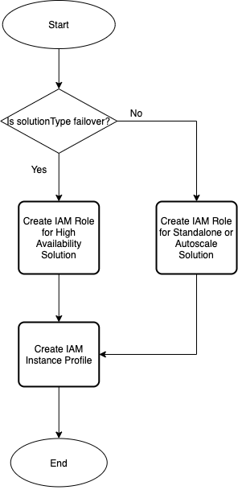

# Deploying Access Template

## Contents

- [Deploying Access Template](#deploying-access-template)
    - [Contents](#contents)
    - [Prerequisites](#prerequisites)
    - [Important Configuration Notes](#important-configuration-notes)
    - [Resources Provisioning](#resources-provisioning)
        - [IAM Permissions by Solution Type](#iam-permissions-by-solution-type)
    - [Template Input Parameters](#template-input-parameters)
    - [Template Outputs](#template-outputs)
    - [Resource Creation Flow Chart](#resource-creation-flow-chart)

## Introduction

This solution uses an AWS CloudFormation template to launch a stack for provisioning Access-related items commonly required in BIG-IP VE Solutions. This template can be deployed as a standalone; however the main intention is to use as a module for provisioning Access-related resources:

  - AWS IAM Role
  - AWS IAM Instance Profile

This solution creates IAM roles based on the following **solutionTypes**:

  - standard
    - Service Discovery *(used by AS3)*
    - CloudWatch Metrics and Logging *(used by Telemetry Streaming)*
    - CloudFormation Status Update *(Used by templates)*
  - secret
    - Permissions from standard +
    - Access a secret from secret-manager *(used by Runtime-Init)*
  - s3
    - Permissions from standard + 
    - S3 bucket *(used by Telemetry Streaming for remote S3 Logging or Cloud Failover Extension for State File Storage)*
  - secretS3
    - Permissions from standard + 
    - Access a secret from secret-manager *(used by Runtime-Init)*
    - S3 bucket *(used by Telemetry Streaming for remote S3 Logging or Cloud Failover Extension for State File Storage)*
  - failover
    - Permissions from standard + 
    - Access a secret from secret-manager *(used by Runtime-Init)*
    - S3 bucket *(used by Telemetry Streaming for remote S3 Logging or Cloud Failover Extension for State File Storage)*
    - Update permissions for IP addresses/routes *(used by Cloud Failover Extension)*

***DISCLAIMER:*** *These example IAM roles provide the permissions required for BIG-IP VE solutions to function and are for illustration purposes only. They are created more generically in a provider context to accommodate varying inputs, environments, and use cases. However, in production, they can often be further locked down via more specific `resource statements` and/or `ResourceTag conditions`. Please see each individual tool's documentation (for example, [Cloud Failover](https://clouddocs.f5.com/products/extensions/f5-cloud-failover/latest/userguide/aws.html#create-and-assign-an-iam-role)), for the most up-to-date permissions required. See your cloud provider resources for IAM Best Practices (for example, [IAM Best Practices](https://docs.aws.amazon.com/IAM/latest/UserGuide/best-practices.html)).*

## Prerequisites

  - None. This template does not require provisioning of additional resources.

## Important Configuration Notes

  - This template provisions resources based on conditions. See [Resources Provisioning](#resources-provisioning) for more details on each resource's minimal requirements.
  - A sample template, 'sample_linked.yaml', is included in the project. Use this example to see how to add a template as a linked template into your templated solution.
  
## Resources Provisioning

  * [AWS IAM Role](https://docs.aws.amazon.com/IAM/latest/UserGuide/id_roles.html):
    - Creates IAM roles for standalone, failover, and autoscale solutions.
  * [AWS IAM Instance Profile](https://docs.aws.amazon.com/IAM/latest/UserGuide/id_roles_use_switch-role-ec2_instance-profiles.html)
    - Instance profile is associated with IAM Role and assigned to EC2 instance used for hosting BIG-IP system.

### IAM Permissions by Solution Type

These are the IAM permissions produced by each type of solution supported by this template. For more details about the purpose of each permission, see the [CFE documentation for AWS Cloud](https://clouddocs.f5.com/products/extensions/f5-cloud-failover/latest/userguide/aws.html#create-and-assign-an-iam-role)

| Permission | Solution Type |
| --- | --- |
| autoscaling:DescribeAutoScalingGroups | standard, secret, s3, secrets3, failover |
| autoscaling:DescribeAutoScalingInstances | standard, secret, s3, secrets3, failover |
| cloudformation:ListStackResources | standard, secret, s3, secrets3, failover | 
| cloudformation:SignalResource | standard, secret, s3, secrets3, failover | 
| cloudwatch:PutMetricData | standard, secret, s3, secrets3, failover | 
| ec2:AssignIpv6Addresses | failover |
| ec2:AssignPrivateIpAddresses | failover | 
| ec2:AssociateAddress | failover | 
| ec2:CreateRoute | failover |
| ec2:DescribeAddresses | standard, secret, s3, secrets3, failover | 
| ec2:DescribeInstances | standard, secret, s3, secrets3, failover | 
| ec2:DescribeInstanceStatus | standard, secret, s3, secrets3, failover | 
| ec2:DescribeNetworkInterfaceAttribute | standard, secret, s3, secrets3, failover | 
| ec2:DescribeNetworkInterfaces | standard, secret, s3, secrets3, failover | 
| ec2:DescribeRouteTables | failover | 
| ec2:DescribeSubnets | failover | 
| ec2:DescribeTags | standard, secret, s3, secrets3, failover | 
| ec2:DisassociateAddress | failover | 
| ec2:ReplaceRoute | failover |
| ec2:UnassignIpv6Addresses | failover |
| ec2:UnassignPrivateIpAddresses | failover |
| logs:DescribeLogGroups | standard, secret, s3, secrets3, failover | 
| logs:DescribeLogStreams | standard, secret, s3, secrets3, failover | 
| logs:PutLogEvents | standard, secret, s3, secrets3, failover | 
| s3:DeleteObject | secrets3, failover | 
| s3:GetBucketLocation | failover |
| s3:GetBucketTagging | failover |
| s3:GetObject | secrets3, failover | 
| s3:ListAllMyBuckets | failover |
| s3:ListBucket | secrets3, failover | 
| s3:PutObject | secrets3, failover | 
| secretsmanager:DescribeSecret | secret, s3, secrets3, failover | 
| secretsmanager:GetResourcePolicy | secret, s3, secrets3, failover | 
| secretsmanager:GetSecretValue | secret, s3, secrets3, failover | 
| secretsmanager:ListSecretVersionIds | secret, s3, secrets3, failover |

## Template Input Parameters

**Required** means user input is required because there is no default value or an empty string is not allowed. If no value is provided, the template will fail to launch. In some cases, the default value may only work on the first deployment due to creating a resource in a global namespace and customization is recommended. See the Description for more details. 

| Parameter | Required | Default | Type | Description |
| --- | --- | --- | --- | --- |
| application | No | f5app | string | Application Tag. |
| bigIqSecretArn | No |  | string | The ARN of the AWS secret containing the password used during BIG-IP licensing via BIG-IQ. |
| cfeTag | No |  | string | Cloud Failover deployment tag value. |
| cloudWatchLogGroup | No |  | string | Provide the CloudWatch Log Group name used for telemetry. |
| cost | No | f5cost | string | Cost Center Tag. |
| createAmiRole | No | false | boolean | Value of 'true' creates IAM roles required for AMI lookup function. |
| createBigIpRoles | No | true | boolean | Value of 'true' creates IAM roles and instance profile assigned to BIG-IP instance(s). |
| createBigIqRoles | No | false | boolean | Value of 'true' creates IAM roles required to revoke license assignments from BIG-IQ. |
| environment | No | f5env | string | Environment Tag. |
| group | No | f5group | string | Group Tag. |
| metricNameSpace | No |  | string | CloudWatch namespace used for custom metrics. This should match the namespace defined in your telemetry services declaration within bigipRuntimInitConfig. |
| owner | No | f5owner | string | Application Tag. |
| s3Bucket | No |  | string | Provide the S3 Bucket name used for for remote logging, failover solution, etc. |
| secretArn | No |  | string | The ARN of an AWS secrets manager secret. |
| solutionType| No | standard | string | Defines solution type to select provision correct IAM role. Allowed Values = 'standard', 'secret', 's3', 'secretS3' and 'failover'. |
| uniqueString | Yes | myUniqStr | string | A prefix that will be used to name template resources. Because some resources require globally unique names, we recommend using a unique value. |

## Template Outputs

| Name | Required Resource | Type | Description |
| --- | --- | --- | --- |
| stackName |  Access template deployment | string | Access nested stack name. |
| bigIpInstanceProfile | IAM Instance Profile and IAM Instance Role | string | BIG-IP instance profile with applied IAM policy.  |
| bigIqNotificationRole | BIG-IQ notification IAM role | string | IAM policy for BIG-IQ Lifecycle Hook notifications. |
| copyZipsRole | CopyZips IAM role | string | IAM policy for CopyZips lambda function. |
| lambdaAccessRole | Lambda IAM role | string | IAM policy for BIG-IQ lambda function. |
| lambdaAmiExecutionRole| Lambda ami IAM role | string | IAM policy for ami lookup function. |

## Resource Creation Flow Chart

