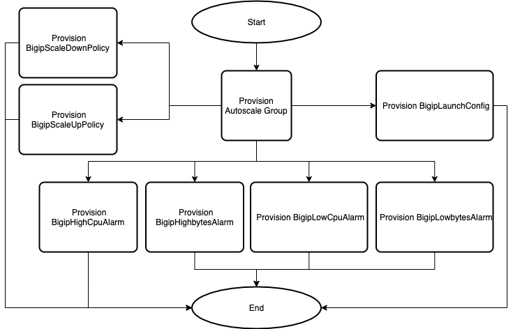

# Deploying BIG-IP Autoscale Template

## Contents

- [Deploying BIG-IP Autoscale Template](#deploying-bigip-autoscale-template)
  - [Contents](#contents)
  - [Introduction](#introduction)
  - [Prerequisites](#prerequisites)
  - [Resources Provisioning](#resources-provisioning)
    - [Template Input Parameters](#template-input-parameters)
    - [Template Outputs](#template-outputs)
  - [Resource Creation Flow Chart](#resource-creation-flow-chart)

## Introduction

This solution uses an AWS CloudFormation template to launch a stack for provisioning an Autoscale Group of BIG-IP VEs. It also utilizes the BIG-IP Runtime Init tool to initialize and onboard the BIG-IP system.

  
## Prerequisites

  - This template requires the following resources:
    * Network module:
        * VPC
        * Subnets
    * Access module
        * IAM Instance Profile
    * DAG module
        * LoadBalancer
  
  
## Resources Provisioning

  * [Autoscale Group](https://docs.aws.amazon.com/autoscaling/ec2/userguide/AutoScalingGroup.html)
  * [AutoScaling Launch Configuration](https://docs.aws.amazon.com/autoscaling/ec2/userguide/LaunchConfiguration.html)
  * [AutoScaling Scaling Policy](https://docs.aws.amazon.com/autoscaling/ec2/userguide/as-scale-based-on-demand.html)
  * [CloudWatch Alarm](https://docs.aws.amazon.com/AmazonCloudWatch/latest/monitoring/AlarmThatSendsEmail.html)
  * [SNS Topic](https://docs.aws.amazon.com/sns/latest/dg/sns-create-topic.html)

    
### Template Input Parameters

**Required** means user input is required because there is no default value or an empty string is not allowed. If no value is provided, the template will fail to launch. In some cases, the default value may only work on the first deployment due to creating a resource in a global namespace and customization is recommended. See the Description for more details. 

| Parameter | Required | Default | Type | Description |
| --- | --- | --- | --- | --- |
| application | No | f5app | string | Application Tag. |
| bigIpExternalSecurityGroup | Yes |  | string | BIG-IP external security group. |
| bigIpRuntimeInitConfig | Yes |  | string | Delivery URL for config file (YAML/JSON) or JSON string. |
| bigIpRuntimeInitPackageUrl | Yes | https://cdn.f5.com/product/cloudsolutions/f5-bigip-runtime-init/v1.5.0/dist/f5-bigip-runtime-init-1.5.0-1.gz.run | string | URL for f5-bigip-runtime-init package. |
| bigIqLicenseRevokeSnsTopic | No |  | string | Provides SNS Topic ARN used for triggering Lambda Function for revoking license on BIG-IQ. |
| bigIqNotificationRole | No |  | string | The ARN of the IAM role to assign to the Lifecycle Hook. |
| bigIqSecretArn | No |  | string | The ARN of the AWS secret containing the password for BIG-IQ used during BIG-IP licensing via BIG-IQ. |
| cloudWatchLogGroupName | No |  | string | The name of the CloudWatch Log Group. This parameter is required if your bigipRuntimInitConfig contains a telemetry services configuration for CloudWatch logging. |
| cloudWatchLogStreamName | No |  | string | The name of the CloudWatch Log Stream. This parameter is required if your bigipRuntimInitConfig contains a telemetry services configuration for CloudWatch logging. |
| cost | No | f5cost | string | Cost Center Tag. |
| customImageId | No |  | string | If you would like to deploy using a custom BIG-IP image, provide the AMI ID. |
| environment | No | f5env | string | Environment Tag. |
| externalTargetGroupHttp | No |  | string | External Load Balancer Target Group with BIG-IP VEs. |
| externalTargetGroupHttps | No |  | string | External Load Balancer Target Group with BIG-IP VEs. |
| group | No | f5group | string | Group Tag. |
| highCpuThreshold | No |  | string | High CPU Percentage threshold to begin scaling up BIG-IP VE instance. |
| imageName | No |  | string | F5 BIG-IP Performance Type. |
| instanceProfile | Yes |  | string | Instance profile with applied IAM policy. |
| instanceType | No | m5.2xlarge | string | Enter valid instance type. |
| internalTargetGroupHttp | No |  | string | Internal Load Balancer Target Group with BIG-IP VEs. |
| internalTargetGroupHttps | No |  | string | Internal Load Balancer Target Group with BIG-IP VEs. |
| licenseType | Yes | payg | string | Specifies license type used for BIG-IP VE. |
| lowCpuThreshold | No |  | string | Low CPU Percentage threshold to begin scaling down BIG-IP VE instances. |
| maxBatchSize | No | 5 | integer | Specifies the maximum number of instances that CloudFormation updates. |
| metricNameSpace | No | f5-scaling-metrics | string | CloudWatch namespace used for custom metrics. This parameter is required if your bigipRuntimInitConfig contains a telemetry services configuration for CloudWatch metrics. |
| minInstancesInService | No | 1 | integer | Specifies the minimum number of instances that must be in service within the Auto Scaling group while CloudFormation updates old instances. |
| notificationEmail | Yes |  | string | Valid email address to send Auto Scaling event notifications. |
| owner | No | f5owner | string | Application Tag. |
| pauseTime | No | 480 | integer | The amount of time in seconds that CloudFormation pauses after making a change to a batch of instances to give those instances time to start software applications. |
| provisionPublicIp | No | true | boolean | Whether or not to provision Public IP Addresses for the BIG-IP Network Interfaces. By default, no Public IP addresses are provisioned. |
| scaleInCpuThreshold | No | 20 | integer | Low CPU Percentage threshold to begin scaling in BIG-IP VE instances. | 
| scaleInThroughputThreshold | No | 10000000 | integer | Incoming throughput threshold to begin scaling in BIG-IP VE instances. | 
| scaleOutCpuThreshold | No | 80 | integer | High CPU Percentage threshold to begin scaling out BIG-IP VE instances. | 
| scaleOutThroughputThreshold | No | 20000000 | integer | Incoming throughput threshold to begin scaling out BIG-IP VE instances. |
| scalingMaxSize | No | 2 | integer |  Maximum number of BIG-IP instances (2-100) that can be created in the Autoscale Group. |
| scalingMinSize | No | 1 | integer | Minimum number of BIG-IP instances (1-99) you want available in the Autoscale Group. |
| secretArn | No |  | string | The ARN of a Secrets Manager secret to create READ permissions for. For example, if customizing your runtime-init config with an admin password, logging credential, etc. |
| snsEvents | No | autoscaling:EC2_INSTANCE_LAUNCH,autoscaling:EC2_INSTANCE_LAUNCH_ERROR | string | Provide a list of SNS Topics used on Autoscale Group. |
| sshKey | Yes |  | string | Supply the public key that will be used for SSH authentication to the BIG-IP and application virtual machines. | 
| subnets | Yes |  | string | Public or external subnets for the availability zones. | 
| uniqueString | No | myUniqStr | string | A prefix that will be used to name template resources. Because some resources require globally unique names, we recommend using a unique value. |

### Template Outputs

| Name | Required Resource | Type | Description |
| --- | --- | --- | --- |
| stackName | bigip-autoscale template deployment | string | bigip-autoscale nested stack name |
| bigIpAutoscaleGroup | None | string | BIG-IP Autoscale Group |
| snsTopic | None | string | SNS topic Autoscale should notify |

## Resource Creation Flow Chart

