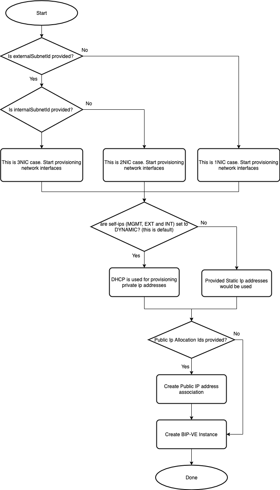

# Deploying BIG-IP Standalone Template

[](https://github.com/f5networks/f5-aws-cloudformation-v2/releases)
[](https://github.com/f5networks/f5-aws-cloudformation-v2/issues)


## Contents

- [Deploying BIG-IP Standalone Template](#deploying-bigip-standalone-template)
  - [Contents](#contents)
  - [Introduction](#introduction)
  - [Prerequisites](#prerequisites)
  - [Resources Provisioning](#resources-provisioning)
    - [Template Input Parameters](#template-input-parameters)
    - [Template Outputs](#template-outputs)
  - [Resource Creation Flow Chart](#resource-creation-flow-chart)
  - [Customization options](#customization-options)
    - [Multiple secondary private external IP addresses](#multiple-secondary-private-external-ip-addresses)
    - [Multiple public external IP addresses](#multiple-public-external-ip-addresses)


## Introduction

This solution uses an AWS CloudFormation template to launch a stack for provisioning a standalone BIG-IP VE.

  
## Prerequisites

  - This template requires the following cloud resources:
      * VPC
      * Subnet(s)
      * Security Group(s)
      * IAM Instance Profile
  
  
## Resources Provisioning

  * [EC2 Instance](https://aws.amazon.com/ec2/)
  * [Network Interface](https://docs.aws.amazon.com/AWSEC2/latest/UserGuide/using-eni.html)

    
### Template Input Parameters

**Required** means user input is required because there is no default value or an empty string is not allowed. If no value is provided, the template will fail to launch. In some cases, the default value may only work on the first deployment due to creating a resource in a global namespace and customization is recommended. See the Description for more details. 

| Parameter | Required | Default | Type | Description |
| --- | --- | --- | --- | --- |
| allowUsageAnalytics | No | true | boolean | This deployment can send anonymous statistics to F5 to help us determine how to improve our solutions. If you select **No** statistics are not sent. |
| application | No | f5app | string | Application Tag. |
| bigIpRuntimeInitConfig | Yes |  | string | Delivery URL for config file (YAML/JSON) or JSON string. |
| bigIpRuntimeInitPackageUrl | No | https://cdn.f5.com/product/cloudsolutions/f5-bigip-runtime-init/v1.5.0/dist/f5-bigip-runtime-init-1.5.0-1.gz.run | string | URL for BIG-IP Runtime Init package. |
| bigIpPeerAddr | No | 10.0.1.11 | string | Type the static self IP address of the remote host here. Set to empty string if not configuring peering with a remote host on this device. |
| bigIpPeerHostname | No |  | string | Type the hostname of the remote host here. Leave empty if not configuring peering with a remote host on this device. |
| cfeS3Bucket | No |  | string | Cloud Failover S3 Bucket. |
| cfeTag | No |  | string | Cloud Failover deployment tag value. |
| cost | No | f5cost | string | Cost Center Tag. |
| environment | No | f5env | string | Environment Tag. |
| externalPrimaryPublicId | No |  | string | The resource ID of the public IP address to apply to the primary IP configuration on the external network interface. The default is an empty string which does not provision public IP. |
| externalSecurityGroupId | No |  | string | The optional resource ID of a security group to apply to the external network interface. |
| externalSelfIp | No |  | string | The private IP address to apply to external network interfaces as primary private address. The address must reside in the subnet provided in the externalSubnetId parameter. ***Note:*** When set to an empty string, DHCP will be used for allocating the IP address. The default value is empty string. |
| externalServiceIps | No |  | string | An array of one or more private IP addresses to apply to the secondary external IP configurations. |
| externalSubnetId | No |  | string | The resource ID of the external subnet. ***Note:*** SubnetId parameters used for identifying number of network interfaces. Example: *1NIC* - only Mgmt subnet ID provided; *2NIC* - Mgmt and External subnets ID provided; *3NIC* - Mgmt, External, and Internal subnets ID provided. |
| group | No | f5group | string | Group Tag. |
| hostname | No | bigip01.local | string | Supply the hostname you would like to use for the BIG-IP instance. The hostname must contain fewer than 63 characters. |
| imageId | Yes |  | string | Provide BIG-IP AMI ID you wish to deploy. |
| instanceProfile | No |  | string | Instance profile with applied IAM policy. |
| instanceIndex | No | 01 | string | Enter valid string. This value will be appended to the name of the BIG-IP instance and related objects. |
| instanceType | No | m5.2xlarge | string | Enter valid instance type. |
| internalSecurityGroupId | No |  | string | The optional resource ID of a security group to apply to the internal network interface. |
| internalSelfIp | No |  | string | The private IP address to apply to the primary IP configuration on the internal network interface. The address must reside in the subnet provided in the internalSubnetId parameter.|
| internalSubnetId | No |  | string | The resource ID of the internal subnet. SubnetId parameters used for identifying number of network interfaces. Example: *1NIC* - only Mgmt subnet ID provided; *2NIC* - Mgmt and External subnets ID provided; *3NIC* - Mgmt, External, and Internal subnets ID provided. |
| licenseKey | No |  | string | Supply the F5 BYOL license key for the BIG-IP instance. Leave this parameter blank if deploying the PAYG solution. |
| mgmtPublicIpId | No |  | string | The resource ID of the public IP address to apply to the management network interface. Leave this parameter blank to create a management network interface without a public IP address. Default is empty string which does not provision public IP. |
| mgmtSecurityGroupId | Yes |  | string | The resource ID of a security group to apply to the management network interface. |
| mgmtSelfIp | No |  | string | The private IP address to apply to the primary IP configuration on the management network interface. The address must reside in the subnet provided in the mgmtSubnetId parameter. ***Note:*** When set to empty string, DHCP will be used for allocating ip address. |
| mgmtSubnetId | Yes |  | string | The resource ID of the management subnet. ***Note:*** SubnetId parameters used for identifying number of network interfaces. Example: *1NIC* - only Mgmt subnet ID provided; *2NIC* - Mgmt and External subnets ID provided; *3NIC* - Mgmt, External and Internal subnets ID provided.|
| owner | No | f5owner | string | Application Tag. |
| secretArn | No |  | string | The ARN of a Secrets Manager secret to create READ permissions for. For example, if customizing your runtime-init config with an admin password, logging credential, etc. |
| sshKey | Yes |  | string | Supply the public key that will be used for SSH authentication to the BIG-IP and application virtual machines. | 
| uniqueString | Yes | myUniqStr | string | A prefix that will be used to name template resources. Because some resources require globally unique names, we recommend using a unique value. |

### Template Outputs

| Name | Required Resource | Type | Description | 
| --- | --- | --- | --- |
| stackName | bigip-standalone template deployment | string | The bigip-standalone nested stack name. |
| bigIpInstanceId | None | string | BIG-IP instance ID. |
| bigIpManagementInterfacePrivateIp | None | string | Internally routable IP of BIG-IP instance NIC eth0. |
| bigIp2nicExternalInterfacePrivateIp | None | string | Internally routable IP of BIG-IP instance NIC eth1. |
| bigIp3NicExternalInterfacePrivateIp | None | string | Internally routable IP of BIG-IP instance NIC eth1. |
| bigIp3NicInternalInterfacePrivateIp | None | string | Internally routable IP of BIG-IP instance NIC eth2. |


## Resource Creation Flow Chart





## Customization options

This section provides instuctions on how to customize BIG-IP standalone template for various use cases.

### Multiple secondary private external IP addresses 

The *externalServiceIps* parameter allows you to provide a list of secondary private external IP addresses. However, due to limitations in AWS CloudFormation DSL, it is not possible to dynamically add secondary IP addresses to the network interface. Instead, you can add secondary IP addresses by updating *BigIpStaticExternalInterface* resource and including the additional private addresses. The same approach can be used for private internal interface (aka *BigipStaticInternalInterface*). 

```yaml
  BigipStaticExternalInterface:
    Condition: useStaticExternalIpAddr
    Properties:
      Description: Public External Interface for the BIG-IP
      GroupSet:
        - !Ref externalNsgId
      PrivateIpAddresses:
        - Primary: 'true'
          PrivateIpAddress: !Ref externalSelfIp
        - Primary: 'false'
          PrivateIpAddress: !Select
            - '0'
            - !Ref externalServiceIps
        - Primary: 'false'
          PrivateIpAddress: !Select
            - '1'
            - !Ref externalServiceIps
        - Primary: 'false'
          PrivateIpAddress: !Select
            - '2'
            - !Ref externalServiceIps
      SubnetId: !Ref externalSubnetId
    Type: 'AWS::EC2::NetworkInterface'
```

### Multiple public external IP addresses

You can enable multiple public external addresses by using the following steps:

1. Create parameter for passing list of Elastic IP Allocation IDs.
 
```yaml
  externalPublicIpsAllocationIds:
    Description: >-
      List of public ip addresses allocations ids.
    Type: CommaDelimitedList

```

2. Create EIP Association resource for associating public IP with external network interface.
  
```yaml
  BigipVipEipAssociation00:
    Condition: useExternalPublicIP
    Properties:
      AllocationId: !Select
        - '0'
        - !Ref externalPublicIpsAllocationIds
      NetworkInterfaceId: !If
        - useDynamicExternalIpAddr
        - !Ref BigipExternalInterface
        - !Ref BigipStaticExternalInterface
      PrivateIpAddress: !If
        - useDynamicExternalIpAddr
        - !Select
          - '0'
          - !GetAtt
            - BigipExternalInterface
            - SecondaryPrivateIpAddresses
        - !Select
          - '0'
          - !GetAtt
            - BigipStaticExternalInterface
            - SecondaryPrivateIpAddresses
    Type: 'AWS::EC2::EIPAssociation'
  BigipVipEipAssociation01:
    Condition: useExternalPublicIP
    Properties:
      AllocationId: !Select
        - '1'
        - !Ref externalPublicIpsAllocationIds
      NetworkInterfaceId: !If
        - useDynamicExternalIpAddr
        - !Ref BigipExternalInterface
        - !Ref BigipStaticExternalInterface
      PrivateIpAddress: !If
        - useDynamicExternalIpAddr
        - !Select
          - '0'
          - !GetAtt
            - BigipExternalInterface
            - SecondaryPrivateIpAddresses
        - !Select
          - '0'
          - !GetAtt
            - BigipStaticExternalInterface
            - SecondaryPrivateIpAddresses
    Type: 'AWS::EC2::EIPAssociation'
```
