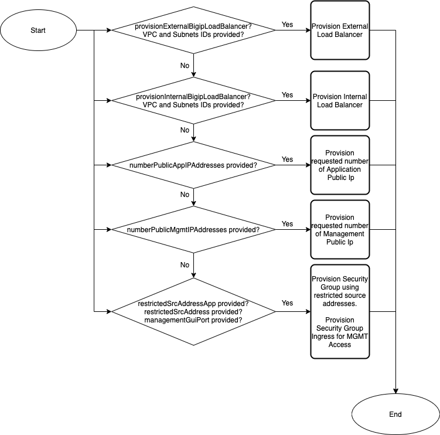

# Deploying DAG/Ingress Template

## Contents

- [Deploying DAG/Ingress Template](#deploying-dagingress-template)
  - [Contents](#contents)
  - [Introduction](#introduction)
  - [Prerequisites](#prerequisites)
  - [Resources Provisioning](#resources-provisioning)
    - [Template Input Parameters](#template-input-parameters)
    - [Template Outputs](#template-outputs)
  - [Resource Creation Flow Chart](#resource-creation-flow-chart)

## Introduction

This solution uses an AWS CloudFormation template to launch a stack for provisioning DAG/Ingress related items. This template can be deployed as a standalone, however the main intention is to use as a module for provisioning DAG/Ingress related resources:

  
## Prerequisites

  - None. This template does not require provisioning of additional resources.
  
  
## Resources Provisioning

   - [External Load Balancer](https://docs.aws.amazon.com/elasticloadbalancing/latest/classic/elb-internet-facing-load-balancers.html)
   - [Internal Load Balancer](https://docs.aws.amazon.com/elasticloadbalancing/latest/classic/elb-internal-load-balancers.html)
   - Public IP Addresses
     * Management
     * External 

### Template Input Parameters

**Required** means user input is required because there is no default value or an empty string is not allowed. If no value is provided, the template will fail to launch. In some cases, the default value may only work on the first deployment due to creating a resource in a global namespace and customization is recommended. See the Description for more details. 

| Parameter | Required | Default | Type | Description |
| --- | --- | --- | --- | --- |
| application | No | f5app | string | Application Tag. |
| cost | No | f5cost | string | Cost Center Tag. |
| createAppSecurityGroup | No | false | boolean | Select true if you would like to create a Security Group for your Application. Required if you are deploying an application. |
| createBastionSecurityGroup | No | false | boolean | Select true if you would like to create a Security Group for your Bastion. Required if you are deploying BIG-IP without a public management IP address. |
| createExternalSecurityGroup | No | false | boolean | Select true if you would like to create a Security Group for the external BIG-IP interface. Required if you are deploying a BIG-IP with 2 or more interfaces. |
| createInternalSecurityGroup | No | false | boolean | Select true if you would like to create a Security Group for the internal BIG-IP interface. Required if you are deploying a BIG-IP with 3 or more interfaces. |
| createFailoverIngress | No | false | boolean | Creates Security Group rules to allow Config Sync and HA between peer BIG-IP instances. |
| environment | No | f5env | string | Environment Tag. |
| externalSubnetAz1 | No |  | string | Availability Zone 1 External Subnet ID. |
| externalSubnetAz2 | No |  | string | Availability Zone 2 External Subnet ID. |
| group | No | f5group | string | Group Tag. |
| internalSubnetAz1 | No |  | string | Availability Zone 1 Internal Subnet ID. |
| internalSubnetAz2 | No |  | string | Availability Zone 2 Internal Subnet ID. |
| numberPublicExternalIpAddresses | No | 0 | integer | Number of external public IP addresses to create. Value must be minimum 0 and maximum 4. |
| numberPublicMgmtIpAddresses | No | 0 | integer | Number of public management IP addresses to create. Value must be minimum 0 and maximum 4.  |
| owner | No | f5owner | string | Application Tag. |
| provisionExternalBigipLoadBalancer | No | false | boolean | Flag to provision external Load Balancer |
| provisionInternalBigipLoadBalancer | No |  false | boolean | Flag to provision internal Load Balancer |
| restrictedSrcAddressMgmt | Yes |  | string | An IP address or address range (in CIDR notation) used to restrict SSH and management GUI access to the BIG-IP Management or bastion host instances. **IMPORTANT**: The VPC CIDR is automatically added for internal use (access via bastion host, clustering, etc.). Please do NOT use "0.0.0.0/0". Instead, restrict the IP address range to your client or trusted network, for example "55.55.55.55/32". Production should never expose the BIG-IP Management interface to the Internet. |
| restrictedSrcAddressApp | Yes |  | string | An IP address range (CIDR) that can be used to restrict access web traffic (80/443) to the BIG-IP instances, for example 'X.X.X.X/32' for a host, '0.0.0.0/0' for the Internet, etc. **NOTE**: The VPC CIDR is automatically added for internal use. |
| restrictedSrcPort | Yes | 8443 | string | The management port used for BIG-IP management GUI. |
| uniqueString | Yes | myUniqStr | string | A prefix that will be used to name template resources. Because some resources require globally unique names, we recommend using a unique value. |
| vpcCidr | No | 10.0.0.0/16 | string | Provide VPC ID. |
| vpc | No |  | string | Provide VPC ID. |

### Template Outputs

| Name | Required Resource | Type | Description |
| --- | --- | --- | --- |
| stackName | DAG template deployment | string | DAG nested stack name. |
| externalElasticLoadBalancer | None | string | External Load Balancer ID. |
| externalElasticLoadBalancerDnsName | None | string | External Load Balancer DNS Name. |
| externalTargetGroupHttps | None | string | External Target Group ID. |
| externalTargetGroupHttp |  None | string |  External Target Group ID. |
| internalElasticLoadBalancer | None | string | Internal Load Balancer ID. |
| internalElasticLoadBalancerDnsName | None | string | Internal Load Balancer DNS Name. |
| internalTargetGroupHttps | None | string | Internal Target Group ID. |
| internalTargetGroupHttp | None | string | Internal Target Group ID. |
| bigIpManagementEipAddress01 | None | string | BIG-IP Management Public IP.  |
| bigIpManagementEipAllocationId01 | None | string | Allocation ID for Elastic IP for BIG-IP Management Interface. |
| bigIpManagementEipAddress02 | None | string | BIG-IP Management Public IP.  |
| bigIpManagementEipAllocationId02 | None | string | Allocation ID for Elastic IP for BIG-IP Management Interface. |
| bigIpManagementEipAddress03 | None | string | BIG-IP Management Public IP.  |
| bigIpManagementEipAllocationId03 | None | string |  Allocation ID for Elastic IP for BIG-IP Management Interface. |
| bigIpManagementEipAddress04 | None | string | BIG-IP Management Public IP.  |
| bigIpManagementEipAllocationId04 | None | string |  Allocation ID for Elastic IP for BIG-IP Management Interface. | 
| bigIpExternalEipAddress00 | None | string |  BIG-IP External Public IP.  |
| bigIpExternalEipAllocationId00 | None | string | Allocation ID for Elastic IP for BIG-IP External Interface. |
| bigIpExternalEipAddress01 | None | string | BIG-IP External Public IP.  |
| bigIpExternalEipAllocationId01 | None | string |  Allocation ID for Elastic IP for BIG-IP External Interface. |
| bigIpExternalEipAddress02 | None | string | BIG-IP External Public IP.  |
| bigIpExternalEipAllocationId02 | None | string | Allocation ID for Elastic IP for BIG-IP External Interface. |
| bigIpExternalEipAddress03 | None | string | BIG-IP External Public IP.  |
| bigIpExternalEipAllocationId03 | None | string | Allocation ID for Elastic IP for BIG-IP External Interface. |
| bigIpExternalEipAddress04 | None | string | BIG-IP External Public IP.  |
| bigIpExternalEipAllocationId04 | None | string | Allocation ID for Elastic IP for BIG-IP External Interface. |
| bigIpExternalSecurityGroup | None | string | BIG-IP External Security Group ID. |
| bigIpInternalSecurityGroup | None | string | BIG-IP Internal Security Group ID. |
| bigIpMgmtSecurityGroup | None | string | BIG-IP Management Security Group ID. |
| appSecurityGroupId | None | string | Application Security Group ID. |
| bastionSecurityGroupId | None | string | Bastion Security Group ID. |

## Resource Creation Flow Chart

