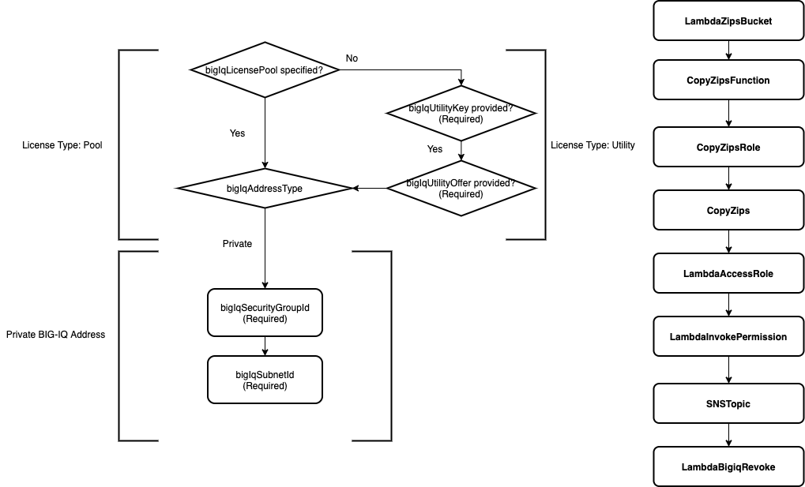

# Deploying Function Template

[](https://github.com/f5networks/f5-aws-cloudformation-v2/releases)
[](https://github.com/f5networks/f5-aws-cloudformation-v2/issues)


## Contents

- [Deploying Function Template](#deploying-function-template)
  - [Contents](#contents)
  - [Introduction](#introduction)
  - [Prerequisites](#prerequisites)
  - [Important Configuration Notes](#important-configuration-notes)
    - [Template Input Parameters](#template-input-parameters)
    - [Template Outputs](#template-outputs)
  - [Understanding AMI Lookup Function](#understanding-ami-lookup-function)
  - [Resource Creation Flow Chart](#resource-creation-flow-chart)

## Introduction

This template creates the AWS Lambda function, IAM roles, SNS topic, S3 bucket, supplemental Lambda function, and other resources required for revoking licenses from a BIG-IQ system based on current AWS Auto Scale group capacity. The Lambda function is triggered by a notification received from an AWS SNS topic targeted by an Auto Scale group notification.

## Prerequisites

- You must have permission to create the required IAM roles.
- When creating BIG-IQ revoke function, you must supply the ARN of the AWS Secrets Manager secret containing the password of the BIG-IQ device used to license the BIG-IPs. The secret must be stored as a string. Below is an example AWS CLI command to create this secret: ```aws secretsmanager create-secret --name mySecretName --secret-string '<BIGIQ PASSWORD>' --region us-east-1```
- When creating BIG-IQ revoke function, if the BIG-IQ device where BIG-IPs are licenses uses a private IP address, you must provide a subnet ID and security group ID from the VPC where BIG-IQ is deployed. You must also configure the VPC with an internet gateway and NAT gateway to provide internet access for AWS SDK requests.  See the Lambda [documentation](https://aws.amazon.com/premiumsupport/knowledge-center/internet-access-lambda-function/) for more information.

## Important Configuration Notes

 - A sample template, 'sample_linked.yaml', has been included in this project. Use this example to see how to add function.yaml as a linked template into your templated solution.

 - If the BIG-IQ device where BIG-IPs are licensed uses a public IP address, leave the values for the bigIqSubnetId and bigIqSecurityGroupId parameters empty.
 
 - BIG-IQ license class must use unreachable. The Lambda function for license revocation filters license assignments based on the assignment tenant value. For this reason, you must specify "reachable: false" in your F5 Declarative Onboarding license class declaration. See the F5 Declarative Onboarding [documentation](https://clouddocs.f5.com/products/extensions/f5-declarative-onboarding/latest/big-iq-licensing.html#license-class) for more information.

 - Disable SSL warnings in Lambda function: By default, the Lambda function is created with the F5_DISABLE_SSL_WARNINGS environment variable set to "False". When revoking licenses from a BIG-IQ License Manager device that is configured to use a self-signed certificate, you can set F5_DISABLE_SSL_WARNINGS to "True" to suppress insecure connection warning messages (this is not recommended for production deployments). You can configure this setting in the Lambda portal by clicking on the Lambda function name, then clicking **Environment Variables > Edit** and changing the value for  F5_DISABLE_SSL_WARNINGS to "True".

 - At provisioning time, this template creates an S3 bucket in the deployment region and a supplemental Lambda function named **CopyZipsFunction**. This Lambda function and its accompanying resources are not required after deployment succeeds, and can be deleted.

 - This template's outputs include the ARN of the SNS topic resource. You can pass this value to the snsTopics input parameter of the examples/modules/bigip-autoscale module template to associate the topic with your Auto Scale group.


### Template Input Parameters

| Parameter | Required | Description |
| --- | --- | --- |
| amiLookupRole | No | The ARN of the IAM role to assign to the AMI lookup function. Required when createAmiLookupFunction set to 'yes'. |
| application | No | Application Tag. |
| bigIqAddress | No | The public or private IP address of the BIG-IQ to be used when revoking licenses from the BIG-IP.  Note: The Lambda function will make a REST call to the BIG-IQ (already existing) to let it know a BIG-IP needs to be revoked. It will then revoke the license of the BIG-IP using the provided BIG-IQ credentials and license pool name/utility license info. Required when createRevokeFunction set to 'yes'. |
| bigIqAddressType | No | Specify the address type of the BIG-IQ device. Required when createRevokeFunction is set to 'yes'. Options are 'public' or 'private'. |
| bigIqLicensePool | No | The name of the BIG-IQ license pool used during BIG-IP licensing via BIG-IQ. Required when createRevokeFunction is set to 'yes'. |
| bigIqSecretArn | No | The ARN of the AWS Secrets Manager secret containing the BIG-IQ credentials to use during BIG-IP license revocation via BIG-IQ. Required when createRevokeFunction set to 'yes'. |
| bigIqSecurityGroupId | No | The ID of the security group where BIG-IQ is deployed. ***Important***: You must provide a value for this parameter when using a private BIG-IP address. Required when createRevokeFunction set to 'yes'. |
| bigIqSubnetId | No | The ID of the subnet where BIG-IQ is deployed. ***Important***: You must provide a value for this parameter when using a private BIG-IP address. Required when createRevokeFunction set to 'yes'. |
| bigIqTenant | No | The BIG-IQ tenant used during BIG-IP licensing via BIG-IQ. This value should match the BIG-IQ tenant specified in the F5 Declarative Onboarding declaration passed to the bigIpRuntimeInitConfig template parameter. This limits the scope of licenses eligible for revocation to those that were licensed with the specified tenant value. Only used when createRevokeFunction set to 'yes'. |
| bigIqUsername | No | The username of the BIG-IQ instance used during BIG-IP license revocation via BIG-IQ. Required when createRevokeFunction set to 'yes'. |
| bigIqUtilitySku | No | The BIG-IQ utility license SKU used during BIG-IP licensing via BIG-IQ. This value should match the BIG-IQ utility SKU specified in the F5 Declarative Onboarding declaration passed to the bigIpRuntimeInitConfig template parameter. ***Important***: This is only required when revoking a license from an ELA/subscription (utility) pool on the BIG-IQ, if not using this pool type leave the default of **Default**. Only used when createRevokeFunction set to 'yes'. |
| copyZipsRole | No | The ARN of the IAM role to assign to the BIG-IQ CopyZips function. Required when createRevokeFunction set to 'yes'. |
| cost | No | Cost Center Tag. |
| createAmiLookupFunction | No | Choose 'true' to create AMI lookup serverless function. |
| createRevokeFunction | No | Choose true to create BIG-IQ revoke license serverless function. |
| environment | No | Environment Tag. |
| group | No | Group Tag. |
| lambdaAccessRole | No | The ARN of the IAM role to assign to the BIG-IQ LambdaBigIqRevoke function. Required when createRevokeFunction set to 'yes'. |
| lambdaS3BucketName | No | The name of the S3 bucket where the lambdaBigiqRevoke Lambda function is located. This defaults to the F5 S3 bucket f5-aws-bigiq-revoke. Required when createRevokeFunction set to 'yes'. |
| lambdaS3Key | No | The top-level key in the Lambda S3 bucket where the Lambda function is located. Required when createRevokeFunction set to 'yes'. |
| owner | No | Application Tag. |

### Template Outputs

| Name | Description | Required Resource | Type | 
| --- | --- | --- | --- |
| stackName | Function nested stack name | Function template deployment | String |
| lambdaARN | Lambda ARN | Lambda function | String |
| snsTopic | SNS Topic ARN | SNS Topic | String |

## Understanding AMI Lookup Function
You can request AMI ID for a specified BIG-IP once AMI lookup function has been deployed. The function requires a service token for the function created by the function template, the region in which a specified BIG-IP is to be deployed, the string to use for filter, and the owner ID. In the following template snip-it, the service token value is found using outputs section of the deployed function template, region value is resolved using intrinsic template function, OSName value is set by parameter named 'imageName', and OwnerId is statically set using AWS Marketplace alias ID.
```yaml
  AmiInfo:
    Type: 'Custom::AMIInfo'
    Properties:
      ServiceToken: !GetAtt [Function, Outputs.lambdaARN]
      Region: !Ref 'AWS::Region'
      OSName: !Ref imageName
      OwnerId: 'aws-marketplace'
```

The AMI lookup function is set up to filter down a list of images that match the given string within the description field of each image. A single AMI ID is returned using the date stamp to determine the latest image.
You can determine what will be returned using the AWS CLI. For example:

```bash
aws ec2 describe-images --owners aws-marketplace --region us-east-1 --filters "Name=description,Values=*15.1.2.1**PAYG-Best 1G*" | jq -r '.Images[] | .Description, .CreationDate'
# F5 BIGIP-15.1.2.1-0.0.10 PAYG-Best 1Gbps-210115154829
# 2021-01-25T18:38:30.000Z
```
returns the latest 15.1.2.1 Best 1G Payg image. Setting parameter imageName: "*15.1.2.1**PAYG-Best 1G*" will return the AMI ID for "F5 BIGIP-15.1.2.1-0.0.10 PAYG-Best 1Gbps" within the given region specified.

Similarly:

```bash
aws ec2 describe-images --owners aws-marketplace --region us-east-1 --filters "Name=description,Values=*15.1.2.1**BYOL-All Modules 2Boot*" | jq -r '.Images[] | .Description, .CreationDate'
# F5 BIGIP-15.1.2.1-0.0.10 BYOL-All Modules 2Boot Loc-210115154829
# 2021-01-25T18:58:50.000Z
```
returns the latest 15.1.2.1 all modules two slot BYOL image. Setting parameter imageName: "*15.1.2.1**BYOL-All Modules 2Boot*" will return the AMI ID for "F5 BIGIP-15.1.2.1-0.0.10 BYOL-All Modules 2Boot" within the given region specified.


## Resource Creation Flow Chart


