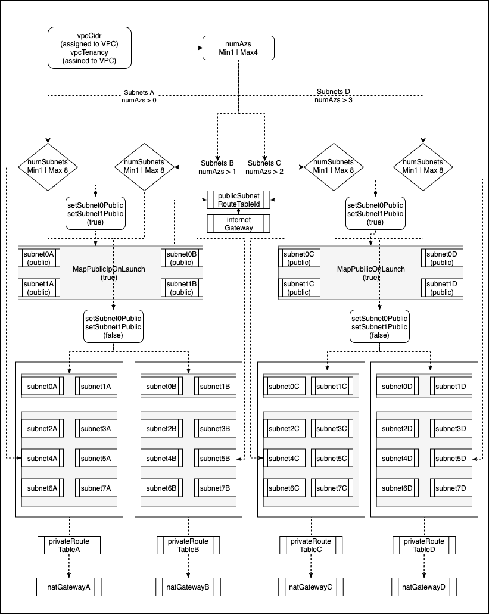

# Deploying Network Template

## Contents

- [Deploying Network Template](#deploying-network-template)
  - [Contents](#contents)
  - [Introduction](#introduction)
  - [Prerequisites](#prerequisites)
  - [Important Configuration Notes](#important-configuration-notes)
    - [Template Input Parameters](#template-input-parameters)
    - [Template Outputs](#template-outputs)
  - [Understanding Subnet CIDR Assignments](#understanding-subnet-cidr-assignments)
  - [Resource Creation Flow Chart](#resource-creation-flow-chart)

## Introduction

This AWS template creates a virtual network and subnets required to support F5 solutions. Link this template to create networks and subnets required for F5 deployments.

## Prerequisites

 - None
 
## Important Configuration Notes

 - A sample template, 'sample_linked.json', has been included in this project. Use this example to see how to add network.yaml as a linked template into your templated solution.

### Template Input Parameters

| Parameter | Required | Description |
| --- | --- | --- |
| application | No | Application Tag. |
| cost | No | Cost Center Tag. |
| environment | No | Environment Tag. |
| group | No | Group Tag. |
| numAzs | No | Number of Availability Zones to use in the VPC. Region must support number of availability  zones entered. Min 1 Max 4.  |
| numSubnets | No | Indicate the number of subnets to create. |
| owner | No | Application Tag. |
| setSubnet1Public | No | Value of true sets subnet1 in each AZ as a public subnet, value of false sets subnet1 as private network. |
| subnetMask | No | Mask for subnets. Valid values include 16-28. Note supernetting of VPC occurs based on mask provided; therefore, number of networks must be >= to the number of subnets created. |
| uniqueString | Yes | Unique String used when creating object names or Tags |
| vpcCidr | No | CIDR block for the VPC. |
| vpcTenancy | No | The allowed tenancy of instances launched into the VPC. Valid values include 'default' or 'dedicated' |

### Template Outputs

| Name | Description | Required Parameter Value | Type |
| --- | --- | --- | --- |
| stackName | Network nested stack name | Network template deployment | String |
| natEipA | IP address used for NAT gateway assigned to subnets in availability zone A. | numAzs > 0 | string |
| natEipB | IP address used for NAT gateway assigned to subnets in availability zone B. | numAzs > 1 | string |
| natEipC | IP address used for NAT gateway assigned to subnets in availability zone C. | numAzs > 2 | string |
| natEipD | IP address used for NAT gateway assigned to subnets in availability zone D. | numAzs > 3 | string |
| privateRouteTableIdA | Route table id assigned to private subnets in availability zone A. | setSubnet1Public = true or numSubnets > 2 | string |
| privateRouteTableIdB | Route table id assigned to private subnets in availability zone B. | setSubnet1Public or numSubnets > 2 and numAzs > 1 | string |
| privateRouteTableIdC | Route table id assigned to private subnets in availability zone C. | setSubnet1Public or numSubnets > 2 and numAzs > 2 | string |
| privateRouteTableIdD | Route table id assigned to private subnets in availability zone D. | setSubnet1Public or numSubnets > 2 and numAzs > 3 | string |
| publicSubnetRouteTableId | Route table id assigned to public subnets. | N/A | string |
| subnetsA | Comma separated list of subnet ids created for availability zone A. Ids listed in order of subnet numerical value. ie: subnet0 1st value, subnet1 2nd value, etc. |  numAzs > 0 | array |
| subnetsB | Comma separated list of subnet ids created for availability zone B. Ids listed in order of subnet numerical value. ie: subnet0 1st value, subnet1 2nd value, etc. |  numAzs > 1 | array |
| subnetsC | Comma separated list of subnet ids created for availability zone C. Ids listed in order of subnet numerical value. ie: subnet0 1st value, subnet1 2nd value, etc. |  numAzs > 2 | array |
| subnetsD | Comma separated list of subnet ids created for availability zone D. Ids listed in order of subnet numerical value. ie: subnet0 1st value, subnet1 2nd value, etc. |  numAzs > 3 | array |
| vpcCidr | IPv4 CIDR associated to VPC | 10.X.X.0/16-24 | string |
| vpcId | VPC ID | N/A | string
| vpcIpv6Cidr | IPv6 CIDR associated to VPC | N/A | string |

## Understanding Subnet CIDR Assignments

This template utilizes [Fn::Cidr](https://docs.aws.amazon.com/AWSCloudFormation/latest/UserGuide/intrinsic-function-reference-cidr.html) combined with mapping to generate and assign networks to subnets created. IE: !Cidr [ "10.0.0.0/16", 5, 8] will return a list of the first 5 supernetted networks using number of subnet bits equal to 8: [ 10.0.0.0/24, 10.0.1.0/24, 10.0.2.0/24, 10.0.3.0.24, 10.0.4.0/24 ]. Note, subtract the number of CIDR bits from 32 to establish mask. For this example: 32-8=24.

Each subnet resource within the template has an assigned map value which is assessed against the returned CIDR list. 
Example ipv4 CIDR assignment:
- numAzs = 1
- numSubnets = 5
- subnetMask = 24
- vpcCidr = 10.0.0.0/16
  - returns map value from subnetMap: '5,0,1,2,3,4'
    - index 0 of map is used to define number of CIDRs to generate
    - resource subnet0A always uses index 1 from returned map to define which network to use from returned CIDR list
    - resource subnet1A always uses index 2 from returned map to define which network to use from returned CIDR list 
    - resource subnet2A always uses index 3 from returned map to define which network to use from returned CIDR list 
    - resource subnet3A always uses index 4 from returned map to define which network to use from returned CIDR list
    - resource subnet4A always uses index 5 from returned map to define which network to use from returned CIDR list 
  - returns the map value from maskTocidrBits: '8'
  - returns the vpc network CIDR value: '10.0.0.0/16'
- Returned values are used to populate CIDR function !Cidr [ "10.0.0.0/16", 5, 8]
- Returned Cidr list is used to assign CIDRs to subnets: ' [ 10.0.0.0/24, 10.0.1.0/24, 10.0.2.0/24, 10.0.3.0.24, 10.0.4.0/24] '
  - resource subnet0A uses index value of 0 which returns 10.0.0.0/24
  - resource subnet1A uses index value of 1 which returns 10.0.1.0/24
  - resource subnet2A uses index value of 2 which returns 10.0.2.0/24
  - resource subnet3A uses index value of 3 which returns 10.0.3.0/24
  - resource subnet4A uses index value of 4 which returns 10.0.4.0/24
- Ipv6 CIDRs are assigned using the same methodology with a couple differences:
  - VPC IPv6 CIDR is assigned by AWS by using AmazonProvidedIpv6CidrBlock=true
  - AWS IPv6 suernetting only supports /64
    - Example ipv6 CIDR function: !Cidr [ "2406:da12:629:2d00::/56", 5, 64 ] Note, subtract the number of CIDR bits from 128 to establish mask. For this example: 128-64=64.

## Resource Creation Flow Chart

