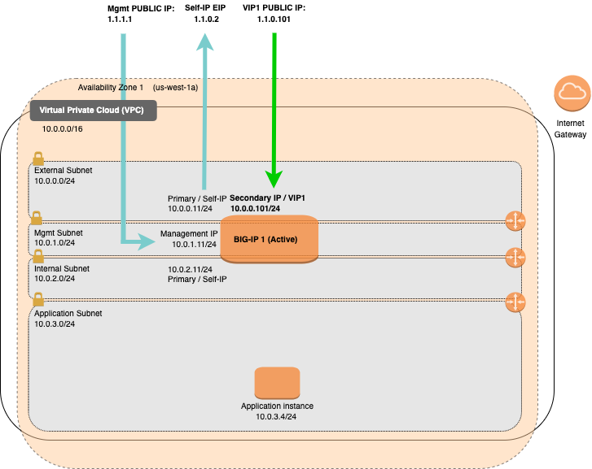

# Example Quickstart - BIG-IP Virtual Edition with WAF (LTM + ASM)

[](https://github.com/f5networks/f5-aws-cloudformation-v2/releases)
[](https://github.com/f5networks/f5-aws-cloudformation-v2/issues)

## Contents

- [Example Quickstart - BIG-IP Virtual Edition with WAF (LTM + ASM)](#example-quickstart---big-ip-virtual-edition-with-waf-ltm--asm)
  - [Contents](#contents)
  - [Introduction](#introduction)
  - [Diagram](#diagram)
  - [Prerequisites](#prerequisites)
  - [Important Configuration Notes](#important-configuration-notes)
    - [Template Input Parameters](#template-input-parameters)
    - [Template Outputs](#template-outputs)
    - [Existing Network Template Input Parameters](#existing-network-template-input-parameters)
    - [Existing Network Template Outputs](#existing-network-template-outputs)
  - [Deploying this Solution](#deploying-this-solution)
    - [Deploying via the AWS Launch Stack button](#deploying-via-the-aws-launch-stack-button)
    - [Deploying via the AWS CLI](#deploying-via-the-aws-cli)
    - [Changing the BIG-IP Deployment](#changing-the-big-ip-deployment)
  - [Validation](#validation)
    - [Validating the Deployment](#validating-the-deployment)
    - [Accessing the BIG-IP](#accessing-the-big-ip)
      - [SSH](#ssh)
      - [WebUI](#webui)
    - [Further Exploring](#further-exploring)
      - [WebUI](#webui-1)
      - [SSH](#ssh-1)
    - [Testing the WAF Service](#testing-the-waf-service)
  - [Deleting this Solution](#deleting-this-solution)
    - [Deleting this Solution using the AWS Console](#deleting-this-solution-using-the-aws-console)
    - [Deleting this Solution using the AWS CLI](#deleting-this-solution-using-the-aws-cli)
  - [Troubleshooting Steps](#troubleshooting-steps)
  - [Security](#security)
  - [BIG-IP Versions](#big-ip-versions)
  - [Documentation](#documentation)
  - [Getting Help](#getting-help)
    - [Filing Issues](#filing-issues)


## Introduction

With this solution, you can quickly deploy a BIG-IP and begin exploring the BIG-IP platform in a working full-stack deployment that can pass traffic.

This solution uses a parent template to launch several linked child templates (modules) to create an example BIG-IP solution. The linked templates are in the [examples/modules](https://github.com/F5Networks/f5-aws-cloudformation-v2/tree/main/examples/modules) directory in this repository. *F5 recommends you clone this repository and modify these templates to fit your use case.*

***Full Stack (quickstart.yaml)***<br>
Use the *quickstart.yaml* parent template to deploy an example full stack BIG-IP solution, complete with network, bastion *(optional)*, dag/ingress, bigip and application.  

***Existing Network Stack (quickstart-existing-network.yaml)***<br>
Use *quickstart-existing-network.yaml* parent template to deploy an example BIG-IP solution into an existing infrastructure. This template expects vpc and subnets have already been deployed. A demo application is also **NOT** part of this parent template as it intended use is for an existing environment.

The modules below create the following resources:

- **Network**: A virtual network (also known as VPC), subnets, internet/NAT gateways, DHCP options, network ACLs, and other network-related resources. *(Full stack only)*
- **Bastion**: This template creates a bastion host for accessing the BIG-IP instances when no public IP address is used for the management interfaces. *(Full stack only)*
- **Application**: A generic application for use when demonstrating live traffic through the BIG-IP. *(Full stack only)*
- **Access**: This template creates IAM Roles, AWS InstanceProfiles and ssh keys.
- **Disaggregation** *(DAG/Ingress)*: Resources required to get traffic to the BIG-IP, including AWS Security Groups and Public IP Addresses.
- **BIG-IP**: a BIG-IP instance provisioned with Local Traffic Manager (LTM) and Application Security Manager (ASM). 


By default, this solution creates a single Availability Zone VPC with four subnets, an example Web Application instance and a PAYG BIG-IP instance with three network interfaces (one for management and two for dataplane/application traffic - called external and internal). Application traffic from the Internet traverses an external network interface configured with both public and private IP addresses. Traffic to the application traverses an internal network interface configured with a private IP address.

***DISCLAIMER/WARNING***: To reduce prerequisites and complexity to a bare minimum for evaluation purposes only, this quickstart provides immediate access to the management interface via a Public IP (AWS EIP). At the very *minimum*, configure the **restrictedSrcAddressMgmt** parameter to limit access to your client IP or trusted network. In production deployments, management access should never be directly exposed to the Internet and instead should be accessed via typical management best practices like jumpboxes/bastion hosts, VPNs, etc. 

## Diagram



## Prerequisites

- Accepted the EULA for the F5 image in the AWS marketplace. If you have not deployed BIG-IP VE in your environment before, search for F5 in the Marketplace and then click **Accept Software Terms**. This only appears the first time you attempt to launch an F5 image. By default, this solution deploys the [F5 BIG-IP BEST with IPI and Threat Campaigns (PAYG, 25Mbps)](https://aws.amazon.com/marketplace/pp/prodview-nlakutvltzij4) images. For more information, see [K14810: Overview of BIG-IP VE license and throughput limits](https://support.f5.com/csp/article/K14810).  

- The appropriate permission in AWS to launch CloudFormation (CFT) templates. You must be using an IAM user with the AdministratorAccess policy attached and have permission to create the objects contained in this solution. VPCs, Routes, EIPs, EC2 Instances. For details on permissions and all AWS configuration, see AWS's [documentation](https://aws.amazon.com/documentation/). 

- Sufficient **EC2 Resources** to deploy this solution. For more information, see AWS's resource limit [documentation](https://docs.aws.amazon.com/AWSEC2/latest/UserGuide/ec2-resource-limits.html). *NOTE:* The most likely resource limit to be hit by this solution is for Public IP addresses (AWS EIPs). This solution requires a minimum of two EIP addresses (for Single NIC deployments - one for the External Self-IP and one for an example Virtual Service) or three for Multi-Nic deployments (one for the Management Port, one for the External Self-IP and one for an example Virtual Service). By default, this solution deploys a 3NIC BIG-IP with 3 EIPs. 


## Important Configuration Notes

- By default, this solution configures an SSH Key pair in AWS for management access to BIG-IP VE via the **sshKey** parameter. For more information about creating and/or importing the key pair in AWS, see [AWS SSH key documentation](https://docs.aws.amazon.com/AWSEC2/latest/UserGuide/ec2-key-pairs.html). If one is not specified, one will be created for you named `uniqueString-keyPair` *(where `uniqueString` is the value you provided in the **uniqueString** parameter)*. To obtain the private key, refer to AWS section [To retrieve the private key in plain text](https://docs.aws.amazon.com/AWSCloudFormation/latest/UserGuide/aws-resource-ec2-keypair.html). 
  - For example, you first obtain the key pair ID.
    - If using the AWS Management Console, navigate to *EC2 > Key Pairs > uniqueString-keyPair > ID column*.
    - If using the AWS CLI, you can run the following aws cli [command](https://docs.aws.amazon.com/cli/latest/reference/ec2/describe-key-pairs.html), replacing uniqueString and region with your values:
      ```bash
      aws ec2 describe-key-pairs --key-name ${UNIQUE_STRING}-keyPair --query KeyPairs[*].KeyPairId --output text --region ${REGION}
      ```
  - Then you can use the key pair ID to obtain the private key:
    - If using the AWS Management Console, navigate to *Systems Manager > Parameter Store > click on your /ec2/keypair/${KEY_ID} -> click Show*
    - If using the AWS CLI, you can run the following aws cli [command](https://docs.aws.amazon.com/cli/latest/reference/ssm/get-parameter.html), replacing the key id and region with your values:
      ```bash
      aws ssm get-parameter --name "/ec2/keypair/${KEY_ID}" --with-decryption --query Parameter.Value --output text --region ${REGION}
      ```
  - For more information about accessing the instances with a SSH private key, see Accessing the BIG-IP [below](#ssh). 

- By default, this solution creates a username **admin** with a ***temporary*** password set to value of the instance-id which is provided in the output (**bigIpInstanceId**) of the parent template. **IMPORTANT**: You should change this temporary password immediately following deployment.

- By default, in order to reduce requirements to a minimum, this solution does not create IAM resources. However, by specifying a value for the **bigIpInstanceProfile** input parameter, you can assign a pre-existing IAM instance profile to the BIG-IP instance. See AWS IAM [documentation](https://docs.aws.amazon.com/codedeploy/latest/userguide/getting-started-create-iam-instance-profile.html) for more information on creating these resources.

  - If the **bigIpInstanceProfile** input parameter is empty, this solution does support creating an IAM instance profile granting access to an AWS Secrets Manager secret if you provide an existing secret (via the **bigIpSecretArn** parameter) OR the **provisionSecret** parameter is set to **true**.

    - If **provisionSecret** is set to **true**, the solution also creates a secret with an auto-generated password named `uniqueString-BigIpSecret` *(where `uniqueString` is the value provided for the **uniqueString** input parameter)*. To obtain the secret value, run the https://docs.aws.amazon.com/cli/latest/reference/secretsmanager/get-secret-value.html AWS Command Line Interface (AWS CLI) command, changing the region and secret-id as needed:
    
      ```bash
      $ aws secretsmanager get-secret-value --secret-id ${uniqueString}-BigIpSecret --query "SecretString" --output text --region ${REGION}
      ```

  - ***NOTE:*** By default, the example quickstart BIG-IP Runtime-Init configurations don't leverage secrets. If a secret and instance profile are provisioned, you will need to customize and re-host the example BIG-IP configuration files to use the secret. See [Changing the BIG-IP Deployment](#changing-the-big-ip-deployment) for more BIG-IP customization details and other solutions in this repository for more examples.

- By default, this solution deploys the [F5 BIG-IP BEST with IPI and Threat Campaigns (PAYG, 25Mbps)](https://aws.amazon.com/marketplace/pp/prodview-nlakutvltzij4) images. To change the BIG-IP image to a BYOL image, update the  **licenseType** parameter to `byol` and see [Changing the BIG-IP Deployment](#changing-the-big-ip-deployment) for more details. For custom images (for example, different versions from the marketplace, clones or those created by the [F5 BIG-IP Image Generator](https://github.com/f5devcentral/f5-bigip-image-generator/)), update the **bigIpCustomImageId** parameter. To see a list of available BIG-IP images and IDs from the markeplace, you can run the aws command below:

  ```
  $ aws ec2 describe-images --owners aws-marketplace --region us-east-1 --filters "Name=description,Values=F5*BIGIP**"  --query 'Images[*].[ImageId,Description,CreationDate]'
  ```


- This solution requires Internet Access for: 
    - Downloading additional F5 software components used for onboarding and configuring the BIG-IP (via GitHub.com). Internet access is required via the management interface and then via a dataplane interface (for example, external Self-IP) once a default route is configured. See [Overview of Mgmt Routing](https://support.f5.com/csp/article/K13284) for more details. By default, as a convenience, this solution provisions Public IPs to enable this but in a production environment, outbound access should be provided by a `routed` SNAT service (for example, NAT Gateway, custom firewall, etc.). *NOTE: access via web proxy is not currently supported. Other options include 1) hosting the file locally and modifying the runtime-init package url and configuration files to point to local URLs instead or 2) baking them into a custom image, using the [F5 Image Generation Tool](https://clouddocs.f5.com/cloud/public/v1/ve-image-gen_index.html).*
    - Contacting native cloud services (for example, s3.amazonaws.com, ec2.amazonaws.com, etc.) for various cloud integrations: 
    - *Onboarding*:
        - [F5 BIG-IP Runtime Init](https://github.com/f5networks/f5-bigip-runtime-init) - to fetch secrets from native vault services
    - *Operation*:
        - [F5 Application Services 3](https://clouddocs.f5.com/products/extensions/f5-appsvcs-extension/latest/) - for features like Service Discovery
        - [F5 Telemetry Streaming](https://clouddocs.f5.com/products/extensions/f5-telemetry-streaming/latest/) - for logging and reporting
        - [Cloud Failover Extension (CFE)](https://clouddocs.f5.com/products/extensions/f5-cloud-failover/latest/) - for updating IP and route mappings
      - Additional cloud services like [VPC endpoints](https://docs.aws.amazon.com/vpc/latest/privatelink/vpc-endpoints.html) can be used to address calls to native services traversing the Internet.
  - See [Security](#security) section for more details. 

- This solution template provides an **initial** deployment only for an "infrastructure" use case (meaning that it does not support managing the entire deployment exclusively via the template's "Update-Stack" function). This solution leverages cloud-init to send the instance **user_data**, which is only used to provide an initial BIG-IP configuration and not as the primary configuration API for a long-running platform. Although "Update-Stack" can be used to update some cloud resources, as the BIG-IP configuration needs to align with the cloud resources, like IPs to NICs, updating one without the other can result in inconsistent states, while updating other resources, like the **imageName** or **instanceType**, can trigger an entire instance redeployment. For instance, to upgrade software versions, traditional in-place upgrades should be leveraged. See [AskF5 Knowledge Base](https://support.f5.com/csp/article/K84554955) and [Changing the BIG-IP Deployment](#changing-the-big-ip-deployment) for more information.

- If you have cloned this repository to modify the templates or BIG-IP config files and published to your own location (NOTE: CloudFormation can only reference S3 bucket locations for templates and not generic URLs like from GitHub), you can use the **s3BucketName**, **s3BucketRegion** and **artifactLocation** input parameters to specify the new location of the customized templates. You may also need to ensure that the user has READ IAM permissions to that bucket. See main [/examples/README.md](../README.md#cloud-configuration) for more template customization details. If you have customized the Runtime Configurations, use the **bigIpRuntimeInitConfig** input parameter to specify the new location of the BIG-IP Runtime-Init config. See [Changing the BIG-IP Deployment](#changing-the-big-ip-deployment) for more BIG-IP customization details. 

- In this solution, the BIG-IP VE has the [LTM](https://f5.com/products/big-ip/local-traffic-manager-ltm) and [ASM](https://f5.com/products/big-ip/application-security-manager-asm) modules enabled to provide advanced traffic management and web application security functionality. 

- This solution has specifically been tested in AWS Commercial Cloud. Additional cloud environments such as AWS China Cloud have not yet been tested.

- This template can send non-identifiable statistical information to F5 Networks to help us improve our templates. You can disable this functionality for this deployment only by supplying **false** for the value of the **allowUsageAnalytics** input parameter, or you can disable it system-wide by setting the **autoPhonehome** system class property value to false in the F5 Declarative Onboarding declaration. See [Sending statistical information to F5](#sending-statistical-information-to-f5).

- See [trouble shooting steps](#troubleshooting-steps) for more details.

### Template Input Parameters

**Required** means user input is required because there is no default value or an empty string is not allowed. If no value is provided, the template will fail to launch. In some cases, the default value may only work on the first deployment due to creating a resource in a global namespace and customization is recommended. See the Description for more details. 


| Parameter | Required* | Default | Type | Description |
| --- | --- | --- | --- | --- |
| allowUsageAnalytics | No | true | string | This deployment can send anonymous statistics to F5 to help us determine how to improve our solutions. If you select **false** statistics are not sent. |
| appDockerImageName | No | f5devcentral/f5-demo-app:latest  | string | The name of a container to download and install which is used for the example application server(s). If this value is left blank, the application module template is not deployed. |
| application | No | f5app  |  string |Application Tag. |
| artifactLocation | No | f5-aws-cloudformation-v2/v3.1.0.0/examples/  |  string | The directory, relative to the templateBaseUrl, where the modules folder is located. |
| bigIpCustomImageId | No |   |  string | Provide a custom BIG-IP AMI ID you wish to deploy. Otherwise, can leave empty. |
| bigIpHostname | No | bigip01.local | string | Supply the hostname you would like to use for the BIG-IP instance. The hostname must be in fqdn format and contain fewer than 63 characters. |
| bigIpImage | No | Best |  string | F5 BIG-IP Performance Type. |
| bigIpInstanceProfile | No |  | string | Enter the name of an existing IAM instance profile with applied IAM policy to be associated to the BIG-IP virtual machine(s). Leave default if not using an instance profile. |
| bigIpInstanceType | No | m5.xlarge |  string | Enter a valid instance type. |
| bigIpRuntimeInitConfig | No | https://f5-cft-v2.s3.amazonaws.com/f5-aws-cloudformation-v2/v3.1.0.0/examples/quickstart/bigip-configurations/runtime-init-conf-3nic-payg-with-app.yaml | string | URL or JSON string for BIG-IP Runtime Init config. |
| bigIpRuntimeInitPackageUrl | No | https://cdn.f5.com/product/cloudsolutions/f5-bigip-runtime-init/v1.5.0/dist/f5-bigip-runtime-init-1.5.0-1.gz.run | string | Supply a URL to the bigip-runtime-init package |
| bigIpSecretArn | No |  | string | The ARN of the AWS secret manager secret where the BIG-IP password is stored. If provided, an AWS IAM instance profile is created and assigned to the BIG-IP instance. |
| cost | No | f5costcenter  | string | Cost Center Tag. |
| environment | No | f5env  | string | Environment Tag. |
| group | No | f5group |  string | Group Tag |
| licenseType | No | payg | string | Specifies license type used for BIG-IP VE. Default is payg. If selecting byol, see additional configuration notes. |
| numAzs | No | 1 | integer | Number of Availability Zones. Default = 1 |
| numSubnets | No | 4 | integer | Number of Subnets. NOTE: Quickstart requires leaving at Default = 4 as Application Subnet is hardcoded to be in 4th subnet |
| numNics | No | 3 | integer | Number of interfaces to create on BIG-IP instance. Maximum of 3 allowed. Minimum of 1 allowed. |
| owner | No | f5owner | string | Owner Tag. |
| provisionPublicIp | No | true | string | Whether or not to provision Public IP Addresses for the BIG-IP Management Network Interface. By default, Public IP addresses are provisioned. See the restrictedSrcAddressMgmt parameter below. If set to false, a bastion host will be provisioned instead. See [diagram](diagrams/diagram-w-bastion.png). |
| provisionSecret | No | false | string | Value of true creates AWS Secrets Manager secret, and an AWS IAM instance profile is created and assigned to the BIG-IP instance. |
| restrictedSrcAddressMgmt | **Yes** |   | string | An IP address or address range (in CIDR notation) used to restrict SSH and management GUI access to the BIG-IP Management or bastion host instances. **IMPORTANT**: The VPC CIDR is automatically added for internal use (access via bastion host, clustering, etc.). Please do NOT use "0.0.0.0/0". Instead, restrict the IP address range to your client or trusted network, for example "55.55.55.55/32". Production should never expose the BIG-IP Management interface to the Internet. |
| restrictedSrcAddressApp | **Yes** |   | string | An IP address range (CIDR) that can be used to restrict access web traffic (80/443) to the BIG-IP instances, for example 'X.X.X.X/32' for a host, '0.0.0.0/0' for the Internet, etc. **NOTE**: The VPC CIDR is automatically added for internal use. |
| s3BucketRegion | No | us-east-1 | string | The AWS Region for the S3 bucket containing the templates. |
| s3BucketName | No | f5-cft-v2 | string | The S3 bucket containing the templates. The S3 bucket name can include numbers, lowercase letters, uppercase letters, and hyphens (-). It cannot start or end with a hyphen (-). |
| sshKey | No |   | string | Supply the key pair name as listed in AWS that will be used for SSH authentication to the BIG-IP virtual machines. Example: ``myAWSkey``. If a value is not provided, one will will be created using the value of the uniqueString input parameter. Example: ``uniqueString-keyPair``. |
| throughput | No | 25Mbps | string | Maximum amount of throughput for BIG-IP VE. |
| uniqueString | No | myuniqstr | string | A prefix that will be used to name template resources. Because some resources require globally unique names, we recommend using a unique value. Must contain between 1 and 12 lowercase alphanumeric characters with first character as a letter. |
| version | No |  16-1-3-3-003 | string | Select version of BIG-IP you wish to deploy. |


### Template Outputs

| Name | Required Resource | Type | Description | 
| --- | --- | --- | --- |
| bastionInstanceId | Bastion Module | string |  Instance ID of standalone Bastion instance. |
| bigIpKeyPairName | SSH Key Pair | string | SSH key pair name. |
| bastionPublicIp | Bastion Module | string | Public IP address of standalone Bastion instance. |
| bigIpInstanceId | BigipStandalone Module | string | Instance ID of BIG-IP VE instance | 
| bigIpManagementPrivateIp | BigipStandalone Module | string | Private management address |
| bigIpManagementPublicIp | Dag Module | string |  Public management address |
| bigIpManagementSsh | Dag Module | string | SSH Command to Public Management IP |
| bigIpManagementUrl443 | Dag Module | string | URL to public management address |
| bigIpManagementUrl8443 | Dag Module | string | URL to public management address |
| bigIpSecretArn | Secrets Manager secret | string | Secret ARN. |
| vipPublicUrl | Dag Module | string | URL to public application address |


### Existing Network Template Input Parameters


| Parameter | Required* | Default | Type | Description |
| --- | --- | --- | --- | --- |
| allowUsageAnalytics | No | true | string | This deployment can send anonymous statistics to F5 to help us determine how to improve our solutions. If you select **false** statistics are not sent. |
| application | No | f5app | string | Application Tag. |
| artifactLocation | No | f5-aws-cloudformation-v2/v3.1.0.0/examples/ | string | The directory, relative to the templateBaseUrl, where the modules folder is located. |
| bigIpCustomImageId | No |   | string | Provide BIG-IP AMI ID you wish to deploy. Otherwise, can leave empty. |
| bigIpHostname | No | bigip01.local | string | Supply the hostname you would like to use for the BIG-IP instance. The hostname must be in fqdn format and contain fewer than 63 characters. |
| bigIpExternalServiceIps | No | 10.0.0.101 | string | A comma-delimited list of up to four private IP addresses to apply to the external (2/3 nic) or management (1 nic) network interface as secondary private addresses. **NOTE:** These addresses will be applied to the network interface **only** when a value is provided for the bigIpExternalSelfIp (2/3 nic) or bigIpMgmtAddress (1 nic) parameter. If using static self IP addresses, the number of addresses provided here must match the value of the numSecondaryPrivateIpAddresses parameter. |      
| bigIpExternalSelfIp | No | 10.0.0.11 | string | External Private IP Address for the BIG-IP instance. The address must reside in the subnet provided in the bigIpExternalSubnetId parameter. Leave empty to allow cloud provider to assign an IP address |
| bigIpExternalSubnetId | No |   | string | Subnet id used for BIG-IP instance external interface. Required for 2 NIC deployments. |
| bigIpImage | No | Best | string | F5 BIG-IP Performance Type. |
| bigIpInstanceProfile | No |  | string | Enter the name of an existing IAM instance profile with applied IAM policy to be associated to the BIG-IP virtual machine(s). Leave default if not using an instance profile. |
| bigIpInstanceType | No | m5.xlarge | string | Enter a valid instance type. |
| bigIpInternalSelfIp | No | 10.0.2.11  | string | Internal Private IP Address for the BIG-IP instance. The address must reside in the subnet provided in the bigIpInternalSubnetId parameter. Leave empty to allow cloud provider to assign an IP address  |
| bigIpInternalSubnetId | No |   | string | Subnet id used for BIG-IP instance internal interface. Required for 3 NIC deployments. |
| bigIpLicenseKey | No |  | string | Supply the F5 BYOL license key for the BIG-IP instance. Leave this parameter blank if deploying the PAYG solution. |
| bigIpMgmtAddress | No | 10.0.1.11 | string | Management Private IP Address for the BIG-IP instance. The address must reside in the subnet provided in the bigIpMgmtSubnetId parameter. Leave empty to allow cloud provider to assign an IP address |
| bigIpMgmtSubnetId | **Yes** |   | string | Subnet id used for BIG-IP instance management interface. Required for 1 NIC deployments. |
| bigIpRuntimeInitConfig | No | https://f5-cft-v2.s3.amazonaws.com/f5-aws-cloudformation-v2/v3.1.0.0/examples/quickstart/bigip-configurations/runtime-init-conf-3nic-payg-with-app.yaml | string | URL or JSON string for BIG-IP Runtime Init config. |
| bigIpRuntimeInitPackageUrl | No | https://cdn.f5.com/product/cloudsolutions/f5-bigip-runtime-init/v1.5.0/dist/f5-bigip-runtime-init-1.5.0-1.gz.run | string | Supply a URL to the bigip-runtime-init package |
| bigIpSecretArn | No |  | string | The ARN of the AWS secret manager secret where the BIG-IP password is stored. If provided, an AWS IAM instance profile is created and assigned to the BIG-IP instance. |
| cost | No | f5costcenter | string | Cost Center Tag. |
| environment | No | f5env | string | Environment Tag. |
| group | No | f5group | string | Group Tag. |
| licenseType | No | payg | string | Specifies license type used for BIG-IP VE. Default is payg. If selecting byol, see additional configuration notes. |
| networkBorderGroup | No |  | string | Supply the name of the AWS Network Border Group for the [AWS Local Zone](https://aws.amazon.com/about-aws/global-infrastructure/localzones) where the BIG-IP subnets are located. ex. 'us-east-1-bos'. |
| numNics | No | 3 | integer | Number of interfaces to create on BIG-IP instance. Maximum of 3 allowed. Minimum of 1 allowed. |
| numExternalPublicIpAddresses | No | 2 | integer | Number of external public IP addresses to create (for the Self-IP and virtual services). Value must be minimum 0 and maximum 5. The first address will be used for the primary public EIP; each additional EIP will be associated with a secondary private IP address (either dynamic or provided via the bigIpExternalServiceIps parameter). |
| numSecondaryPrivateIpAddresses | No | 1 | string | The number of secondary private IP addresses to associate to the external (2/3 nic) or management (1 nic) network interface (for virtual services). Value must be minimum 0 and maximum 5. Dynamic IP addresses will be created only when the externalSelfIp (2/3 nic) or mgmtAddress (1 nic) parameter is left blank. If providing a value for bigIpExternalServiceIps, this number must match the number of secondary private IP addresses provided. |
| owner | No | f5owner | string | Owner Tag. |
| provisionPublicIp | No | true | string | Whether or not to provision Public IP Addresses for the BIG-IP Management Network Interface. By default, Public IP addresses are provisioned. See the restrictedSrcAddressMgmt parameter below. If set to false, a bastion host will be provisioned instead. See [diagram](diagrams/diagram-w-bastion.png). |
| provisionSecret | No | false | string | Value of true creates AWS Secrets Manager secret, and an AWS IAM instance profile is created and assigned to the BIG-IP instance. |
| restrictedSrcAddressMgmt | **Yes** |   | string | An IP address or address range (in CIDR notation) used to restrict SSH and management GUI access to the BIG-IP Management or bastion host instances. **IMPORTANT**: The VPC CIDR is automatically added for internal use (access via bastion host, clustering, etc.). Please do NOT use "0.0.0.0/0". Instead, restrict the IP address range to your client or trusted network, for example "55.55.55.55/32". Production should never expose the BIG-IP Management interface to the Internet. |
| restrictedSrcAddressApp | **Yes** |   | string | An IP address range (CIDR) that can be used to restrict access web traffic (80/443) to the BIG-IP instances, for example 'X.X.X.X/32' for a host, '0.0.0.0/0' for the Internet, etc. **NOTE**: The VPC CIDR is automatically added for internal use. |
| s3BucketRegion | No | us-east-1 | string | The AWS Region for the S3 bucket containing the templates. |
| s3BucketName | No | f5-cft-v2 | string | The S3 bucket containing the templates. The S3 bucket name can include numbers, lowercase letters, uppercase letters, and hyphens (-). It cannot start or end with a hyphen (-). |
| sshKey | No |   | string | Supply the key pair name as listed in AWS that will be used for SSH authentication to the BIG-IP virtual machines. Example: ``myAWSkey``. If a value is not provided, one will will be created using the value of the uniqueString input parameter. Example: ``uniqueString-keyPair``. |
| throughput | No | 25Mbps | string | Maximum amount of throughput for BIG-IP VE. |
| uniqueString | No | myuniqstr | string | A prefix that will be used to name template resources. Because some resources require globally unique names, we recommend using a unique value. Must contain between 1 and 12 lowercase alphanumeric characters with first character as a letter. |
| version | No |  16-1-3-3-003 | string | Select version of BIG-IP you wish to deploy. |
| vpcId | **Yes** |   | string | Id for VPC to use with deployment. |

<br>

### Existing Network Template Outputs


| Name | Required Resource | Type | Description | 
| --- | --- | --- | --- |
| bigIpInstanceId | BigipStandalone Module | string | Instance ID of BIG-IP VE instance |
| bigIpKeyPairName | SSH Key Pair | string | SSH key pair name. |
| bigIpManagementPrivateIp | BigipStandalone Module | string | Private management address |
| bigIpManagementPublicIp | Dag Module | string | Public management address |
| bigIpManagementSsh | Dag Module | string | SSH Command to Public Management IP |
| bigIpManagementUrl443 | Dag Module | string | URL to public management address |
| bigIpManagementUrl8443 | Dag Module | string | URL to public management address |
| bigIpSecretArn | Secrets Manager secret | string | Secret ARN. |
| vipPublicUrl | Dag Module | string | URL to public application address |


## Deploying this Solution

Two options for deploying this solution:
  - Using the [Launch Stack button](#deploying-via-the-aws-launch-stack-button)
  - Using the [AWS CLI](#deploying-via-the-aws-cli)

### Deploying via the AWS Launch Stack button
The easiest way to deploy this CloudFormation template is to use the Launch button.<br>
**Important**: By default, the link takes you to an AWS console set to the us-east-1 region. Select the AWS region (upper right) in which you want to deploy after clicking the Launch Stack button. 

**Quickstart**<br>
<a href="https://console.aws.amazon.com/cloudformation/home?region=us-east-1#/stacks/new?stackName=BigIp-Quickstart-Example&templateURL=https://f5-cft-v2.s3.amazonaws.com/f5-aws-cloudformation-v2/v3.1.0.0/examples/quickstart/quickstart.yaml">
    </a>

**Quickstart Existing Network**<br>
<a href="https://console.aws.amazon.com/cloudformation/home?region=us-east-1#/stacks/new?stackName=BigIp-Quickstart-Existing-Network-Example&templateURL=https://f5-cft-v2.s3.amazonaws.com/f5-aws-cloudformation-v2/v3.1.0.0/examples/quickstart/quickstart-existing-network.yaml">
    </a>

*Step 1: Specify template* 
  - Click "Next".

*Step 2: Specify stack details* 
  - Fill in the *REQUIRED* parameters. For example:
    - **restrictedSrcAddressMgmt**
    - **restrictedSrcAddressApp**
  - And any network related parameters if deploying the quickstart-existing-network.yaml template, for example:
    - **vpcId**
    - **vpcCidr**
    - **bigIpMgmtSubnetId** *(for 1 NIC)*
    - **bigIpExternalSubnetId** *(for 2 NIC)*
    - **bigIpInternalSubnetId** *(for 3 NIC)*
  - Click "Next"

*Step 3: Configure Stack Options*
  - Click "Next".

*Step 4: Review*
  - Navigate to **Capabilities** > Check "Acknowledgment" Boxes.
  - Click **Create Stack**.

For next steps, see [Validating the Deployment](#validating-the-deployment).


### Deploying via the AWS CLI

By default, the templates in this repository are also publicly hosted on S3 at [https://f5-cft-v2.s3.amazonaws.com/f5-aws-cloudformation-v2/[VERSION]/](https://f5-cft-v2.s3.amazonaws.com/f5-aws-cloudformation-v2/). If you want deploy the template using the [AWS CLI](https://docs.aws.amazon.com/cli/latest/userguide/cli-chap-welcome.html), provide url of the parent template and REQUIRED parameters:

```bash
 aws cloudformation create-stack --region ${REGION} --stack-name ${STACK_NAME} \
  --template-url https://f5-cft-v2.s3.amazonaws.com/f5-aws-cloudformation-v2/v3.1.0.0/examples/quickstart/quickstart.yaml \
  --parameters "ParameterKey=<KEY>,ParameterValue=<VALUE> ParameterKey=<KEY>,ParameterValue=<VALUE>"
```

or with a local parameters file (see `quickstart-parameters.json` example in this directory):
```bash
 aws cloudformation create-stack --region ${REGION} --stack-name ${STACK_NAME} \
  --template-url https://f5-cft-v2.s3.amazonaws.com/f5-aws-cloudformation-v2/v3.1.0.0/examples/quickstart/quickstart.yaml \
  --parameters file://quickstart-parameters.json
```

Example using `--parameters` option:

```bash
 aws cloudformation create-stack --region us-east-1 --stack-name myQuickstart \
  --template-url https://f5-cft-v2.s3.amazonaws.com/f5-aws-cloudformation-v2/v3.1.0.0/examples/quickstart/quickstart.yaml \
  --parameters "ParameterKey=sshKey,ParameterValue=MY_SSH_KEY_NAME ParameterKey=restrictedSrcAddressMgmt,ParameterValue=55.55.55.55/32 ParameterKey=restrictedSrcAddressApp,ParameterValue=0.0.0.0/0"
```

For next steps, see [Validating the Deployment](#validating-the-deployment).


### Changing the BIG-IP Deployment


You will most likely want or need to change the BIG-IP configuration. This generally involves referencing or customizing a [F5 BIG-IP Runtime Init](https://github.com/f5networks/f5-bigip-runtime-init) configuration file and passing it through the **bigIpRuntimeInitConfig** template parameter.

Example from quickstart-parameters.json
```json
  {
    "ParameterKey": "bigIpRuntimeInitPackageUrl",
    "ParameterValue": "https://cdn.f5.com/product/cloudsolutions/f5-bigip-runtime-init/v1.5.0/dist/f5-bigip-runtime-init-1.5.0-1.gz.run"
  },
```

**IMPORTANT**: Any URLs pointing to git **must** use the raw file format (for example, "raw.githubusercontent.com").

F5 has provided the following example configuration files in the `examples/quickstart/bigip-configurations` folder:

- These examples install Automation Tool Chain packages for a PAYG licensed deployment.
  - `runtime-init-conf-1nic-payg.yaml`
  - `runtime-init-conf-2nic-payg.yaml`
  - `runtime-init-conf-3nic-payg.yaml`
- These examples install Automation Tool Chain packages and create WAF-protected services for a PAYG licensed deployment.
  - `runtime-init-conf-1nic-payg-with-app.yaml`
  - `runtime-init-conf-2nic-payg-with-app.yaml`
  - `runtime-init-conf-3nic-payg-with-app.yaml`
- These examples install Automation Tool Chain packages for a BYOL licensed deployment.
  - `runtime-init-conf-1nic-byol.yaml`
  - `runtime-init-conf-2nic-byol.yaml`
  - `runtime-init-conf-3nic-byol.yaml`
- These examples install Automation Tool Chain packages and create WAF-protected services for a BYOL licensed deployment.
  - `runtime-init-conf-1nic-byol-with-app.yaml`
  - `runtime-init-conf-2nic-byol-with-app.yaml`
  - `runtime-init-conf-3nic-byol-with-app.yaml`
- `Rapid_Deployment_Policy_13_1.xml`: This ASM security policy is supported for BIG-IP 13.1 and later.

See [F5 BIG-IP Runtime Init](https://github.com/f5networks/f5-bigip-runtime-init) for more examples.

**IMPORTANT**: 
By default, this solution deploys a 3-NIC PAYG BIG-IP:
  - The **Full Stack** (quickstart.yaml) references the `runtime-init-conf-3nic-payg-with-app.yaml` BIG-IP config file, which includes an example virtual service, and can be used as is. This example configuration does not require any modifications to deploy successfully *(Disclaimer: "Successfully" implies the template deploys without errors and deploys BIG-IP WAFs capable of passing traffic. To be fully functional as designed, you would need to have satisfied the [Prerequisites](#prerequisites))*. However, in production, these files would commonly be customized. Some examples of small customizations or modifications are provided below. 
  - The **Existing Network Stack** (quickstart-existing-network.yaml) references the `runtime-init-conf-3nic-payg.yaml` BIG-IP config file, which provides basic system onboarding and does **NOT** include an example virtual service, and can be used as is. 

To deploy a **1NIC** instance:
  1. Update the **bigIpRuntimeInitConfig** input parameter to reference a corresponding `1nic` config file (for example, runtime-init-conf-1nic-payg-with-app.yaml )
  2. Update the **numNics** input parameter to **1**

To deploy a **2NIC** instance:
  1. Update the **bigIpRuntimeInitConfig** input parameter to reference a corresponding `2nic` config file (for example, runtime-init-conf-2nic-payg-with-app.yaml )
  2. Update the **numNics** input parameter to **2**

To deploy a **BYOL** instance:

  1. Update the **licenseType** input parameter to use `byol` or update the **bigIpCustomImageId** input parameter to use `byol` image.
  2. Update the **bigIpLicenseKey** input parameters to reference the registration key to use when licensing the BIG-IP instance.
      Example:
      ```json
      "bigIpLicenseKey":{ 
        "value": "AAAAA-BBBBB-CCCCC-DDDDD-EEEEEEE" 
      }
      ```
  3. Update the **bigIpRuntimeInitConfig** input parameter to reference the corresponding `byol` config file (for example, `runtime-init-conf-3nic-byol-with-app.yaml`).


However, most changes require customizing the example configuration files. 

To change BIG-IP configuration:

1. Edit/modify the declaration(s) in the example runtime-init config file with the new `<VALUES>`. For example, if you wanted to change the DNS or NTP settings, update values in the Declarative Onboarding declaration:

    Example:

    ```yaml
              My_Dns:
                class: DNS
                nameServers:
                  - <YOUR_CUSTOM_DNS_SERVER>
              My_License:
                class: License
                licenseType: regKey
                regKey: '{{{LICENSE_KEY}}}'
              My_Ntp:
                class: NTP
                servers:
                  - <YOUR_CUSTOM_NTP_SERVER>
                timezone: UTC
    ```

2. Publish/host the customized runtime-init config file at a location reachable by the BIG-IP at deploy time (for example, S3, git, etc.).
3. Update the **bigIpRuntimeInitConfig** input parameter to reference the new URL of the updated BIG-IP configuration.


In order deploy additional virtual services:

For illustration purposes, this solution pre-provisions IP addresses needed for an example virtual service and the runtime-init configurations contain an AS3 declaration with a virtual service. However, in practice, cloud-init runs once and is typically used for initial provisioning, not as the primary configuration API for a long-running platform. More typically in an infrastructure use case, virtual services are added post initial deployment and involves:
  1. *Cloud* - Provisioning additional IPs on the desired Network Interfaces.
      - [Assigning a Private IP](https://docs.aws.amazon.com/AWSEC2/latest/UserGuide/MultipleIP.html#ManageMultipleIP)
      - [Allocating a Public IP](https://docs.aws.amazon.com/AWSEC2/latest/UserGuide/elastic-ip-addresses-eip.html#using-instance-addressing-eips-allocating)
      - [Associating a Public IP](https://docs.aws.amazon.com/AWSEC2/latest/UserGuide/elastic-ip-addresses-eip.html#using-instance-addressing-eips-associating)
  2. *BIG-IP* - Creating Virtual Services that match those additional Secondary IPs.
      - Updating the [AS3](https://clouddocs.f5.com/products/extensions/f5-appsvcs-extension/latest/userguide/composing-a-declaration.html) declaration with additional Virtual Services (see **virtualAddresses:**).

*NOTE: For cloud resources, templates can be customized to pre-provision and update additional resources (for example, various combinations of NICs, IPs, Public IPs, etc.). Please see [Getting Help](#getting-help) for more information. For BIG-IP configurations, you can leverage any REST or Automation Tool Chain clients like [Ansible](https://ansible.github.io/workshops/exercises/ansible_f5/3.0-as3-intro/), [Terraform](https://registry.terraform.io/providers/F5Networks/bigip/latest/docs/resources/bigip_as3), etc.*

## Validation

This section describes how to validate the template deployment, test the WAF service, and troubleshoot common problems.

### Validating the Deployment

To view the status of the example and module stack deployments in the AWS Console, navigate to **CloudFormation > Stacks > *Your stack name***. You should see a series of stacks, including one for the Parent Quickstart template as well as the Network, Application, DAG, BIG-IP nested templates. The creation status for each stack deployment should be "CREATE_COMPLETE".

Expected Deploy time for entire stack =~ 13-15 minutes.

If any of the stacks are in a failed state, proceed to the [Troubleshooting Steps](#troubleshooting-steps) section below.

### Accessing the BIG-IP

From Parent Template Outputs:
  - **Console**: Navigate to **CloudFormation > *STACK_NAME* > Outputs**.
  - **AWS CLI**: 
      ```bash
      aws --region ${REGION} cloudformation describe-stacks --stack-name ${STACK_NAME}  --query  "Stacks[0].Outputs" 
      ```

  - Obtain the Instance Id *(this will be used for password later)*:
    - **Console**: Navigate to **CloudFormation > *STACK_NAME* > Outputs > *bigIpInstanceId***.
    - **AWS CLI**: 
        ```bash
        aws --region ${REGION} cloudformation describe-stacks --stack-name ${STACK_NAME} --query  "Stacks[0].Outputs[?OutputKey=='bigIpInstanceId'].OutputValue" --output text
        ```

  - Obtain the IP address of the BIG-IP Management Port:
    - **Console**: Navigate to **CloudFormation > *STACK_NAME* > Outputs > *bigIpManagementPublicIp***.
    - **AWS CLI**: 
      - Public IPs: 
          ```bash
          aws --region ${REGION} cloudformation describe-stacks --stack-name ${STACK_NAME} --query  "Stacks[0].Outputs[?OutputKey=='bigIpManagementPublicIp'].OutputValue" --output text
          ```
      - Private IPs: 
          ```bash 
          aws --region ${REGION} cloudformation describe-stacks --stack-name ${STACK_NAME} --query  "Stacks[0].Outputs[?OutputKey=='bigIpManagementPrivateIp'].OutputValue" --output text
          ```
    - Or if you are going through a bastion host (when **provisionPublicIP** = **false**):

        Obtain the Public IP address of the bastion host:
        ```bash 
        aws --region ${REGION} cloudformation describe-stacks --stack-name ${STACK_NAME} --query  "Stacks[0].Outputs[?OutputKey=='bastionPublicIp'].OutputValue" --output text
        ```
#### SSH
  
  - **SSH key authentication**: 
     ```bash
      # (Optional) If you did not provide the name of an existing SSH key pair, you must retrieve the private key before connecting
      REGION=us-east-1
      UNIQUE_STRING=myuniqstr
      YOUR_PRIVATE_SSH_KEY=${UNIQUE_STRING}-private-key.pem

      # Retrieve the key pair ID
      KEY_ID=$(aws ec2 describe-key-pairs --key-name ${UNIQUE_STRING}-keyPair --query KeyPairs[*].KeyPairId --output text --region ${REGION})
      # Uses key Pair ID to retrieve the private key and save to a file for SSH client
      aws ssm get-parameter --name "/ec2/keypair/${KEY_ID}" --with-decryption --query Parameter.Value --output text --region ${REGION} > ${YOUR_PRIVATE_SSH_KEY}
      # Set the permissions on the private key file for SSH client
      chmod 400 ${YOUR_PRIVATE_SSH_KEY}
      
      # Key is now ready to use for SSH client
      ssh admin@${IP_ADDRESS_FROM_OUTPUT} -i ${YOUR_PRIVATE_SSH_KEY}
      ```
  - **Password authentication**: 
      ```bash 
      ssh admin@${IP_ADDRESS_FROM_OUTPUT}
      ``` 
      at prompt, enter your **bigIpInstanceId** (see above to obtain from template "Outputs")


- OR if you are going through a bastion host (when **provisionPublicIP** = **false**):

    From your desktop client/shell, create an SSH tunnel:
    ```bash
    ssh -i ${YOUR_PRIVATE_SSH_KEY} -o ProxyCommand="ssh -i ${YOUR_PRIVATE_SSH_KEY} -W %h:%p ubuntu@[BASTION-HOST-PUBLIC-IP]" admin@[BIG-IP-MGMT-PRIVATE-IP]
    ```

    Replace the variables in brackets before submitting the command.

    For example:
    ```bash
    ssh -i ~/.ssh/mykey.pem -o ProxyCommand="ssh -i ~/.ssh/mykey.pem -W %h:%p ubuntu@34.82.102.190" admin@10.0.1.11

#### WebUI 

1. Obtain the URL address of the BIG-IP Management Port.
    - *NOTE*: Multi-NIC, will use https://host. Single NIC will use https://host:8443. 
    - **Console**: Navigate to **CloudFormation > *STACK_NAME* > Outputs > *bigIpManagementUrl443* for multi-NIC or *bigIpManagementUrl8443* for single NIC**.
    - **AWS CLI**: 
      - 3-NIC (default): 
          ```bash
          aws --region ${REGION} cloudformation describe-stacks --stack-name ${STACK_NAME} --query  "Stacks[0].Outputs[?OutputKey=='bigIpManagementUrl443'].OutputValue" --output text
          ```
      - 1-NIC: 
          ```bash
          aws --region ${REGION} cloudformation describe-stacks --stack-name ${STACK_NAME} --query  "Stacks[0].Outputs[?OutputKey=='bigIpManagementUrl8443'].OutputValue" --output text

    - OR when you are going through a bastion host (when **provisionPublicIP** = **false**):

        From your desktop client/shell, create an SSH tunnel:
        ```bash
        ssh -i [keyname-passed-to-template.pem] ubuntu@[BASTION-HOST-PUBLIC-IP] -L 8443:[BIG-IP-MGMT-PRIVATE-IP]:[BIGIP-GUI-PORT]
        ```
        For example:
        ```bash
        ssh -i ~/.ssh/mykey.pem ubuntu@34.82.102.190 -L 8443:10.0.1.11:443
        ```

        You should now be able to open a browser to the BIG-IP UI from your desktop:

        https://localhost:8443


2. Open a browser to the Management URL.
  - *NOTE: By default, the BIG-IP system's WebUI starts with a self-signed cert. Follow your browser's instructions for accepting self-signed certs (for example, if using Chrome, click inside the page and type this "thisisunsafe". If using Firefox, click "Advanced" button, click "Accept Risk and Continue").*
  - To Login: 
    - username: admin
    - password: **bigIpInstanceId** (see above to obtain from template "Outputs")


### Further Exploring

#### WebUI
 - Navigate to **Virtual Services**. 
    - From the drop-down menu **Partition** (upper right), select Partition = `Tenant_1`.
    - Navigate to **Local Traffic > Virtual Servers**. You should see two Virtual Services (one for HTTP and one for HTTPS). This should show up as Green. Click on them to look at the configuration *(declared in the AS3 declaration)*.

#### SSH

  - From TMSH shell, type 'bash' to enter the bash shell
    - Examine BIG-IP configuration via [F5 Automation Toolchain](https://www.f5.com/pdf/products/automation-toolchain-overview.pdf) declarations:
    ```bash
    curl -u admin: http://localhost:8100/mgmt/shared/declarative-onboarding | jq .
    curl -u admin: http://localhost:8100/mgmt/shared/appsvcs/declare | jq .
    curl -u admin: http://localhost:8100/mgmt/shared/telemetry/declare | jq . 
    ```
  - Examine the Runtime-Init Config downloaded: 
    ```bash 
    cat /config/cloud/runtime-init.conf
    ```

### Testing the WAF Service

To test the WAF service, perform the following steps:

1. Obtain the address of the WAF service:
  - **Console**: Navigate to **CloudFormation > *STACK_NAME* > Outputs > *vip1PublicUrl***. 
  - **AWS CLI**: 
      ```bash 
      aws --region ${REGION}  cloudformation describe-stacks --stack-name ${STACK_NAME} --query  "Stacks[0].Outputs[?OutputKey=='vip1PublicUrl'].OutputValue" --output text
      ```

2. Verify the application is responding:
  - Paste the IP address in a browser: ```https://${IP_ADDRESS_FROM_OUTPUT}```
      - *NOTE: By default, the Virtual Service starts with a self-signed cert. Follow your browsers instructions for accepting self-signed certs (for example, if using Chrome, click inside the page and type this "thisisunsafe". If using Firefox, click "Advanced" button, click "Accept Risk and Continue", etc.).*
  - Use curl: 
      ```shell
       curl -sko /dev/null -w '%{response_code}\n' https://${IP_ADDRESS_FROM_OUTPUT}
       ```

3. Verify the WAF is configured to block illegal requests:
    ```shell
    curl -sk -X DELETE https://${IP_ADDRESS_FROM_OUTPUT}
    ```
  - The response should include a message that the request was blocked, and a reference support ID.
    Example:
    ```shell
    $ curl -sko /dev/null -w '%{response_code}\n' https://55.55.55.55
    200
    $ curl -sk -X DELETE https://55.55.55.55
    <html><head><title>Request Rejected</title></head><body>The requested URL was rejected. Please consult with your administrator.<br><br>Your support ID is: 2394594827598561347<br><br><a href='javascript:history.back();'>[Go Back]</a></body></html>
    ```

## Deleting this Solution


### Deleting this Solution using the AWS Console

1. Navigate to **CloudFormation > Stacks**.

2. Select the radio button to highlight the Parent Template.

3. Click **Delete**.

4. At the confirm pop up "Deleting this stack will delete all stack resources. Resources will be deleted according to their DeletionPolicy. Learn more", click **Delete Stack**.

### Deleting this Solution using the AWS CLI

```bash
 aws cloudformation delete-stack --region ${REGION} --stack-name ${STACK_NAME}
```

## Troubleshooting Steps

There are generally two classes of issues:

1. Stack creation itself failed
2. Resource(s) within the stack failed to deploy

In the even that a template in the stack failed, click on the name of a failed stack, and then click `Events`. Check the `Status Reason` column for the failed event for details about the cause. 

**When creating a GitHub issue for a template, please include as much information as possible from the failed CloudFormation stack events.**

Common deployment failure causes include:
- Required fields were left empty or contained incorrect values (input type mismatch, prohibited characters, etc.) causing template validation failure
- Insufficient permissions to create the deployment or resources created by a deployment (IAM roles, etc.)
- Resource limitations (exceeded limit of IP addresses or compute resources, etc.)
- AWS service issues (service health can be checked from the AWS [Service Health Dashboard](https://status.aws.amazon.com/)

If all stacks were created "successfully" but maybe the BIG-IP or Service is not reachable, then log in to the BIG-IP instance via SSH to confirm BIG-IP deployment was successful (for example, if startup scripts completed as expected on the BIG-IP). To verify BIG-IP deployment, perform the following steps:
- Obtain the IP address of the BIG-IP instance. See instructions [above](#accessing-the-bigip-ip)
- Check startup-script to make sure was installed/interpolated correctly:
  - ```cat /opt/cloud/instance/user-data.txt```
- Check the logs (in order of invocation):
  - cloud-init Logs:
    - */var/log/boot.log*
    - */var/log/cloud-init.log*
    - */var/log/cloud-init-output.log*
  - runtime-init Logs:
    - */var/log/cloud/startup-script.log*: This file contains events that happen prior to execution of f5-bigip-runtime-init. If the files required by the deployment fail to download, for example, you will see those events logged here.
    - */var/log/cloud/bigIpRuntimeInit.log*: This file contains events logged by the f5-bigip-runtime-init onboarding utility. If the configuration is invalid causing onboarding to fail, you will see those events logged here. If deployment is successful, you will see an event with the body "All operations completed successfully".
  - Automation Tool Chain Logs:
    - */var/log/restnoded/restnoded.log*: This file contains events logged by the F5 Automation Toolchain components. If an Automation Toolchain declaration fails to deploy, you will see more details for those events logged here.
- *GENERAL LOG TIP*: Search most critical error level errors first (for example, egrep -i err /var/log/<Logname>).

If you are unable to login to the BIG-IP instance, you can navigate to **EC2 > Instances**, select the check box next to the instance you want to troubleshoot, and then click **Actions > Monitor and Troubleshoot > Get System Log** or **Get Instance Screenshot** for potential logging to serial console.

```
aws ec2 get-console-output --region ${REGION}  --instance-id <ID>'
```


## Security

This CloudFormation template downloads helper code to configure the BIG-IP system:

- f5-bigip-runtime-init.gz.run: The self-extracting installer for the F5 BIG-IP Runtime Init RPM can be verified against a SHA256 checksum provided as a release asset on the F5 BIG-IP Runtime Init public GitHub repository, for example: https://github.com/F5Networks/f5-bigip-runtime-init/releases/download/1.3.2/f5-bigip-runtime-init-1.3.2-1.gz.run.sha256.
- F5 BIG-IP Runtime Init: The self-extracting installer script extracts, verifies, and installs the F5 BIG-IP Runtime Init RPM package. Package files are signed by F5 and automatically verified using GPG.
- F5 Automation Toolchain components: F5 BIG-IP Runtime Init downloads, installs, and configures the F5 Automation Toolchain components. Although it is optional, F5 recommends adding the extensionHash field to each extension install operation in the configuration file. The presence of this field triggers verification of the downloaded component package checksum against the provided value. The checksum values are published as release assets on each extension's public GitHub repository, for example: https://github.com/F5Networks/f5-appsvcs-extension/releases/download/v3.30.0/f5-appsvcs-3.30.0-5.noarch.rpm.sha256

The following configuration file will verify the Declarative Onboarding and Application Services extensions before configuring AS3 from a local file:

```yaml
runtime_parameters: []
extension_packages:
    install_operations:
        - extensionType: do
          extensionVersion: 1.23.0
          extensionHash: bfe88c7cf3fdb24adc4070590c27488e203351fc808d57ae6bbb79b615d66d27
        - extensionType: as3
          extensionVersion: 3.30.0
          extensionHash: 47cc7bb6962caf356716e7596448336302d1d977715b6147a74a142dc43b391b
extension_services:
    service_operations:
      - extensionType: as3
        type: url
        value: file:///examples/declarations/as3.json
```

More information about F5 BIG-IP Runtime Init and additional examples can be found in the [GitHub repository](https://github.com/F5Networks/f5-bigip-runtime-init/blob/main/README.md).


List of endpoints BIG-IP may contact during onboarding:
- BIG-IP image default:
    - vector2.brightcloud.com (by BIG-IP image for [IPI subscription validation](https://support.f5.com/csp/article/K03011490) )
- Solution / Onboarding:
    - github.com (for downloading helper packages mentioned above)
    - f5-cft.s3.amazonaws.com (downloading GPG Key and other helper configuration files)
    - license.f5.com (licensing functions)
- Telemetry:
    - www-google-analytics.l.google.com
    - product-s.apis.f5.com.
    - f5-prod-webdev-prod.apigee.net.
    - global.azure-devices-provisioning.net.
    - id-prod-global-endpoint.trafficmanager.net.


## BIG-IP Versions

These templates have only been explicitly tested and validated with the following versions of BIG-IP.

| BIG-IP Version | Build Number |
| --- | --- |
| 16.1.3.3 | 0.0.3 |
| 14.1.5.3 | 0.0.5 |

These templates leverage Runtime-Init, which requires BIG-IP Versions 14.1.2.6 and up, and are assumed compatible to work. 

## Documentation

For more information on F5 solutions for AWS, including manual configuration procedures for some deployment scenarios, see the AWS section of [Public Cloud Docs](http://clouddocs.f5.com/cloud/public/v1/).

For information on getting started using F5's CloudFormation templates on GitHub, see [Amazon Web Services: Solutions 101](https://clouddocs.f5.com/cloud/public/v1/aws/AWS_solutions101.html). 


## Getting Help

Due to the heavy customization requirements of external cloud resources and BIG-IP configurations in these solutions, F5 does not provide technical support for deploying, customizing, or troubleshooting the templates themselves. However, the various underlying products and components used (for example: [F5 BIG-IP Virtual Edition](https://clouddocs.f5.com/cloud/public/v1/), [F5 BIG-IP Runtime Init](https://github.com/F5Networks/f5-bigip-runtime-init), [F5 Automation Toolchain](https://www.f5.com/pdf/products/automation-toolchain-overview.pdf) extensions, and [Cloud Failover Extension (CFE)](https://clouddocs.f5.com/products/extensions/f5-cloud-failover/latest/)) in the solutions located here are F5-supported and capable of being deployed with other orchestration tools. Read more about [Support Policies](https://www.f5.com/company/policies/support-policies). Problems found with the templates deployed as-is should be reported via a GitHub issue.

For help with authoring and support for custom CST2 templates, we recommend engaging F5 Professional Services (PS).


### Filing Issues

Use the **Issues** link on the GitHub menu bar in this repository for items such as enhancement or feature requests and bugs found when deploying the example templates as-is. Tell us as much as you can about what you found and how you found it.
